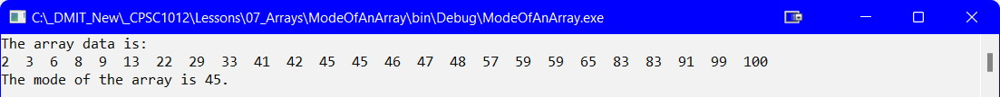

## Introduction
The Mode of an array is the count of the element that appears most in the array.

## Code
The code below uses a manually created array of integer values but the code cam easily be adapted to work with any type or size of array.

```csharp
namespace ModeOfAnArray
{
    internal class Program
    {
        static void Main(string[] args)
        {
            const int PhysicalSize = 25;
            int[] numbers = { 2, 3, 6, 8, 9, 13, 22, 29, 33, 41, 42, 45, 45, 46, 47, 48, 57, 59, 59, 65, 83, 83, 91, 99, 100 };
            int mode;
            DisplayArray(numbers, PhysicalSize);

            mode = FindMode(numbers, PhysicalSize);
            Console.WriteLine($"\nThe mode of the array is {mode}.");

            Console.ReadLine();
        }//eom

        static int FindMode(int[] numbers, int size)
        {
            //find the highest number in the array, which was previously sorted
            int max = numbers[size - 1];
            int top = max + 1;
            int[] count = new int[top];
            //initialize the count array to all 0's
            for (int index = 0; index < top; index++)
            {
                count[index] = 0;
            }
            //store the count of each element of the input array
            for (int index = 0; index < size; index++)
            {
                count[numbers[index]]++;
            }
            //mode is the index with the maximum count
            int mode = 0;
            int modeCount = count[0];
            for (int index = 1; index < top; index++)
            {
                if (count[index] > modeCount)
                {
                    modeCount = count[index];
                    mode = index;
                }
            }
            return mode;
        }//end of FindMode

        static void DisplayArray(int[] numbers, int size)
        {
            Console.WriteLine("The array data is:");
            for (int index = 0; index < size; index++)
            {
                Console.Write($"{numbers[index]}  ");
            }
        }//end of DisplayArray
    }//eoc
}//eon
```



#### [Arrays Home](index.md)
#### [CPSC1012 Home](../)