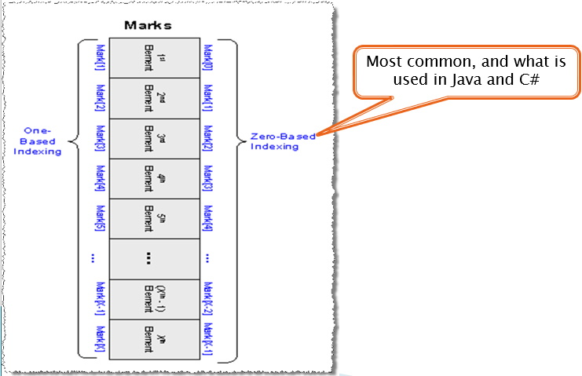

## Introduction
This section will introduce you to the most basic of _collection classes_, an **Array**. The objectives of this section are:
1. Declare an array
2. Load an array
3. Display the data in an array

## What is an Array?
* An array is a simple collection of common data (all the elements have the same data type)
* Think of how you store all email or phone contacts. You can add, delete, or edit the list, but this list is very much like an array

## Arrays in Computer Memory

An array takes up a contiguous block of computer memory.

## Array Indexing

In **C#** arrays will **always** use zero-based indexing. This means the first element of the array will be `index = 0`.

## Coding Topics
* [1D Arrays](1d-array.md)
* [Parallel Arrays](parallel.md)
* [2D Arrays](2d-array.md)
* [Searching Arrays](searching-arrays.md)

#### [CPSC1012 Home](../)

