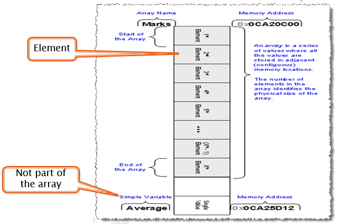

## Introduction
This section will introduce you to the most basic of _collection classes_, an **Array**. The objectives of this section are:
1. Declare an array
2. Load an array
3. Display the data in an array

## What is an Array?
* An array is a simple collection of common data (all the elements have the same data type)
* Think of how you store all email or phone contacts. You can add, delete, or edit the list, but this list is very much like an array

## Arrays in Computer Memory

An array takes up a contiguous block of computer memory.

## Array Indexing

In **C#** arrays will **always** use zero-based indexing. This means the first element of the array will be `index = 0`.

## Coding Topics
[1D Arrays](1d-array.md) 
[Parallel Arrays](parallel.md) 
[2D Arrays](2d-array.md) 
[Searching Arrays](searching-arrays.md) 
[Mode of an Array](array-mode.md)

## Practice Problems
[Array Problems 1](files/array-problems-1.pdf){:target="_blank"} 
[Array Problems 2](files/array-problems-2.pdf){:target="_blank"} 
[Arrays Exercise 1](files/arrays-exercise-1.pdf){:target="_blank"} 
[Arrays Exercise 2](files/arrays-exercise-2.pdf){:target="_blank"} 
[Arrays Worksheet 06a](files/arrays-worksheet-06a.pdf){:target="_blank"} 
[Arrays Worksheet 06b](files/arrays-worksheet-06b.pdf){:target="_blank"}
#### [CPSC1012 Home](../)

