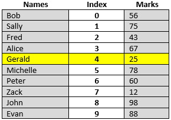

## Introduction
**CONCEPT**: The concept of parallel arrays is simple, but a bit clunky. We need equally sized arrays; each array can hold different data types as they are separate array objects. If we want to find the mark for a given name, we use the same index number. For example, given the array data below what data can be found at `index = 4`?

**Answer**: At index 4 there is `Names[4] = Gerald` and `Marks[4] = 25`.

## Loading Arrays
When loading data into Parallel Arrays, you **must** load each array at the same index number in the same iteration through the looping process.

## Displaying Arrays
Like loading the arrays, you **must** display the data for each array in the same iteration.

## Complications
There are several complications using Parallel Arrays:
1. Sorting: sorting parallel array requires you to decide which array you want to sort on, then sort both arrays at the same time. You ***cannot*** just sort each array separately as that would destroy the data cohesion between the two arrays.
2. What if we have extra data such as Student ID, Phone number, Gender, etc. Now we must add an extra array for each type of data we want to store in **parallel**.

To overcome these complications requires the creation of a class to hold all the data we would need to store in the multiple parallel arrays.

#### [Arrays Home](index.md)
#### [CPSC1012 Home](../)