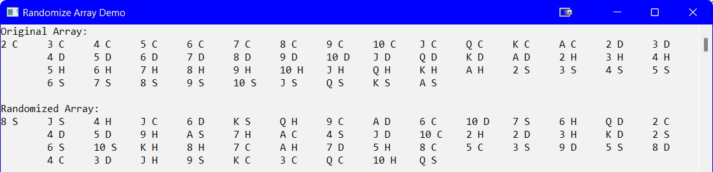

## Introduction
Having an array that is sorted is useful but sometimes you need it randomized. For example, if you have a game using a deck of cards it would be required to have the deck shuffled. The demo code below simulates dealing a round of cards in Bridge.

## LoadArray()

```csharp
static void LoadArray(int[] cards, int size)
{
    for (int index = 0; index < size; index++)
    {
        cards[index] = index + 2;
    }
}//end of LoadArray
```

As the **Ace** in a suit is the highest card, you need `index + 2` to set the correct values in the array.

## ShuffleDeck()
Once the array is loaded with sequential numbers, the next step is to randomize the values:

```csharp
static void ShuffleDeck(int[] cards, int size)
{
    Random random = new Random();
    int swap,
    position1,
    position2;
    for (int index = 0; index < size; index++)
    {
        position1 = random.Next(0, size);
        position2 = random.Next(0, size);
        swap = cards[position1];
        cards[position1] = cards[position2];
        cards[position2] = swap;
    }
}//end of ShuffleDeck
```

_Alternately, you could use nested loops to further randomize the order of the cards._

## ShowDeck()
It would be easy to just show the numerical values now ranomized in the array, but as this is a deck of cards it would be better to show the type of card and its suit. The code below does that:

```csharp
static void ShowDeck(int[] cards, int size)
{
    string suit,
        card;
    int remainder;

    for (int index = 0; index < size; index++)
    {
        if (cards[index] <= 14)
        {
            suit = "C";
        }
        else if (cards[index] <= 27)
        {
            suit = "D";
        }
        else if (cards[index] <= 40)
        {
            suit = "H";
        }
        else
        {
            suit = "S";
        }
        remainder = cards[index] % 13;
        switch (remainder)
        {
            case 1:
                card = "A";
                break;
            case 0:
                card = "K";
                break;
            case 12:
                card = "Q";
                break;
            case 11:
                card = "J";
                break;
            default:
                card = remainder.ToString();
                break;
        }
        Console.Write($"{card} {suit}\t");
     }
     Console.WriteLine();
 }//end of ShowDeck
 ```

## Program Class - Part 1
At this point you need the following code in the `Main()` method:

```csharp
static void Main(string[] args)
{
    Setup();
    const int PhysicalSize = 52;
    const int HandSize = 13;
    int[] cards = new int[PhysicalSize];
    int[] west = new int[HandSize];
    int[] north = new int[HandSize];
    int[] east = new int[HandSize];
    int[] south = new int[HandSize];

    LoadArray(cards, PhysicalSize);

    Console.WriteLine("Original Array:");
    ShowDeck(cards, PhysicalSize);

    Console.WriteLine("\nRandomized Array:");
    ShuffleDeck(cards, PhysicalSize);
    ShowDeck(cards, PhysicalSize);

    Console.ReadLine();
}//eom

static void Setup()
{
    Console.Title = "Randomize Array Demo";
    Console.ForegroundColor = ConsoleColor.Black;
    Console.BackgroundColor = ConsoleColor.White;
    Console.Clear();
}//end of Setup
```

There are 4 arrays, one for each player's hand, that will be used later.<br>



#### [Arrays Home](index.md)
#### [CPSC1012 Home](../)