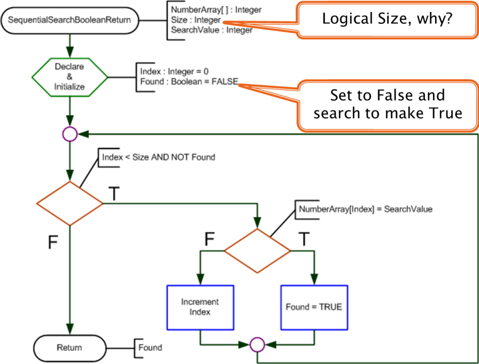
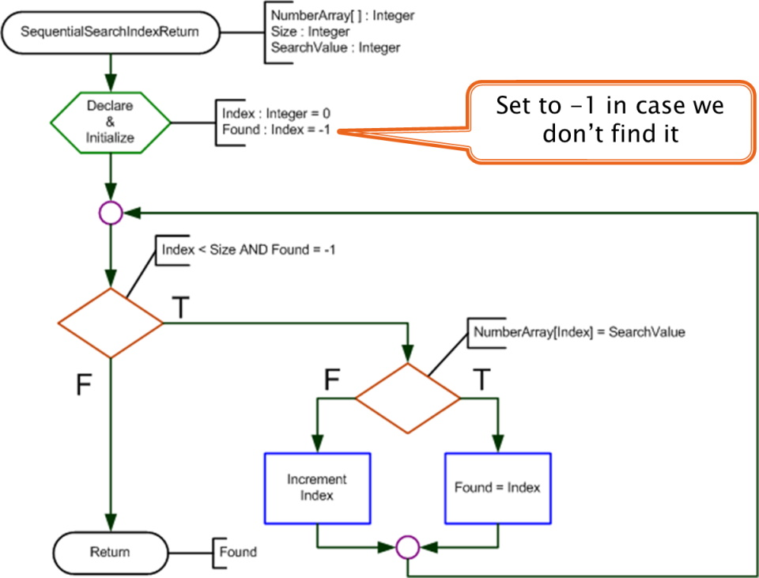
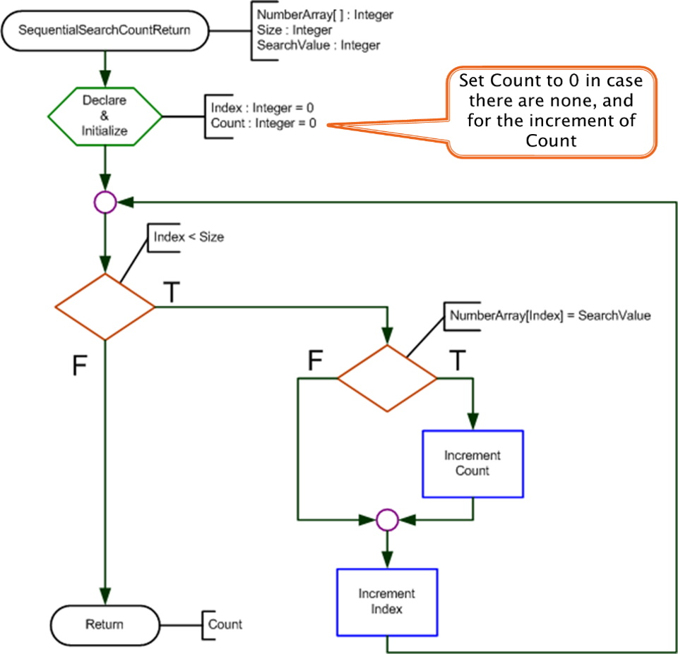
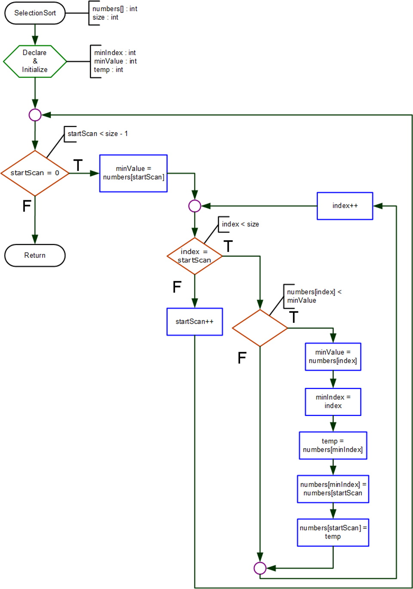

## Introduction
There are two types of searches:
*  [Sequential](#sequesntial): Start at the beginning of the array and examine each element, one after the other, to locate a value
*  [Binary](#binary): Requires a sorted array and does a _Divide & Conquer_ approach; splits the array in halves until the value is found

A search can return:
*  The value
*  A Boolean
*  The location in the array
*  The count of how many matching items are in the array

## <a id="sequential">Sequential Searches</a>
### Sequential Search - Boolean


```csharp
static bool SearchArrayBoolean(int[] grades, int size, int searchValue)
{
    bool found = false;
    for (int index = 0; index < size; index++)
    {
        if (searchValue == grades[index])
        { 
            found = true;
            index = size;
        }
    }
    return found;
}//end of SearchArrayBoolean
```

### Sequential Search - Location


```csharp
static int SearchArrayLocation(int[] grades, int size, int searchValue)
{
    int location = -1; //-1 is NOT a valid index number of an array
    for (int index = 0; index < size; index++)
    {
        if (searchValue == grades[index])
        {
            location = index;
            index = size;
        }
    }
    return location;
}//end of SearchArrayLocation

### Sequential Search - Count


```csharp
static int SearchArrayCount(int[] grades, int size, int searchValue)
{
    int count = 0;
    for (int index = 0; index < size; index++)
    {
        if (searchValue == grades[index])
        {
            count++;
        }
    }
    return count;
}//end of SearchArrayCount
```

### NOTE
Before coding it is important to remember that the comparison of strings is different from numerical values.
*  Numbers: `if(a == b)` is a valid test
*  Strings: `if("Allan" == "allan")` is not always valid, instead use `if("Allan".Equals("allan"))`

## <a id="binary">Binary Search</a>
### Selection Sort


```csharp
static void SelectionSort(int[] numbers, int size)
{
    int minIndex, minValue;
    int temp;
    for (int startScan = 0; startScan < size - 1; startScan++)
    {
        //assume, for now, the first element has the smallest value
        minValue = numbers[startScan];
        //now look at the rest of the array
        for (int index = startScan; index < size; index++)
        {
           if (numbers[index] < minValue)
           {
                minValue = numbers[index];
                minIndex = index;
                //now swap
                temp = numbers[minIndex];
                numbers[minIndex] = numbers[startScan];
                numbers[startScan] = temp;
            }//end if
        }//end inner for
    }//end outer for
}//end of SelectionSort
```

### Binary Search


```csharp
static int BinarySearch(int[] numbers, int size)
{
    //Ensure the array is sorted!
    SelectionSort(numbers, size);
    //local variables
    int first = 0, 
        last = size - 1;
    int middle = (first + last + 1) / 2;
    int location = -1;
    //loop 
    while (first <= last && location == -1)
    {
        if (searchNumber > numbers[middle])
        {
            first = middle + 1;
        }
        else if (searchNumber < numbers[middle])
        {
            last = middle - 1;
        }
        else
        {
            location = middle;
        }
         middle = (first + last + 1) / 2;
    }
    return location;
}//end of BinarySearch
```

#### [Arrays Home](index.md)
#### [CPSC1012 Home](../)