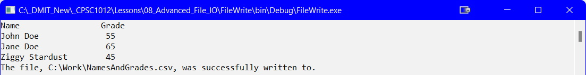

## Writing to File
Much of the same concepts of reading a file apply to wrting to a file. To write to a file you will use the `StreamWriter` class. To write data to a file you can do either of:
*  Have the user input data to write to the file
*  Have data store in an array or in parallel arrays
*  Have data stored in a [`List<T>`](../10-collection-classes/index.md)

For this lesson, you will be using two parallel arrays, `string[] names` and `int[grades]`. Additionally, as you can read or write to a `*.txt` or `*.csv` file, this lesson will use the `*.csv` file.

### Variables
The following variables will be needed:

```csharp
const int Size = 3;
const string PathAndFile = @"C:\Work\NamesAndGrades.csv";
string[] names = {"John Doe", "Jane Doe", "Ziggy Stardust"};
int[] grades = {55, 65, 45};
```

### Dispaly the Array Data (Optional)
Before writing to a file, you could check the data you are writing as follows:

In the `Main()` method you could have:

```csharp
DisplayArrays(names, grades, Size);
```

In your code file you could have the following method:

```csharp
static void DisplayArrays(string[] names, int[] grades, int size)
{
    Console.WriteLine("{0,-20} {1,3}", "Name", "Grade");
    for(int index = 0; index < size; index++)
    {
        Console.WriteLine("{0,-20} {1,3}", names[index], grades[index]);
    }
}//end of DisplayArrays
```

### Writing & Exception Handling
You can add the code to write to a file inside your `Main()` method but a better approach is to have this done in a separate method. In your `Main()` method you would have something like:

```csharp
FileWrite(PathAndFile, names, grades, Size);
```

In your code file you would then have the following method:

```csharp
static void FileWrite(string file, string[] names, int[] grades, int size)
{
    StreamWriter writer = null;
    try
    {
        writer = File.CreateText(file);
        for(int index = 0; index < size; index++)
        {
            writer.WriteLine(string.Format("{0},{1}", names[index], grades[index]));
        }
    }
    catch (Exception ex)
    {
        Console.WriteLine(ex.Message);
    }
    finally
    {
        writer.Close();
    }
}//end of FileWrite
```



#### [File I/O Home](index.md)
#### [CPSC1012 Home](../)