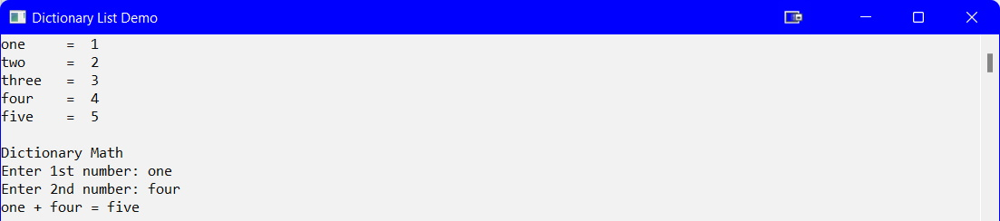

---
layout: page
title: Generics - DictionaryList
--- 

## Introduction
A `DictionaryList` is another type of generic class. It works much like a _dictionary_ in that you declare a `<Key, Value>` pair. As this topic is not normally coved in this course, the code provided is to be used at your own expense.

```csharp
namespace DictionaryListDemo
{
    class Program
    {
        static void Main(string[] args)
        {
            Setup();
            // Create a DictionaryList (Dictionary<Key, Value>)
            Dictionary<string, int> numbers = new Dictionary<string, int>();
            // Add data to the DictionaryList
            numbers.Add("one", 1);
            numbers.Add("two", 2);
            numbers.Add("three", 3);
            numbers.Add("four", 4);
            numbers.Add("five", 5);
            // Display the DictionaryList
            DisplayDictionaryList(numbers);
            // Do some stuff with the DictionaryList
            DictionaryMath(numbers);

            Console.ReadLine();
        }//eom

        static void DisplayDictionaryList(Dictionary<string, int> numbers)
        {
            // use a foreach loop
            foreach(KeyValuePair<string, int> pair in numbers)
            {
                Console.WriteLine("{0}\t= {1,2}", pair.Key, pair.Value);
            }
        }//end of DisplayDictionaryList

        static void DictionaryMath(Dictionary<string,int> numbers)
        {
            string string1,
                string2, stringResult;
            int number1,
                number2,
                intResult;
            Console.WriteLine("\nDictionary Math");
            Console.Write("Enter 1st number: ");
            string1 = Console.ReadLine();
            Console.Write("Enter 2nd number: ");
            string2 = Console.ReadLine();
            if (numbers.ContainsKey(string1) && numbers.ContainsKey(string2))
            {
                number1 = numbers[string1];
                number2 = numbers[string2];
                intResult = number1 + number2;
                if (numbers.ContainsValue(intResult))
                {
                    stringResult = numbers.ElementAt(intResult - 1).Key;
                    Console.WriteLine("{0} + {1} = {2}", string1, string2, stringResult);
                }//end if
                else
                {
                    Console.WriteLine("Result ({0}) not found", intResult);
                }//end else
            }//end if
            else
            {
                Console.WriteLine("No math possible using {0} and {1}", string1, string2);
            }//end else
        }//end of DictionaryMath

        static void Setup()
        {
            Console.Title = "Dictionary List Demo";
            Console.ForegroundColor = ConsoleColor.Black;
            Console.BackgroundColor = ConsoleColor.White;
            Console.Clear();
        }//end of Setup
    }//eoc
}//eon
```



#### [Generics Home](index.md)
#### [CPSC1012 Home](../index.md)