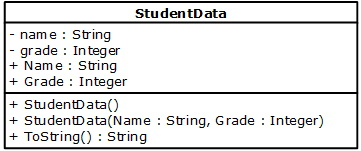
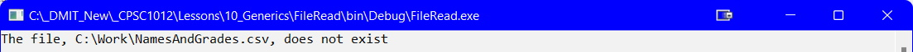
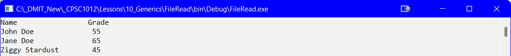

---
layout: page
title: List<T> - Reading From File
--- 

## Introduction
To tap into the power of the `List<T>`, you can store objects in the list. For this lesson, you will use the following class:



This class has the following code (_note that there is no validation for the `set` methods - you can add these later_):

```csharp
public class StudentData
{
   private string _name;
   private int _grade;

   public string Name
   {
       get { return _name; }
       set { _name = value; }
   }//end of Name

   public int Grade
   {
       get { return _grade; }
       set { _grade = value; }
   }//end of Grade

   public StudentData()
   {
       Name = "";
       Grade = 0;
   }

   public StudentData(string name, int grade)
   {
       Name = name;
       Grade = grade;
   }

   public override string ToString()
   {
       return string.Format("{0,-20} {1,3}", Name, Grade);
   }//end of ToString
}//eoc
```

### Variables
most of the variables used in the previous File I/O read are used in this example. One to make sure you have is:

```csharp
List<StudentData> studentData = new List<StudentData>();
```

### Reading
As with previous File I/O, you will need `using System.IO;`, the `PathAndFile`, and check if the file exists.

As you read a line in the file you will need to:
1. Create a `StudentData` object
2. Add the object created aboce to a `List<StudentData>`

The code for the reading looks like:

```csharp
static void Main(string[] args)
{
    List<StudentData> studentData = new List<StudentData>();
    const string PathAndFile = @"C:\Work\NamesAndGrades.csv";
            
    if (File.Exists(PathAndFile))
    {
        ReadFile(PathAndFile, studentData);
                      
        DisplayList(studentData);
    }
    else
    {
        Console.WriteLine($"The file, {PathAndFile}, does not exist");
    }

    Console.ReadLine();
}//eom

static void ReadFile(string file, List<StudentData> studentData)
{
    string input;
    string name;
    int grade;

    StreamReader reader = null;
    try
    {
        reader = File.OpenText(file);
        while ((input = reader.ReadLine()) != null)
        {
            string[] parts = input.Split(',');
            name = parts[0];
            grade = int.Parse(parts[1]);
            //1. Create a StudentData object
            StudentData student = new StudentData(name, grade);
            //2. Add the object to the List<StudentData>
            studentData.Add(student);
        }
    }
    catch (Exception ex)
    {
        Console.WriteLine(ex.Message);
    }
    finally
    {
        reader.Close();
    }
}//end of ReadFile
```

### Display List
Once you read the file data, and store it in the `List<T>`, yoy will need to display the contents of the list as follows:


In your code file you need something like the code below as the `DisplayList()` method is called after the `ReadFile()` method:

```csharp
static void DisplayList(List<StudentData> studentData)
{
    Console.WriteLine("{0,-20} {1,3}", "Name", "Grade");
    foreach(StudentData student in studentData)
    {
      Console.WriteLine(student); // calls the ToString() method
    }
}//end of DisplayList
```

<br>


#### [Generics Home](index.md)
#### [CPSC1012 Home](../index.md)