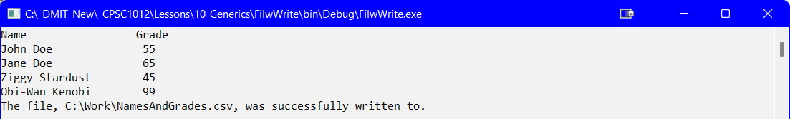

---
layout: page
title: List<T> - Wrtiting to File
--- 

## Introduction
Like the file read with a `List<T>`, and the write to file with parallel arrays, this lesson will focus on reading data from a `List<T>` and store the data into a `*.csv` file. Additionally, this builds on the fundamentals of objects and File I/O.

You will still need the `StudentData.cs` class file for this demo:

```csharp
public class StudentData
{
   private string _name;
   private int _grade;

   public string Name
   {
       get { return _name; }
       set { _name = value; }
   }//end of Name

   public int Grade
   {
       get { return _grade; }
       set { _grade = value; }
   }//end of Grade

   public StudentData()
   {
       Name = "";
       Grade = 0;
   }

   public StudentData(string name, int grade)
   {
       Name = name;
       Grade = grade;
   }

   public override string ToString()
   {
       return string.Format("{0,-20} {1,3}", Name, Grade);
   }//end of ToString
}//eoc
```

### List `List<StudentData>`
There are many techniques covered in this course to prompt the user for data and store that data in the program. For simplicity sake, the list will be loaded manually:

```csharp
List<StudentData> studentData = new List<StudentData>
{
    new StudentData("John Doe", 55),
    new StudentData("Jane Doe", 65),
    new StudentData("Ziggy Stardust", 45),
    new StudentData("Obi-Wan Kenobi", 99)
};
```

To verify the data is in the list you could add:

```csharp
static void DisplayList(List<StudentData> studentData)
{
    Console.WriteLine("{0,-20} {1,3}", "Name", "Grade");
    foreach(StudentData student in studentData)
    {
      Console.WriteLine(student); // calls the ToString() method
    }
}//end of DisplayData
```

### Write to File

```csharp
static void FileWrite(string file, List<StudentData> studentData)
{
    StreamWriter writer = null;
    try
    {
        writer = File.CreateText(file);
        foreach(StudentData student in studentData)
        {
            writer.WriteLine(String.Format("{0},{1}", student.Name, student.Grade));
        }

        Console.WriteLine($"The file, {file}, was successfully written to.");
    }
    catch (Exception ex)
    {
        Console.WriteLine(ex.Message);
    }
    finally
    {
        writer.Close();
    }
}//end of FileWrite
```

To call this method from the `Main()` method use:

```csharp
FileWrite(PathAndFile, studentData);
```



#### [Generics Home](index.md)
#### [CPSC1012 Home](../index.md)