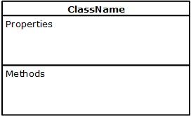
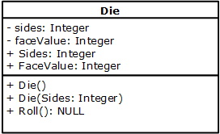

## Introduction
**CONCEPT**: Object Oriented Programming (OOP) is a modern way to code. It is a paradigm shift from the traditional, functional programming. The C# language and the .NET framework are built specifically for OOP. For an explantion of OOP go [here](what-is-oop.md).

The fundamental concept to grasp is that a `class` represents a _blueprint_ of a real-world _thing_. As it is a blueprint, you can use the class to create `Object`s based on the `class`. Each 'Object` is unique, just like values for numbers and strings, but that is where much of the similarity ends.

## What is a Class?
As previously mentioned, a `class` is a _blueprint_ for a real-world _thing_. A `class` consists of the following:
1. Name: each class must have a unique name to separate it from all other classes.
2. Properties: a property is a separate identifier of a `class`. Together, all the properties identify what the `class` is made up of.
3. Accessors & Mutators:
    *  Accessor: this is a _method_ that allows programming code to read the value of a single property
    *  Mutator: this is a _method_ that allows programming code to write or change the value of a single property
4. Class methods: class methods are the means to do _something_ with the `class`; they rely on the properties, with their associated Accessors and Mutators, to make the 'class` more _functional_.

### Class Diagram
A Class Diagram is a visual representation of the `class`; it outlines the _blueprint_ to code the `class`. (You are **not** required to create a Class Diagram in this course, only to use it to code the `class`.) A Class Diagram has three areas:<br>


### Die.cs


```csharp
public class Die
{
    private Random rnd = new Random(); // used to get a random roll of a Die

    // private member fields
    private int _sides;
    private int _faceValue;

    // public Accessors & Mutators
    public int Sides
    {
        get { return _sides; } // public Accessor
        set
        {
            if (value >= 4)
            {
                _sides = value;
            }
            else
            {
                throw new Exception("Invalid sides for a Die");
            }
        }
    }// end of Sides

    public int FaceValue
    {
        get { return _faceValue; }
        set
        {
            if (value > 0 && value <= _sides) // could also write: if (value > 0 && value <= Sides)
            {
                _faceValue = value;
            }
            else
            {
                throw new Exception("Invalid face value for a Die");
            }
        }
    }// end of FaceValue

    // Constructor(s)
    // Empty Constructor
    public Die()
    {
        Sides = 6;
        FaceValue = 1;
    }

    // Greedy Constructor
    public Die(int sides)
    {
        Sides = sides;
        FaceValue = 1;
    }

    // Class method(s)
    public void Roll()
    {
        FaceValue = rnd.Next(1, Sides + 1);
    }

    public override string ToString()
    {
        //return "Sides = " + Sides + ", FaceValue = " + FaceValue;
        return string.Format("Sides = {0}, FaceValue = {1}", Sides, FaceValue)
    }
}
```

### Program.cs

```csharp
class Program
{
    static void Main(string[] args)
    {
        Setup();

        //Create and display a default instance of the class
        Die sixSidedDie = new Die();
        Console.WriteLine("Sides = {0}, FaceValue = {1}", sixSidedDie.Sides, sixSidedDie.FaceValue);

        //Display the instance of the class using a class method

        //Create and display a non-default instance of the class
        Die someDie = new Die(20);
        Console.WriteLine("Sides = {0}, FaceValue = {1}", someDie.Sides, someDie.FaceValue);

        //Change the values(s) of the instances of the class
        sixSidedDie.Roll();
        someDie.Roll();
        Console.WriteLine("\nCalling the properties directly");
        Console.WriteLine("Sides = {0}, FaceValue = {1}", sixSidedDie.Sides, sixSidedDie.FaceValue);
        Console.WriteLine("Sides = {0}, FaceValue = {1}", someDie.Sides, someDie.FaceValue);
        Console.WriteLine("\nCalling the .ToString() method");
        Console.WriteLine(sixSidedDie);
        Console.WriteLine(someDie);

        //Exceptions
        Console.WriteLine("\nThe try-catch working");
        try
        {
            //sixSidedDie.FaceValue = 7;
            someDie.Sides = 1;
        }
        catch (Exception ex)
        {
            Console.ForegroundColor = ConsoleColor.Red;
            Console.WriteLine(ex.Message);
            Console.ForegroundColor = ConsoleColor.Black;
        }

        Console.ReadLine();
    }//eom

    #region Provided methods
    static void Setup()
    {
        Console.Title = "Die Class Demo";
        Console.ForegroundColor = ConsoleColor.Black;
        Console.BackgroundColor = ConsoleColor.White;
        Console.Clear();
    }//end of Setup
    #endregion
}//eoc
```

## Coding Topics
TBD...

#### [CPSC1012 Home](../)