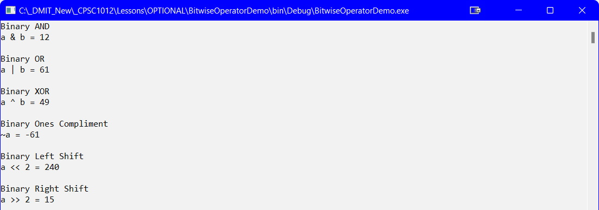

## Introduction
In this course you were able to use the Boolean operators `&&`, `||`, and `!`. These are not the only _Boolean_ operators. There are several **Bitwise Operators**.

## Demo Code

```csharp
namespace BitwiseOperatorDemo
{
    internal class Program
    {
        static void Main(string[] args)
        {
            int a = 60;    //60 = 0011 1100
            int b = 13;    //13 = 0000 1101
            int c;

            Console.WriteLine("Binary AND");
            c = a & b;
            Console.WriteLine($"a & b = {c}");

            Console.WriteLine("\nBinary OR");
            c = a | b;
            Console.WriteLine($"a | b = {c}");

            Console.WriteLine("\nBinary XOR");
            c = a ^ b;
            Console.WriteLine($"a ^ b = {c}");

            Console.WriteLine("\nBinary Ones Compliment");
            c = ~a;
            Console.WriteLine($"~a = {c}");

            Console.WriteLine("\nBinary Left Shift");
            c = a << 2;
            Console.WriteLine($"a << 2 = {c}");

            Console.WriteLine("\nBinary Right Shift");
            c = a >> 2;
            Console.WriteLine($"a >> 2 = {c}");

            Console.ReadLine();
        }//eom
    }//eoc
}//eon
```


_NOTE: The results in the screenshot above can be better explained by converting all the values for `c` to binary and to do binary math._


#### [Advanced Home](index.md)
#### [CPSC1012 Home](../index.md)