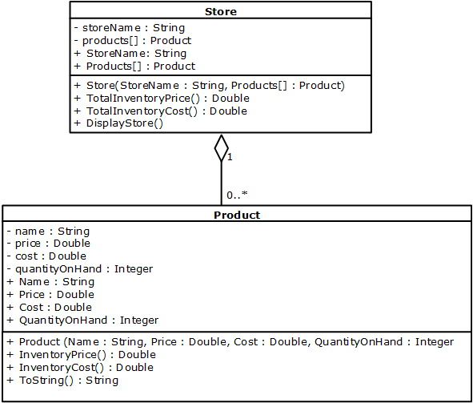
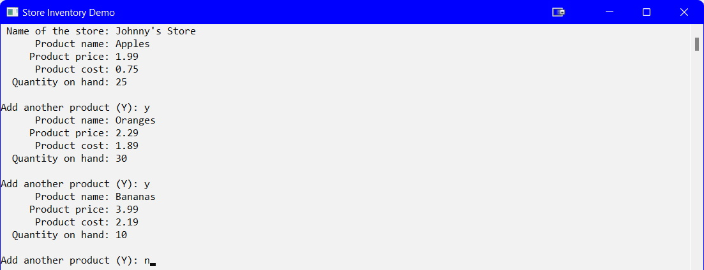
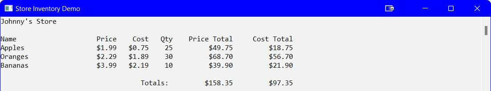

## Introduction
In more advanced OOP you will come across a class that includes a property that is a collection of another class. The class diagram below is an example of this:<br>


Here you see that the `Store` class has a property that is a collection of the `Product` class.

### Product Class
There are 2 calculation methods in this class which take in no external parameters. In order for them to calculate, and return, a value they must have data values. Where do the data values come from? They come from the properties of the **class** (i.e., they are class-level methods).

```csharp
namespace InventoryDemo
{
    class Product
    {
        private string _name;
        private decimal _price;
        private decimal _cost;
        private int _quantityOnHand;

        public string Name
        {
            get { return _name; }
            set
            {
                if (value.Length >= 3 && value.Length <= 20)
                {
                    _name = value;
                }
                else
                {
                    if (value.Length < 3)
                    {
                        throw new Exception("Invalid name ... must be at least 3 characters");
                    }
                    else
                    {
                        throw new Exception("Invalid name ... must not be greater than 20 characters");
                    }
                }
            }
        }//eop

        public decimal Price
        {
            get { return _price; }
            set
            {
                if (value > 0)
                {
                    _price = value;
                }
                else
                {
                    throw new Exception("Invalid price ... must be greater than 0");
                }
            }
        }//eop

        public decimal Cost
        {
            get { return _cost; }
            set
            {
                if (value > 0)
                {
                    _cost = value;
                }
                else
                {
                    throw new Exception("Invalid cost ... must be greater than 0");
                }
            }
        }//eop

        public int QuantityOnHand
        {
            get { return _quantityOnHand; }
            set
            {
                if (value >= 0)
                {
                    _quantityOnHand = value;
                }
                else
                {
                    throw new Exception("Invalid quantity on hand ... must be >= 0");
                }
            }
        }//eop

        public Product(string name, decimal price, decimal cost, int quantityOnHand)
        {
            Name = name;
            Price = price;
            Cost = cost;
            QuantityOnHand = quantityOnHand;
        }//eom

        public decimal InventoryPrice()
        {
            return Price * QuantityOnHand;
        }//eom

        public decimal InventoryCost()
        {
            return Cost * QuantityOnHand;
        }//eom

        public override string ToString()
        {
            return string.Format("{0,-21}{1,8:c}{2,8:c}{3,6}{4,15:c}{5,15:c}", Name, Price, Cost, QuantityOnHand, InventoryPrice(), InventoryCost());
        }

    }//eoc
}//eon
```

### Store Class
Like the `Product` class, there are 2 calculation methods. These methods need the data values from each of the `Product` objects in the `Products[]` collection.

```csharp
namespace InventoryDemo
{
    class Store
    {
        private string _storeName;
        public List<Product> Products;

        public string StoreName
        {
            get { return _storeName; }
            set
            {
                if (value.Length >= 3 && value.Length <= 20)
                {
                    _storeName = value;
                }
                else
                {
                    if (value.Length < 3)
                    {
                        throw new Exception("Invalid name ... must be at least 3 characters");
                    }
                    else
                    {
                        throw new Exception("Invalid name ... must not be greater than 20 characters");
                    }
                }
            }
        }//eop

        public Store(string storeName, List<Product> products)
        {
            StoreName = storeName;
            Products = products;
        }//eom

        public decimal TotalInvntoryCost()
        {
            decimal totalCost = 0;
            foreach(Product product in Products)
            {
                totalCost += product.InventoryCost();
            }
            return totalCost;
        }//eom

        public decimal TotalInventoryPrice()
        {
            decimal totalPrice = 0;
            foreach(Product product in Products)
            {
                totalPrice += product.InventoryPrice();
            }
            return totalPrice;
        }//eom

        public void DisplayStore()
        {
            Console.WriteLine(StoreName + "\n");
            Console.WriteLine("{0,-21}{1,8}{2,8}{3,6}{4,15}{5,15}", "Name", "Price", "Cost", "Qty", "Price Total","Cost Total");
            foreach(Product product in Products)
            {
                Console.WriteLine(product);
            }
            Console.WriteLine("\n{0,43}{1,15:c}{2,15:c}","Totals: ", TotalInventoryPrice(), TotalInvntoryCost());
        }//eom
    }//eoc
}//eon
```

### Program Class

```csharp
namespace InventoryDemo
{
    class Program
    {
        static void Main(string[] args)
        {
            Setup();
            //NOW CODE UP A STORE
            try
            {
                string storeName = GetSafeString("Name of the store: ");
                List<Product> products = new List<Product>();
                AddProducts(products);
                Store myStore = new Store(storeName, products);
                Console.Clear();
                myStore.DisplayStore();
            }
            catch (Exception ex)
            {
                Console.WriteLine(ex.Message);
            }

            Console.ReadLine();
        }//eom

        static void Setup()
        {
            Console.Title = "Store Inventory Demo";
            Console.ForegroundColor = ConsoleColor.Black;
            Console.BackgroundColor = ConsoleColor.White;
            Console.Clear();
        }//eom

        static void AddProducts(List<Product> products)
        {
            char addAnother = 'Y';
            string name;
            decimal price, cost;
            int quantityOnHand;
            Product product = null;
            do
            {
                try
                {
                    name = GetSafeString("Product name: ");
                    price = GetSafeDecimal("Product price: ");
                    cost = GetSafeDecimal("Product cost: ");
                    quantityOnHand = GetSafeInt("Quantity on hand: ");
                    product = new Product(name, price, cost, quantityOnHand);
                    products.Add(product);
                    Console.Write("\nAdd another product (Y): ");
                    addAnother = char.ToUpper(char.Parse(Console.ReadLine()));
                }
                catch (Exception)
                {
                    Console.WriteLine("ERROR: Input is not valid");
                }
            } while (addAnother == 'Y');
        }//eom

        #region Validation Methods
        static decimal GetSafeDecimal(string prompt)
        {
            decimal number = 1;
            bool isValid = false;
            do
            {
                try
                {
                    Console.Write("{0,20}", prompt);
                    number = decimal.Parse(Console.ReadLine());
                    if (number > 0)
                    {
                        isValid = true;
                    }
                    else
                    {
                        Console.WriteLine("ERROR: Invalid number ... try again");
                    }
                }
                catch (Exception)
                {
                    Console.WriteLine("ERROR: Invalid number ... try again");
                }
            } while (!isValid);
            return number;
        }//eom

        static int GetSafeInt(string prompt)
        {
            int number = 1;
            bool isValid = false;
            do
            {
                try
                {
                    Console.Write("{0,20}", prompt);
                    number = int.Parse(Console.ReadLine());
                    if (number >= 0)
                    {
                        isValid = true;
                    }
                    else
                    {
                        Console.WriteLine("ERROR: Invalid number ... try again");
                    }
                }
                catch (Exception)
                {
                    Console.WriteLine("ERROR: Invalid number ... try again");
                }
            } while (!isValid);
            return number;
        }//eom

        static string GetSafeString(string prompt)
        {
            string name = "";
            bool isValid = false;
            do
            {
                Console.Write("{0,20}", prompt);
                name = Console.ReadLine();
                if(name.Length >= 3)
                {
                    isValid = true;
                }
                else
                {
                    Console.WriteLine("ERROR: Name is not valid");
                }
            } while (!isValid);
            return name;
        }//eom
        #endregion
    }//eoc
}//eon
```





#### [Advanced Home](index.md)
#### [CPSC1012 Home](../index.md)