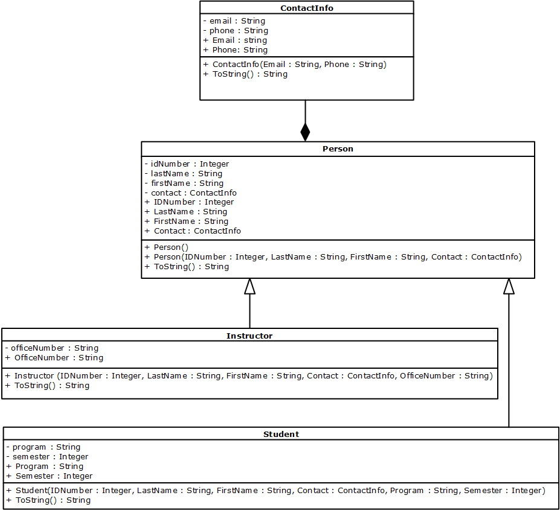

## Introduction
One of the cool aspect of OOP is inheritance. Inheritance is when you create a base, or parent, class and classes that inherit properties and methods from the parent class. In the class diagram below you will see that the `Person` class has a `ContactInfo` property which is represented by the solid diamond at the end of the relationship; the `Person` class cannot exist without the `ContactInfo ` class. Additionally you will see open diamonds at the end of the relationships to the `Person` class from the `Instructor` and `Student` classes. This makes the `Person` class the **parent** class.

Examining the properties and constructors of the `Instructor` and `Student` classes you will see that their constructors need all the parameters from the `Person` class in addition to the specific properties of their respective classes:<br>


_NOTE: For simplicity there is no validation in the classes below, but it can easily be added. Additionally, the classes are placed in a separate folder, `Classes`, to demonstrate that you can organize your classes._

### ContactInfo Class

```csharp
namespace InheritanceDemo.Classes
{
    public class ContactInfo
    {
        private string _email;
        private string _phone;

        public string Email
        {
            get { return _email; }
            set { _email = value; }
        }

        public string Phone
        {
            get { return _phone; }
            set { _phone = value; }
        }

        public ContactInfo(string email, string phone)
        {
            Email = email;
            Phone = phone;
        }

        public override string ToString()
        {
            return string.Format("Email: {0}\nPhone: {1}",Email,Phone);
        }
    }//eoc
}//eon
```

### Person Class

```csharp
namespace InheritanceDemo.Classes
{
    public class Person
    {
        private int _idNumber;
        private string _lastname;
        private string _firstName;
        private ContactInfo _contact;

        public int IDNumber
        {
            get { return _idNumber; }
            set { _idNumber = value; }
        }

        public string LastName
        {
            get { return _lastname; }
            set { _lastname = value; }
        }

        public string FirstName
        {
            get { return _firstName; }
            set { _firstName = value; }
        }

        public ContactInfo Contact
        {
            get { return _contact; }
            set { _contact = value; }
        }

        public Person()
        {
            IDNumber = 1;
            LastName = "Doe";
            FirstName = "John";
            Contact = new ContactInfo("me@here.com", "1-780-555-1212");
        }

        public Person(int idNumber, string lastname, string firstName, ContactInfo contact)
        {
            IDNumber = idNumber;
            LastName = lastname;
            FirstName = firstName;
            Contact = contact;
        }

        public override string ToString()
        {
            return string.Format("ID: {0},\nName: {1}, {2}\nContact: {3}", IDNumber, LastName, FirstName, Contact);
        }
    }//eoc
}//eon
```

### Instructor Class

```csharp
namespace InheritanceDemo.Classes
{
    public class Instructor : Person
    {
        private string _officeNumber;

        public string OfficeNumber
        {
            get { return _officeNumber; }
            set { _officeNumber = value; }
        }

        public Instructor(int idNumber, string lastName, string firstName, ContactInfo contact, string officeNumber)
        {
            IDNumber = idNumber;
            LastName = lastName;
            FirstName = firstName;
            Contact = contact;
            OfficeNumber = officeNumber;
        }

        public override string ToString()
        {
            return string.Format("ID: {0},\nName: {1}, {2}\nContact: {3}\nOffice: {4}", IDNumber, LastName, FirstName, Contact, OfficeNumber);
        }
    }//eoc
}//eon
```

### Student Class

```csharp
namespace InheritanceDemo.Classes
{
    public class Student : Person
    {
        private string _program;
        private int _semester;

        public string Program
        {
            get { return _program; }
            set { _program = value; }
        }

        public int Semester
        {
            get { return _semester; }
            set { _semester = value; }
        }

        public Student(int idNumber, string lastName, string firstName, ContactInfo contact, string program, int semester)
        {
            IDNumber = idNumber;
            LastName = lastName;
            FirstName = firstName;
            Contact = contact;
            Program = program;
            Semester = semester;
        }

        public override string ToString()
        {
            return string.Format("ID: {0},\nName: {1}, {2}\nContact: {3}\nProgram: {4}\nSemester: {5}", IDNumber, LastName, FirstName, Contact, Program, Semester);
        }
    }//eoc
}//eon
```

### Program Class
As the classes above are in a separate folder, you will need the collowing using code line:

```csharp
using InheritanceDemo.Classes;
```

In the `Main()` method you will need a collection object for all the `Person` (including `Instructor` and `Student`) objects:

```csharp
List<Person> people = new List<Person>();
```


#### [Advanced Home](index.md)
#### [CPSC1012 Home](../index.md)