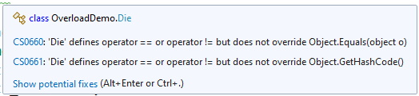
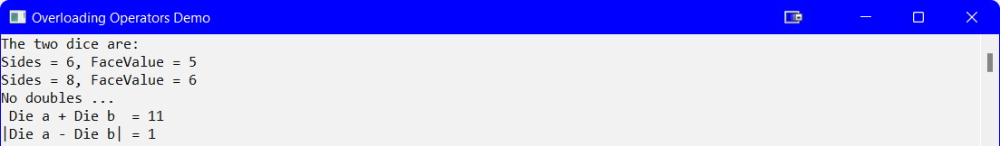

## Introduction
In procedural programming it is quite easy to perform mathematical operations on numerical data types. In OOP where the class contains numerical properties it becomes complex if we bring back the numerical properties and then perform the mathematical operations. Fortunatey, there is batter solution - perform the math inside the class definition.

## Demo
For this demo, you will resue the `Die` class created earlier. You will need to modify the class to add the overload operators. The modified `Die` class is shown below:

```csharp
namespace OverloadDemo
{
    public class Die
    {
        private Random rnd = new Random();
        //private member fields
        private int _sides;
        private int _faceValue;

        //public Accessors & Mutators
        public int Sides
        {
            get { return _sides; } // public Accessor
            //public Mutator
            set
            {
                if (value >= 4)
                {
                    _sides = value;
                }
                else
                {
                    throw new Exception("Invalid sides for a Die");
                }
            }
        }//end of Sides

        public int FaceValue
        {
            get { return _faceValue; }
            set
            {
                if (value > 0 && value <= _sides)
                {
                    _faceValue = value;
                }
                else
                {
                    throw new Exception("Invalid face value for a Die");
                }
            }
        }//end of FaceValue

        //Constructor(s)
        //Empty Constructor
        public Die()
        {
            Sides = 6;
            Roll();
        }

        //Greedy Constructor
        public Die(int sides)
        {
            Sides = sides;
            Roll();
        }

        //Class method(s)
        public void Roll()
        {
            FaceValue = rnd.Next(1, Sides + 1);
        }//end of Roll

        public override string ToString()
        {
            //return "Sides = " + Sides + ", FaceValue = " + FaceValue;
            return string.Format("Sides = {0}, FaceValue = {1}", Sides, FaceValue);
        }

        #region Overloaded Operators
        //1. Equality
        public static bool operator ==(Die a, Die b)
        {
            return a.FaceValue == b.FaceValue;
        }
        //2. Inequality
        public static bool operator !=(Die a, Die b)
        {
            return a.FaceValue != b.FaceValue;
        }
        //3. Addition
        public static int operator +(Die a, Die b)
        {
            return a.FaceValue + b.FaceValue;
        }
        //4. Subtraction
        public static int operator -(Die a, Die b)
        {
            return Math.Abs(a.FaceValue - b.FaceValue);
        }
        #endregion
    }//eoc
}//eon
```

_Note 1: You **must** have both the `==` and `!=` overloads if either one is present in the class._<br>
_Note 2: there are two warnings, `CS0660` and `CS0661` that can be ignored._



The program code looks like:

```csharp
namespace OverloadDemo
{
    class Program
    {
        static void Main(string[] args)
        {
            Setup();

            Die a = new Die();
            Die b = new Die(8);
            Console.WriteLine("The two dice are:\n{0}\n{1}", a, b);

            CheckForDoubles(a, b);

            Console.WriteLine($" Die a + Die b  = {a + b}");
            Console.WriteLine($"|Die a - Die b| = {a - b}");

            Console.ReadLine();
        }//eom

        static void CheckForDoubles(Die a, Die b)
        {
            //This method will check if the two dice are equal to each other
            // using an overloaded operator
            if (a == b)
            {
                Console.WriteLine("Doubles!");
            }
            else
            {
                Console.WriteLine("No doubles ...");
            }

        }//end of CheckForDoubles

        static void Setup()
        {
            Console.Title = "Overloading Operators Demo";
            Console.ForegroundColor = ConsoleColor.Black;
            Console.BackgroundColor = ConsoleColor.White;
            Console.Clear();
        }//end of Setup
    }//eoc
}//eon
```



#### [Advanced Home](index.md)
#### [CPSC1012 Home](../index.md)