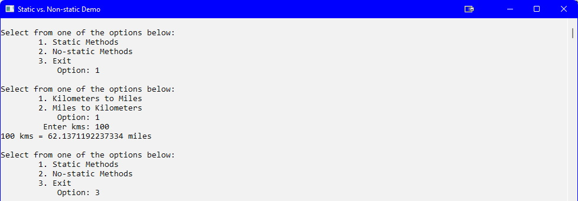
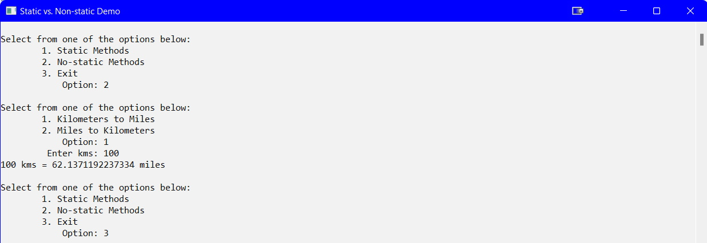
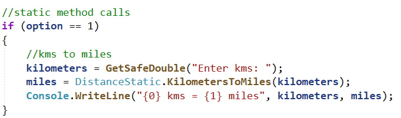
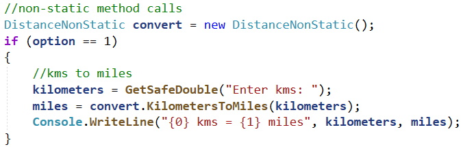

## Introduction
When the [Modularization](05-modules/) topic was covered, all the methods were declared as `static`. Yet, when the [OOP](09-oop/index.md) topic was covered, all the class methods were not. Why the difference? This advanced topic will demonstrate the difference.

## Sample Code

### Static Class

```csharp
namespace Static_vs_NonStatic_Demo
{
    public class DistanceStatic
    {
        public static double KilometersToMiles(double kilometers)
        {
            double miles;
            miles = kilometers * 0.621371192237334;
            return miles;
        }//end of KilometersToMiles

        public static double MilesToKilometers(double miles)
        {
            double kilometers;
            kilometers = miles * 1.609344;
            return kilometers;
        }//end of MilesToKilometers
    }//eoc
}//eon
```

### Non-Static Class

```csharp
namespace Static_vs_NonStatic_Demo
{
    public class DistanceNonStatic
    {
        public double KilometersToMiles(double kilometers)
        {
            double miles;
            miles = kilometers * 0.621371192237334;
            return miles;
        }//end of KilometersToMiles

        public double MilesToKilometers(double miles)
        {
            double kilometers;
            kilometers = miles * 1.609344;
            return kilometers;
        }//end of MilesToKilometers
    }//eoc
}//eon
```

### Main Program

```csharp
namespace Static_vs_NonStatic_Demo
{
    class Program
    {
        static void Main(string[] args)
        {
            Setup();
            int option,
                type;
            double miles,
                kilometers;

            do
            {
                DisplayTypeMenu();
                type = GetSafeInt("Option: ");
                if(type != 3)
                {
                    DisplayOptionMenu();
                    option = GetSafeInt("Option: ");
                    if(type == 1)
                    {
                        //static method calls
                        if (option == 1)
                        {
                            //kms to miles
                            kilometers = GetSafeDouble("Enter kms: ");
                            miles = DistanceStatic.KilometersToMiles(kilometers);
                            Console.WriteLine("{0} kms = {1} miles", kilometers, miles);
                        }
                        else
                        {
                            //miles to kms
                            miles = GetSafeDouble("Enter miles: ");
                            kilometers = DistanceStatic.MilesToKilometers(miles);
                            Console.WriteLine("{0} miles = {1} kms", miles, kilometers);
                        }
                    }
                    else
                    {
                        //non-static method calls
                        DistanceNonStatic convert = new DistanceNonStatic();
                        if (option == 1)
                        {
                            //kms to miles
                            kilometers = GetSafeDouble("Enter kms: ");
                            miles = convert.KilometersToMiles(kilometers);
                            Console.WriteLine("{0} kms = {1} miles", kilometers, miles);
                        }
                        else
                        {
                            //miles to kms
                            miles = GetSafeDouble("Enter miles: ");
                            kilometers = convert.MilesToKilometers(miles);
                            Console.WriteLine("{0} miles = {1} kms", miles, kilometers);
                        }
                    }
                }
            } while (type != 3);

            Console.ReadLine();
        }//eom

       static void Setup()
        {
            Console.Title = "Static vs. Non-static Demo";
            Console.ForegroundColor = ConsoleColor.Black;
            Console.BackgroundColor = ConsoleColor.White;
            Console.Clear();
        }//end of Setup

        static void DisplayOptionMenu()
        {
            Console.WriteLine("\nSelect from one of the options below:");
            Console.WriteLine("\t1. Kilometers to Miles");
            Console.WriteLine("\t2. Miles to Kilometers");
        }//end of DisplayOptionMenu

        static void DisplayTypeMenu()
        {
            Console.WriteLine("\nSelect from one of the options below:");
            Console.WriteLine("\t1. Static Methods");
            Console.WriteLine("\t2. No-static Methods");
            Console.WriteLine("\t3. Exit");
        }//end of DisplayTypeMenu

        static int GetSafeInt(string prompt)
        {
            int number = 1;
            bool isValid = false;
            do
            {
                try
                {
                    Console.Write("{0,20}", prompt);
                    number = int.Parse(Console.ReadLine());
                    if (number >=1 && number <= 3)
                    {
                        isValid = true;
                    }
                    else
                    {
                        Console.WriteLine("ERROR: Invalid number ... try again");
                    }
                }
                catch (Exception)
                {
                    Console.WriteLine("ERROR: Invalid number ... try again");
                }
            } while (!isValid);
            return number;
        }//end of GetSafeInt

        static double GetSafeDouble(string prompt)
        {
            double number = 1;
            bool isValid = false;
            do
            {
                try
                {
                    Console.Write("{0,20}", prompt);
                    number = double.Parse(Console.ReadLine());
                    if (number >= 0)
                    {
                        isValid = true;
                    }
                    else
                    {
                        Console.WriteLine("ERROR: Invalid number ... try again");
                    }
                }
                catch (Exception)
                {
                    Console.WriteLine("ERROR: Invalid number ... try again");
                }
            } while (!isValid);
            return number;
        }//end of GetSafeDouble

    }//eoc
}//eon
```

### Output



## What is the Difference?
The two outputs appear to be identical so what is the difference? Examining the first conversion you will see the following code for the static call:<br>


And the following for the non-static call:<br>


The difference is when the method is `static` you can access the method directly. If it is not declared as `static` you must create an instance (object) from the class before you can call the method.


#### [Advanced Home](index.md)
#### [CPSC1012 Home](../index.md)