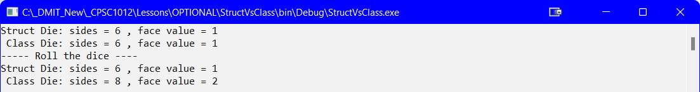

## Introduction
A Class is a reference types (passed by reference, or uses a pointer to a memory location), while a Struct is a value type (passes a copy; retains the original value).

## Die Class

```csharp
namespace StructVsClass
{
    public class DieClass
    {
        public int sides { get; set; }
        public int faceValue { get; set; }

        public DieClass(int sides)
        {
            this.sides = sides;
            faceValue = 1;
        }//eom
    }//eoc
}//eon
```

## Die Struct

```csharp
namespace StructVsClass
{
    public struct DieStuct
    {
        public int sides { get; set; }
        public int faceValue { get; set; }

        public DieStuct(int sides)
        {
            this.sides = sides;
            faceValue = 1;
        }
    }//eos
}//eon
```

## Main Program

```csharp
namespace StructVsClass
{
    class Program
    {
        static void Main(string[] args)
        {
            DieClass cDie = new DieClass(6);
            DieStuct sDie = new DieStuct(6);
            Console.WriteLine("Struct Die: sides = {0} , face value = {1}", sDie.sides, sDie.faceValue);
            Console.WriteLine(" Class Die: sides = {0} , face value = {1}", cDie.sides, cDie.faceValue);

            //
            // Attempt to modify the dice via methods
            //
            RollStructDie(sDie);
            RollClassDie(cDie);
            Console.WriteLine("----- Roll the dice ----");
            Console.WriteLine("Struct Die: sides = {0} , face value = {1}", sDie.sides, sDie.faceValue);
            Console.WriteLine(" Class Die: sides = {0} , face value = {1}", cDie.sides, cDie.faceValue);
            Console.ReadLine();
        }//eom

        public static void RollStructDie(DieStuct die)
        {
            die.sides = 8;
            die.faceValue = 2;
        }//eom

        public static void RollClassDie(DieClass die)
        {
            die.sides = 8;
            die.faceValue = 2;
        }//eom
    }//eoc
}//eon
```

### Output


## What Happened?
1. When the `RollStructDie` method was called, a copy of sDie was passed into the method. The copy was modified, but the original remained unchanged.
2. When the `RollClassDie` method was called, a pointer to the memory location of cDie was passed to the method. The method modified the contents of the memory location, thus we see the changed values for the cDie.


#### [Advanced Home](index.md)
#### [CPSC1012 Home](../index.md)