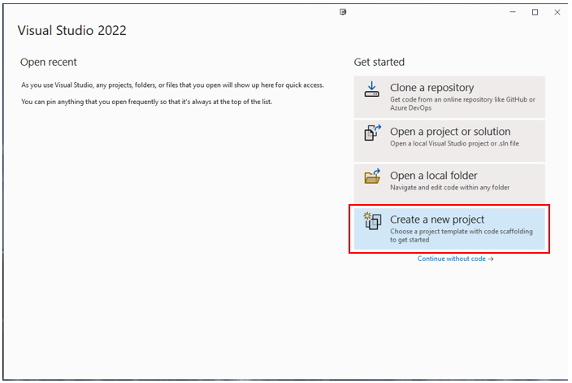
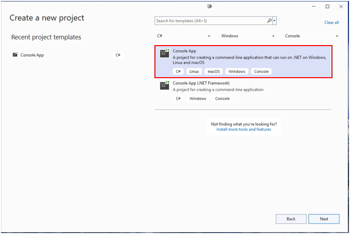
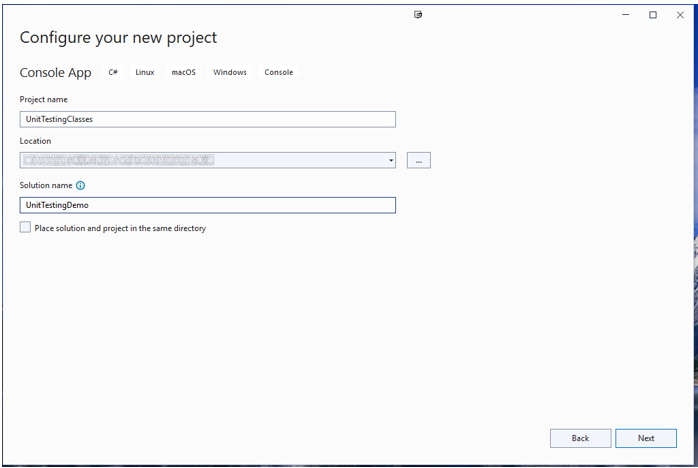
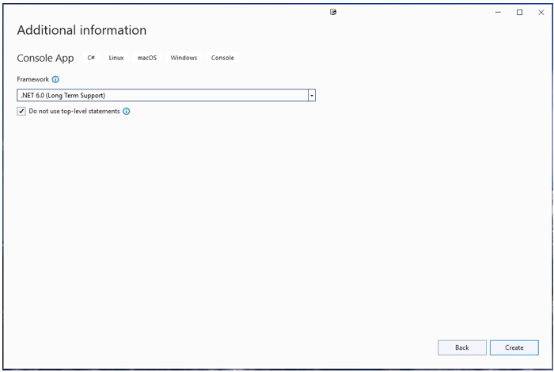
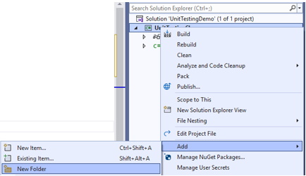
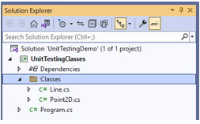
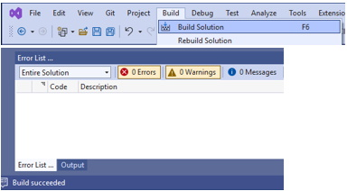

## Introduction
Unit Tests are a means of coding up a test plan for class-level methods.

## Steps
1. Open Visual Studio 200 and select **Create a new project**:<br>

2. Select **Console App** from the choices, and press **Next**:<br>

3. Give the _initial_ project name **UnitTestingClasses**, select your desired location, make sure the **Place solution and project in the same directory** checkbox is **unchecked** and change the Solution name to **UnitTestingDemo**:<br>

4. Ensure the **Additional information** screen is set as shown below, then press **Create**:<br>

5. Once the **Program.cs** file has been created, change the code to the following:<br>

```csharp
namespace UnitTestingClasses
{
    internal class Program
    {
        static void Main()
        {
            Console.WriteLine("Unit Testing Demo - Run the Test Explorer");
            Console.ReadLine();
        }
    }
}
```

6. It is ideal that all the classes that will be tested be created in a separate folder. Create a new folder in the **UnitTestingClasses** project called **Classes**:
  * Right-click the project name
  * Select **Add** then **New folder**<br>
  * Rename the folder to **Classes**
7. In the **Classes** folder, add the following two class files: **Point2D.cs** and **Line.cs**<br>
8. Each of these classes must be made **public** so they can be accessed from outside of the project namespace they are in. Modify the code in each file to be:
  * **Point2D.cs**<br>

  ```csharp
  namespace UnitTestingClasses.Classes
{
    public class Point2D
    {
        //private member fields
        private double _xValue;
        private double _yValue;

        //public properties - using auto-implemented properties as any number is valid
        public double XValue
        {
            get { return _xValue; }
            set { _xValue = value; }
        }//end of XValue

        public double YValue
        {
            get { return _yValue; }
            set { _yValue = value; }
        }//end of YValue

        //constructor
        public Point2D(double xValue, double yValue)
        {
            XValue = xValue;
            YValue = yValue;
        }//end of Point2D

        //Class Methods
        public Point2D MidPoint(Point2D pointB)
        {
            return new Point2D(0.5 * (XValue + pointB.XValue), 0.5 * (YValue + pointB.YValue));
        }//end of MidPoint

        public double SegmentLength(Point2D pointB)
        {
            return Math.Sqrt(Math.Pow(pointB.XValue - XValue, 2) + Math.Pow(pointB.YValue - YValue, 2));
        }//end of SegmentLength
    }
}
  ```

  * **Line.cs**:<br>

  ```csharp
namespace UnitTestingClasses.Classes
{
    public class Line
    {
        private Point2D _pointA;
        private Point2D _pointB;

        public Point2D PointA
        {
            get { return _pointA; }
            set { _pointA = value; }
        }//end of PointA

        public Point2D PointB
        {
            get { return _pointB; }
            set { _pointB = value; }
        }//end of PointB

        public Line(Point2D pointA, Point2D pointB)
        {
            PointA = pointA;
            PointB = pointB;
        }

        public double Slope()
        {
            return (PointA.YValue - PointB.YValue) / (PointA.XValue - PointB.XValue);
        }//end of Slope

        public double YIntercept()
        {
            return PointA.YValue - (Slope() * PointA.XValue);
        }//end of YIntercept

        public override string ToString()
        {
            return $"y = {Slope()}x + {YIntercept()}";
        }//end of ToString
    }
}
  ```

9. If everything has been typed/coded correctly, your solution should build without errors; you may receive some warnings which can be ignored.<br>