## Introduction
Unit Tests are a means of coding up a test plan for class-level methods.

## Steps
1.  Open Visual Studio 200 and select **Create a new project**: 

2.  Select **Console App** from the choices, and press **Next**: 

3.  Give the _initial_ project name **UnitTestingClasses**, select your desired location, make sure the **Place solution and project in the same directory** checkbox is **unchecked** and change the Solution name to **UnitTestingDemo**: 

4.  Ensure the **Additional information** screen is set as shown below, then press **Create**: 

5.  Once the **Program.cs** file has been created, change the code to the following: 

6. It is ideal that all the classes that will be tested be created in a separate folder. Create a new folder in the **UnitTestingClasses** project called **Classes**:
  * Right-click the project name
  * Select **Add** then **New folder** 
  * Rename the folder to **Classes**
7. In the **Classes** folder, add the following two class files: **Point2D.cs** and **Line.cs** 
8. Each of these classes must be made **public** so they can be accessed from outside of the project namespace they are in. Modify the code in each file to be:
  * **Point2D.cs**  
  * **Line.cs**:  
9. If everything has been typed/coded correctly, your solution should build without errors; you may receive some warnings which can be ignored. 
10. The next phase is to create a new project, in the same solution (and solution folder) to hold the testing environment. Right click the solution name and add a new project: 

11. The project type will be a ***NUnit Test Project***: 

12. The name of this project will be **UnitTests**, (**do not** change the location) and press **Next**: 

13. Accept the **Additional information** then press **Create**: 
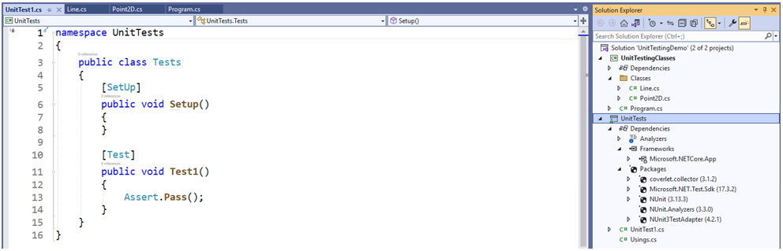 
***Note***_: The figure, above, shows an expanded view that displays the additional packages added to this new project to enable unit testing._
14. The first thing to do is add a reference to this new project so it can find the project that contains the classes to test:
  * Right-click the project name, select **Add** then **Project Reference...**: 
  * There should only be one project listed, thus select it, and press **OK**: 
15. Just adding the reference to the project is not sufficient for the test project to access the classes in the other project. Add the following line of code above the **namespace** in the **UnitTest1.cs** code file (initially this will be _greyed_ out, but that will change once more code is added): 
16. Inside the  replace the code with this first block of code (ignore any warning messages): 
 
The code above creates a test method with some sample test data. The first 2 lines inside the method create instance of the **Point2D** class. Following these lines, the code line runs the actual code in the **Point2D** class. Finally, there is a code line to see if what we expect from our test plan, **expected**, is the same as the **actual** value.
17. To execute the test method created above select the **Test** menu item and run the **Test Explorer**: 

18. The **Test Explorer** should initially show the following: 
 
Running the tests should give results like the following: 

19. More tests can be added to test the method. Change the test line to that shown below and re-run the test method: 
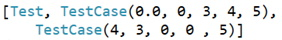 
The results should be like those shown below: 
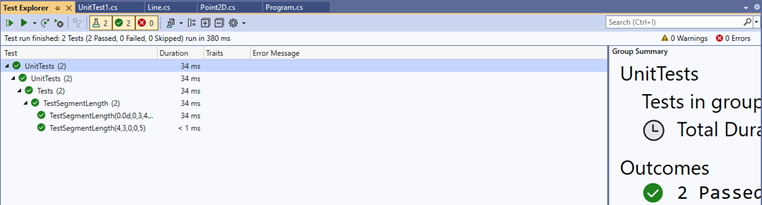
20. It would make sense to test the other class methods of the **Point2D** class, therefore add the following test method below the existing method in the **UnitTest1.cs** class file: 

21. Re-run the tests in the **Test Explorer** to see something like the following: 
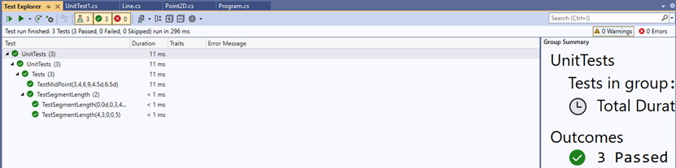
22. What happens if a test fails? Change the test cases for this second test method to that shown below and re-run the **Test Explorer**: 
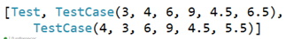 
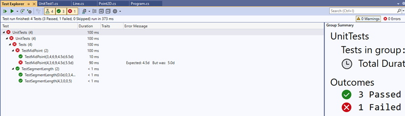 
The error is either the test data was incorrect (manual calculations gave the wrong answer) or the class method being tested has a logic error. Which is it? The first step is to double-check the expected results from the given test data. 

23. It now appears that the second set of test data was incorrect for the expected results therefore change the second **TestCase** (right-click on the failed test to run just that test) to that shown below and re-run the failed test: 
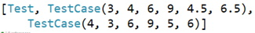 
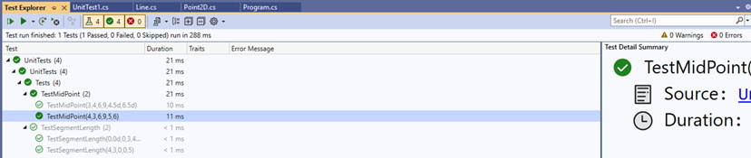
24. Now that it is shown that unit tests can be created and run, and failed tests can be checked, add the following test methods to the **UnitTest1.cs** class file and re-run the **Test Explorer**: 
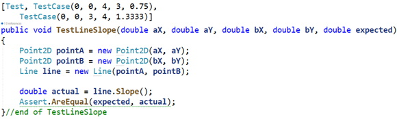 
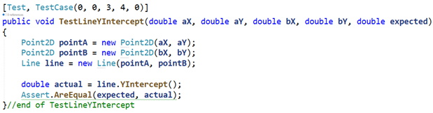 
The results should look like the following: 
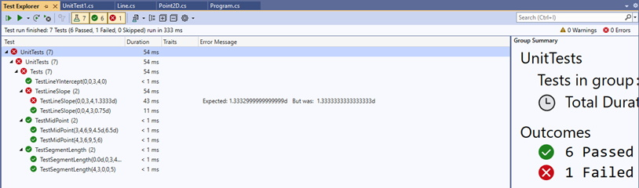
25. Oops! There seems to be a problem with one set of test data. Why nis that? The answer is that the expected value was rounded to 4 decimal places and the line  expects an exact numerical match to pass the test; even though the results are very close the test fails. [_Note: Floating point math in C# is not always accurate, thus rounding errors tend to appear._] When such an error occurs, it is a good practice to use the **Math.Round()** method. Change the test code to that shown below and re-run the failed test: 
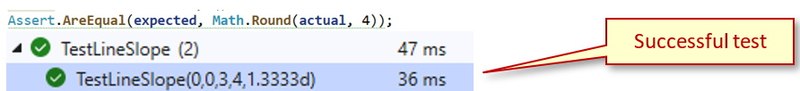

## Summary
This demo walked through creating a test project, writing unit tests, executing the unit tests, and resolving failed tests. As the main project is still a console application, once all the tests pass any code needed for the application to produce the desired results should produce said results. Currently the console application only gives the following: 
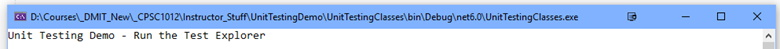

#### [Advanced Home](index.md)
#### [CPSC1012 Home](../index.md)
