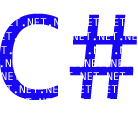

 **Programming Fundamentals**

## Topics
_NOTE: Some of the lessons are still under development. They will be added when completed._ 
[Introduction to Programming](01-intro-to-programming/) 
[Sequence Structure](02-sequence/) 
[Decision Structures](03-decisions/) 
[Looping Structures](04-looping/) 
[Modularization](05-modules/) 
[Exception Handling](06-exceptions/) 
[Arrays](07-arrays/) 
[File I/O](08-file-io/) 
[Object Oreiented Programming (OOP)](09-oop/) 
[Collection Classes](10-collection-classes/)

### [Advanced Topics](advanced-topics/index.md)
### [References](references/)

#### [Home](../)
