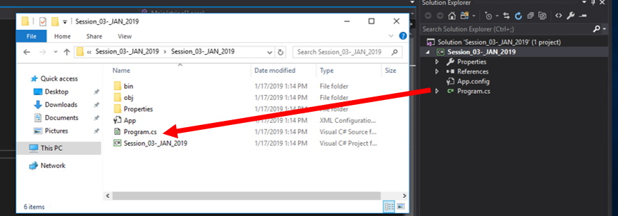

## Introduction
There is a right way and a wrong way to open the C# files you will be creating in this course. This document outlines these methods.

Here is the main Solution folder, with all our files inside: 

Here is the folder as it is shown in the solution explorer in Visual Studio: 

The **.sln** file is in the top level because it associates all the solution files, and background references inside it. It is the file you want to open to have everything.

If you go another level lower: 

If you make this mistake, you will only get the “Attach” you see as described below: 

You need to go back up one level and double click the **.sln** file with the solution name so you get all the background files and associations that you need for the solution and project.

#### [References Home](index.md)
#### [CPSC1012 Home](../)