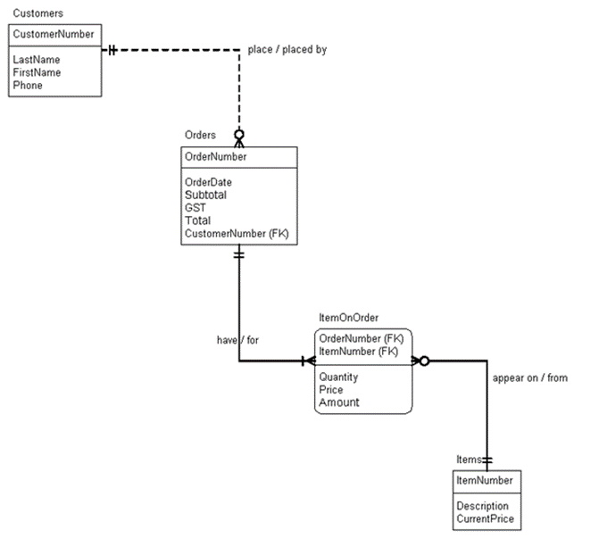
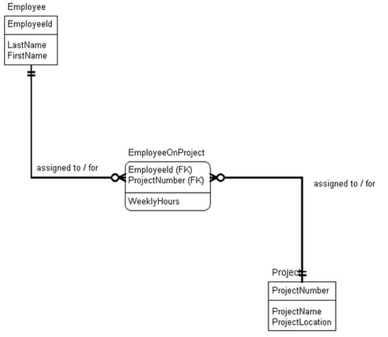
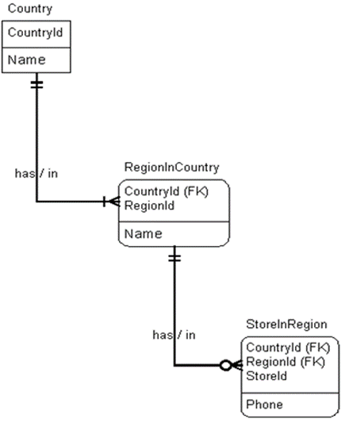
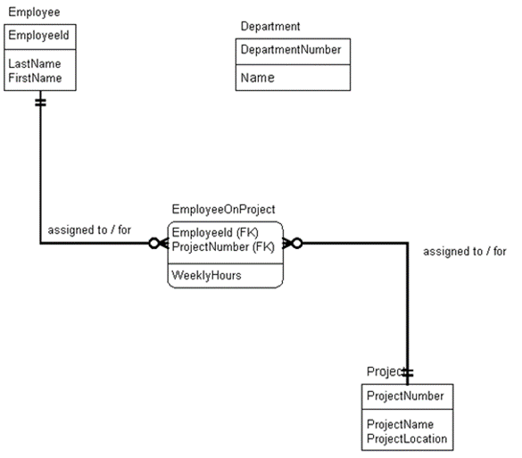

## Topics on this page:
* [Basic Table Definition](#basic)
* [CREATE TABLE Syntax](#create)
* [Verifying Your Table](#verify)
* [DROP Statement](#drop)
* [Constraints](#constraints)
  * [PK Constraints](#pk)
  * [FK Constraints](#fk)
  * [CHECK Constraints](#check)
  * [LIKE Operator](#like)
  * [Testing a CHECK Constratint](#testing)
  * [DEFAULT Constraint](#default)
* [DDL Practice](#practice)

## <a ID="basic">Basic Table Definition</a>
* Data are stored in tables
* A table is a _2D array_ and consists of rows & columns:
  * Each `column` records **one attribute**
  * Each `row` records **all** attributes for **one instance**
* In SQL we use `CREATE TABLE` statements to create a table object in a database, which includes:
  * The `name` of the `table`
  * The `name` of each `column`
  * The [`data type`](../references/sql-data-types.md) of each `column`
  * Whether `NULL` is a **acceptable value** for the`column`
  * Any othere `CONSTRAINT`S that must hold **true** for a column

## <a ID="create">CREATE TABLE Syntax</a>

```sql
CREATE TABLE TableName (
    Column1 DATATYPE [IDENTITY [(seed, increment)]] | [NULL | NOT NULL] [<column constraints>],
    Column2 DATATYPE [IDENTITY [(seed, increment)]] | [NULL | NOT NULL] [<column constraints>],
    Column3 DATATYPE [IDENTITY [(seed, increment)]] | [NULL | NOT NULL] [<column constraints>],
    ...  
    [<table constraints>]
) 
```

OR

```sql
CREATE TABLE TableName (
    Column1 DATATYPE,
    Column2 DATATYPE,
    Column3 DATATYPE,
    ...  
) 
```

For example, using the ERD<br>


We can write the table creation SQL as follows:

```sql
-- Create the Customers table
CREATE TABLE Customers (
	CustomerNumber	       INT IDENTITY(1,1)	NOT NULL,
	LastName		VARCHAR(100)		NOT NULL,
	FirstName		VARCHAR(100)		NOT NULL,
	Phone			CHAR(8)		        NULL
)

-- Create the Orders table
CREATE TABLE Orders (
	OrderNumber		INT IDENTITY(1,1)	NOT NULL,
	OrderDate		SMALLDATETIME		NOT NULL,
	CustomerNumber	       INT			NOT NULL,
	Subtotal		MONEY			NOT NULL,
	GST			MONEY			NOT NULL,
	Total 	 		MONEY			NOT NULL
)

-- Create the Items table
CREATE TABLE Items (
	ItemNumber		INT IDENTITY(1,1)	NOT NULL,
	Description	       VARCHAR(100)		NOT NULL,
	CurrentPrice	       SMALLMONEY		NOT NULL
)

-- Create the ItemsOnOrder table
CREATE TABLE ItemOnOrder (
	OrderNumber		INT			NOT NULL,
	ItemNumber		INT			NOT NULL,
	Quantity		SMALLINT		NOT NULL,	
	Price			SMALLMONEY		NOT NULL,
	Amount 			MONEY			NOT NULL
)
```

## <a ID="verify">Verifying Your Table</a>
After a table has been created, use the system Stored Procedure `SP_HELP` to list the table definition.

The syntax to run a Stored Procedure is:

```sql
EXEC ProcedureName [parameter1, parameter2, ...]
```

So, the syntax to run this Stored Procedure is:

```sql
EXEC SP_HELP Customers
```

## <a ID="drop">DROP Statement</a>
The `DROP TABLE` statement is used to **delete** a table (both is data and its definition). The syntax is:

```sql
DROP TABLE TableName
```

e.g., to drop the `Items` table:

```sql
DROP TABLE Items
```

**Practice**:


1. Create a script that will create the 3 tables above:<br>
    <ol type="a">
        <li>Use appropriate data types</li>
        <li>Do not worry about defining `PK`s or `FK`s</li>
        <li>Do not allow `NULL`s in any column</li>
        <li>`EmployeeID`s are 11 characters long</li>
        <li>Use the identity property for ProjectNumber in the Project table, but not in the EmployeeOnProject table (why?)</li>
    </ol>
2. List the table definition
3. Save your script

## <a ID="constraints">Constraints</a>
Constraints are used for:
1. Define the `PK`
  * This is defined by the [`PRIMARY KEY`](#pk)
2. Define **relationships**
  * This is defined by the [`FOREIGN KEY`](#fk) constraint
3. Define **defualt values**
  * Defined by the [`DEFAULT`](#default) constraint
4. Define the **domain of valid values**
  * Defined by the [`CHECK`](#check) constraint
5. Ensure that **all values in a column are unique**

### Setting Constraints
1. When the table is initially created, using the `CREATE TABLE` statement, or
2. On an already existing table, using the `ALTER TABLE` statement

Each constraint must have a unique name, and we will use prefixes to identify each type: `PK`, `FK`, `CK`(CHECK), and `DF`(DEFAULT)

### <a ID="pk">PK Constraints</a>
In a normalized database design, all tables must have the `PK` constraint.

Any column that acts as a `PK` must be defined as `NOT NULL`.

#### Primary Key Syntax: (column-level constraint)
Syntax:

```sql
CONSTRAINT PK_ConstraintName PRIMARY KEY CLUSTERED
```

Example:

```sql
CREATE TABLE Student (
    StudentId 	CHAR(9)		NOT NULL CONSTRAINT PK_Student PRIMARY KEY CLUSTERED,
    LastName    VARCHAR(20)	NOT NULL,
    FirstName   VARCHAR(15)	NOT NULL)
```

#### Primary Key Syntax: (table-level constraint)
What about tables with composite keys?

Example:

```sql
CREATE TABLE Marks (
    StudentId 	CHAR(9)		NOT NULL,
    CourseId	CHAR(6)		NOT NULL,
    Mark	SMALLINT	NULL,
    CONSTRAINT PK_Marks PRIMARY KEY CLUSTERED (StudentId, CourseId))
```

**Practice**:

1. Modify the script that defines the `Employee`, `Project`, and `EmployeeOnProject` tables to include the necessary `PK` constraint definitions.
2. Use the `SP_HELP` procedure to retrieve a description.
3. Save your script.

### <a ID="fk">FK Constraints</a>
The `FK` constraint defines a relationship between rows, and defines a parent-child relationship between tables.

This affects:
1. Dropping tables
2. Creating tables
3. Inserting/updating/deleting rows in tables

#### FK Constraints & Referential Integrity
You must `DROP` a child table before you `DROP` its parent table.

You must `CREATE` a parent table before you `CREATE` its child table.

The value of a column acting as a `FK` must be either:
* A value that exists as a `PK` in the associated parent table
* `NULL`

For example, given the ERD below:<br>


1. `DROP TABLE StoreInRegion`
2. `DROP TABLE RegionInCountry`
3. `DROP TABLE Country`
4. `CREATE TABLE Country (...)`
5. `CREATE TABLE RegionInCountry (...)`
6. `CREATE TABLE StoreInRegion (...)`

#### Data Types
`FK`s must have the same datatype as its associated `PK`.

Syntax:

```sql
CONSTRAINT FK_ConstraintName
	[FOREIGN KEY (Column1[, ... Column16] ]
	REFERENCES TableName (Column1 [, ... Column16] )
```
**RegionInCountry Example**: Using the ERD show earlier:

```sql
CREATE TABLE RegionInCountry (
	CountryId	SMALLINT		NOT NULL
		CONSTRAINT FK_RegionInCountryToCountry
		    REFERENCES Country (CountryId),
	RegionId	SMALLINT		NOT NULL,
	Name		VARCHAR(100) 	        NOT NULL,
	CONSTRAINT	PK_CountryId_RegionId
	    PRIMARY KEY CLUSTERED (CountryId, RegionId)
)
```

**StoreInRegion Example**

```sql
CREATE TABLE StoreInRegion (
	CountryId	SMALLINT		NOT NULL,	
	RegionId	SMALLINT		NOT NULL,	
	StoreId		SMALLINT		NOT NULL,
	Phone		VARCHAR(100) 	        NOT NULL,
	CONSTRAINT	PK_CountryId_RegionId_StoreId 
	    PRIMARY KEY CLUSTERED (CountryId, RegionId, StoreId),
	CONSTRAINT	FK_StoreInRegionToRegionInCountry
	    FOREIGN KEY (CountryId, RegionId)
	    REFERENCES RegionInCountry (CountryId, RegionId)
)
```

#### Exercise

1. Modify the script that defines the `Employee`, `Project` and `EmployeeOnProject` tables to include the necessary `Foreign Key` constraint definitions.  
2. Create the `Department` table as a stand-alone table for now (no relationships to other tables).  Use the `IDENTITY` property for the `DepartmentNumber`.    


### <a ID="check">CHECK Constraints</a>

### <a ID="like">LIKE Operator</a>

### <a ID="testing">Testing a CHECK Constraint</a>

### <a ID="default">DEFAULT Constraint</a>

## <a ID="practice">DDL Practice</a>

### [DMIT1508 Home](../)