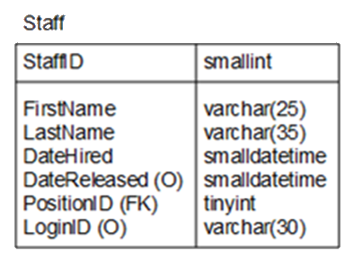
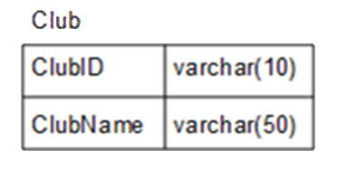

## Topics on this page:
* [INSERT](#insert)
* [UPDATE](#update)
* [DELETE](#delete)

## <a ID="insert">INSERT</a>
The INSERT statement adds 1+ rows to a table. It can include hard-coded values, or can use subqueries to retrieve data from other tables.

```sql
INSERT [INTO] TableName
[(column list)]
{VALUES
({DEFAULT | NULL | expression}, . . . )
|
SELECT ... }
```

If the statement supplies data that does not comply with constraints, or the data is incompatible with the data type of the column, the statement **fails**.

**Example**:


Given the staff table as defined here, we would add a new staff record like this:

```sql
INSERT INTO Staff (FirstName, LastName, DateHired, DateReleased, PositionID, LoginID)
VALUES ('Jason', 'Teachalot', 'Jan 1 2013', NULL, 4, NULL)
```

Instead of _hardcoding_ the PositionID, we could do this:

```sql
INSERT INTO Staff (FirstName, LastName, DateHired, DateReleased, PositionID, LoginID)
VALUES ('Jason', 'Teachalot', 'Jan 1 2013', NULL,
(SELECT PositionID FROM Staff WHERE FirstName = 'Robert' and LastName = 'Smith'), NULL)
```

### Examples using DEFAULT values:

```sql
INSERT INTO Staff (FirstName, LastName, DateHired, DateReleased, PositionID, LoginID)
VALUES ('Jason', 'Teachalot', DEFAULT, NULL, 4, NULL) 
```

or

```sql
INSERT INTO Staff (FirstName, LastName, DateReleased, PositionID, LoginID)VALUES ('Jason', 'Teachalot', NULL, 4, NULL)
```

### INSERT using SELECT
Rather than hard-cording a specific number of values, we can `INSERT` from a `SELECT` statement!

```sql
INSERT INTO Student (FirstName, LastName)
SELECT FirstName, LastName FROM Employee
```

## <a ID="update">UPDATE</a>
The UPDATE statement updates existing data in the table. It can update one or more columns. Data can be updated by providing new values for columns or using subqueries to provide the data.

```sql
UPDATE	TableName
SET Column1 = expression[, Column2 = expression … ]
[WHERE … ]
```

**Examples**:
Update the `Course` table and set `MaxStudents` to `3` for `CourseID` DMIT101:

```sql
UPDATE Course
SET MaxStudents = 3
WHERE CourseID = 'DMIT101'
```

Update the `Course` table and increase the `Cost` of DMIT108 by 10%:

```sql
UPDATE Course
SET Cost = Cost * 1.1
WHERE CourseID = 'DMIT108'
```

Update the `Course` table and set the `Cost` of DMIT170 to be the same as DMIT254:

```sql
UPDATE Course
SET Cost = (SELECT Cost FROM Course
            WHERE CourseID = 'DMIT254')
WHERE CourseID = 'DMIT170'
```

Update `CourseHours`, `MaxStudents`, and `Cost` columns for `CourseID` DMIT 101:

```sql
UPDATE Course
SET
    CourseHours = 4,
    MaxStudents = 5,
    Cost = 300
WHERE CourseID = 'DMIT101'
```

## <a ID="delete>DELETE</a>
The `DELETE` statement removes rows from a table.

```sql
DELETE [FROM]	TableName
[WHERE … ]
```

**Examples**:


Delete all records in the `Club` table:

```sql
DELETE FROM Club
```

or

```sql
DELETE Club
```

Delete the record where the `ClubID` is ACM:

```sql
DELETE FROM Club
WHERE ClubID = 'ACM'
```

Delete all `Payment` records that are less than the average payment amount:

```sql
DELETE FROM Payment
WHERE Amount < (SELECT AVG(Amount) FROM Payment)
```

### [DMIT1508 Home](../)