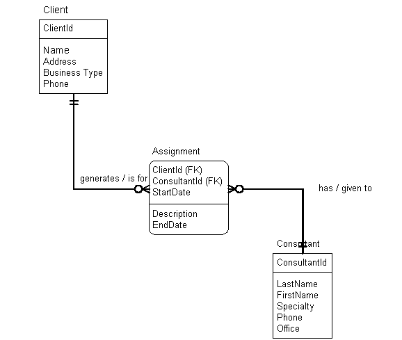
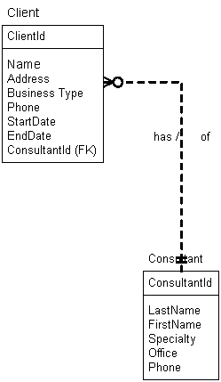

## Normalization: How
Large tables with many columns can be difficult to understand and increase redundant data within the database as well as increase the likelihood of anomalies occurring. The normalization process provides database designers with a systematic method of breaking down large tables into a group of related, smaller sized tables which:
* Are easier to understand.
* Minimize the amount of redundant data stored in the database.
* Minimize the likelihood of anomalies occurring within the data.

The normalization process is based on a set of rules for designing relational databases enables and the database to be in one of five states:
* First normal form (1NF)
* Second normal form (2NF)
* Third normal form (3NF)
* Boyce-Codd normal form
* Fourth normal form (4NF)
* Domain-Key normal form

Each normal form represents a set of rules. If a database is in a particular normal form, e.g., third normal form, then all its tables comply with the rules for the normal form. First, second and third normal forms are based on E.F. Codd’s initial set of rules for normalization. Over time additional normal forms have been developed to address problems, which were not addressed by Codd’s initial forms. Boyce-Codd normal form is a revision of Codd’s initial third normal form. Fourth normal form is an additional set of rules. Domain-Key normal form is a theoretical ultimate in relational database design proposed by Fagin in 1981. There is no defined method to consistently produce tables in Domain-Key normal form, so it remains a work in progress.

Each normal form enables you to create more tables with smaller number of columns in each table. As the number of tables in the database increases data redundancy and the likelihood of an anomaly occurring decreases. This makes the database easier to maintain. Unfortunately, as the number of tables rise the overhead increases. Performance can suffer, particularly if there are high volumes of rows in the tables. Normalization is a tradeoff between ease of maintenance and performance. Third normal form strikes the best balance (for most applications) between maintenance and performance requirements. Most relational databases are designed to comply with the rules of third normal form.

### Denormalization
The term denormalization is used to describe the process where after you have completed a database design that meets the rules of normalization you adjust the design and introduce violations to a normal form.

This may be done to make the database more efficient or easier to use. We will introduce a final database design with the IQ School database that will contain a solution that is not fully normalized.

### Normal Forms Based on Keys and Business Rules
Before looking at the specific rules of the normal forms we must understand that normal forms are based on two critical concepts.

First, a primary key uniquely identifies a row in a table. Every table has a primary key. If a mistake is made in selecting the primary key for a table, the normalization process will not produce a good database design.

The database design must reflect the business policies (rules) of the organization. The database designer must have a clear understanding of an organization’s business rules to apply the rules of normalization in a manner that produces a database design, which reflects the business policies of the organization. This is best demonstrated by an example.

Consider the database design for an assignment tracking application for a consulting firm. The database will record information about the firm’s consultants, clients and which consultants are assigned to work with a given client. The firm may have a business policy that a client can be served by many different consultants based on a match between the type of service the client requests and the specialty of the consultant. The database design shown below would reflect this business policy. 

The business policy results in a many to many relationship between clients and consultants (one consultant can serve many clients and a single client can receive services from many consultants). This causes the normalization process to create the `Assignment` table with a primary key of `ClientId`, `ConsultantId` and `StartDate`; the combination of `ClientId`, `ConsultantId` and `StartDate` uniquely identifies an individual assignment.

If a different business policy were in place the normalization process would produce a different database design. Suppose the policy was that a client is permanently assigned to one consultant who will provide all services requested by the client. This results in a one-to-many relationship between consultants and clients (a client works with a single consultant, but a single consultant can work with many clients). The following database design would emerge: 

Note that the `Assignment` table is no longer required to track which consultant is assigned to which client as there will only be one consultant working with a given client.

### The Rules of the Normal Forms
The normalization process lets us systematically break down large tables to many smaller ones. We typically apply the normalization process to each view (subset of data, which facilitates one specific task) in the application. This provides a database design for each individual view. The views are then merged to produce a single logical design for the entire database that accommodates the requirements of all the individual views.

We shall now work through an example view and apply the rules of first, second and third normal forms to produce a schema for the view in third normal form. We start with a source document of some sort, which describes the data required by the view, and use it to define a single table that contains all the data required by the view. We then apply the rules of normalization (first, second then third normal form) to break the single table into many smaller, related tables.

#### Example: Employee Workload
The employee workload is a display, which lets a manager determine the department an employee is assigned to within the company and the projects the employee is currently working on. This information helps the manager assign employees to new projects that are taken on by the company. A sample employee workload screen layout is shown below:

### [DMIT1508 Home](../)