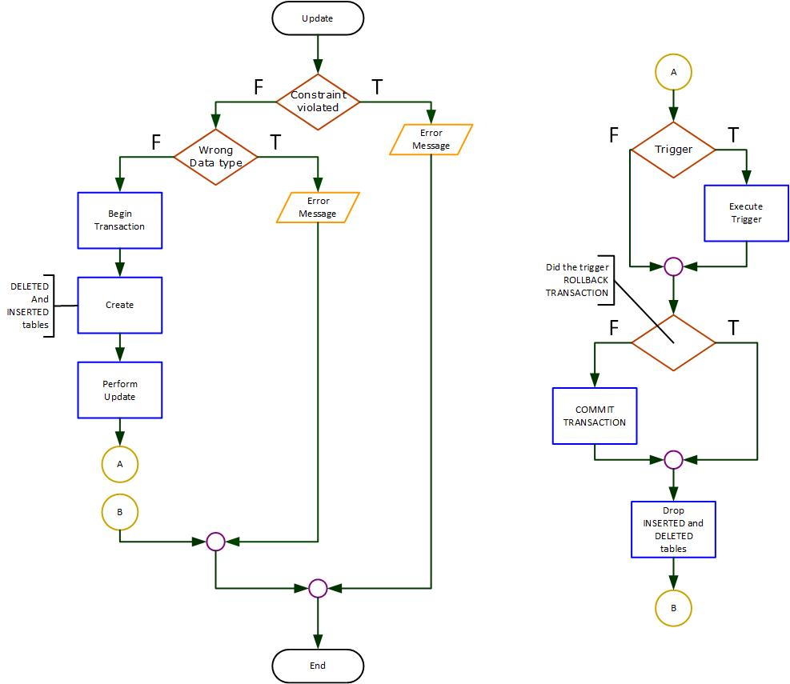

## Topics on this page
* [What & Why of Triggers](#whatwhy)
* [Temporary Tables](#temp)
* [Trigger Execution](#execute)
* [Trigger Syntax](#syntax)
* [Considerations](#considerations)
* [Practice](#practice)

## <a ID="whatwhy">What & Why of Triggers</a>
Triggers are objects that are stored in the database, that execute when they are triggered by a specific DML statement.

For example, we could create a trigger that is associated with an `INSERT` operation on the `Staff` table. Every time we execute an `INSERT` on the `Staff` table, the code in that trigger will execute.

**Triggers cannot be explicitly executed, and cannot accept parameters.**

Triggers can help us to
1. Enforce referential integrity across databases
2. Enforce business rules (too complex for `CK` constraint)
3. Automate an operation (backup, archive)
4. Create an audit trail



## <a ID="temp">Temporary Tables</a>
Two temporary tables are created and used by the server when executing a DML operation.
* `DELETED`: contains the **before** image of all rows affected
* `INSERTED`: contains the **after** image of all rows affected

We will use the term "base table" to refer to the table the trigger is associated with.

### Temporary tables for INSERT
If the trigger is associated with an `INSERT` on the base table:
* `INSERTED` contains the new rows
* `DELETED` is empty
*  Base table contains the new rows and all previously existing rows

### Temporary tables for a DELETE
If the trigger is associated with a `DELETE` on the base table:
* `DELETED` contains the deleted rows
* `INSERTED` is empty
* Base table contains all the rows that were not deleted.

### Temporary tables for UPDATE
If the trigger is associated with an `UPDATE` on the base table:
* `DELETED` contains the **before** image of the changed rows
* `INSERTED` contains the **after** image of the changed rows
* Base table contains the after image of the changed rows and all other rows not affected by the operation.

## <a ID="execute">Trigger Execution</a>
When can a trigger execute?
* When the DML operation affects zero rows in the base table
* When the DML operation affects one row in the base table
* When the DML operation affects many rows in the base table

The logic **must work in all three conditions**.

## <a ID="syntax">Trigger Syntax</a>
Syntax:

```sql
CREATE TRIGGER TriggerName
    ON TableName
    FOR [UPDATE][,] [INSERT][,] [DELETE]
AS
    -- SQL statements go here
RETURN
```

**Examples**:
To create a trigger for the `INSERT` and `UPDATE` operations associated with the `Staff` table:

```sql
CREATE TRIGGER TR_Staff_Insert_Update
    ON Staff 
    FOR INSERT, UPDATE
AS
    -- SQL statements go here
RETURN
```

To create a trigger for the `DELETE` operation associated with the `Student` table:

```sql
CREATE TRIGGER TR_Student_Delete
    ON Student 
    FOR DELETE	
AS
    -- SQL statements go here
RETURN
```

### More Syntax

```sql
DROP TRIGGER TriggerName

ALTER TRIGGER TriggerName
    ON TableName
    FOR [UPDATE][,] [INSERT][,] [DELETE]	
AS
    -- SQL statements
RETURN
```

## <a ID="considerations">Considerations</a>
### Dropping Tables
If you drop a table that has triggers associated with it, the triggers are dropped as well.

**Triggers cannot exist without the table it is associated with.**

### Viewing Triggers
To see a list of triggers in your database:

```sql
SELECT Name 
FROM SysObjects 
WHERE Type = 'TR'
```

To see the source code of a trigger:

```sql
EXEC SP_HELPTEXT TriggerName
```

## <a ID="practice">Practice</a>
### Practice Q #1 - How to test
To test:
1. Issue an update to the `BalanceOwing` column that **violates the data type** of the column being updated.
2. Issue a valid update to the character wages that affects **one row**.
3. Issue a valid update to the character wages that affects **multiple rows**.
4. Issue a valid update to the character wages that affects **zero rows**

**MovieCharacter ERD**:<br>


### Practice Q #2
Create a trigger to enforce a rule that `CharacterWages` must be `>= 0`.

### Practice Q #3
Create a trigger that enforces a rule that an **`AgentFee` cannot be increased by more than 100% in one update**.

e.g., if the `AgentFee` was $100, I cannot update it to a value greater than $200.

### Practice Q #4
Create a trigger that enforces a rule that a `MovieCharacter` cannot be deleted if their Agent's `AgentFee` is `>= 50`.

### Practice Q #5
Create a trigger that enforces a rule that an `Agent` cannot represent more than 2 movie characters.

### Practice Q #6
Create a trigger to Log when changes are made to the `CourseCost` in the `Course` table. The changes will be inserted in to the following Logging table:

```sql
CREATE TABLE CourseChanges(
    LogID           INT IDENTITY(1,1)  NOT NULL
        CONSTRAINT PK_CourseChanges PRIMARY KEY CLUSTERED,
    ChangeDate      DATETIME           NOT NULL,
    OldCourseCost   MONEY              NOT NULL,
    NewCourseCost   MONEY              NOT NULL,
    CourseID        CHAR(7)            NOT NULL
)
```


### Practice Q #7
Create a trigger to **enforce referential integrity between the `Agent` and `MovieCharacter` table**.

#### [DMIT1508 Home](../)