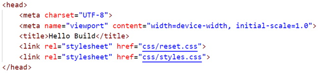
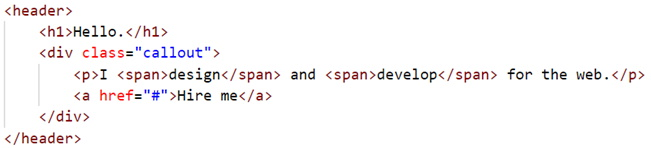
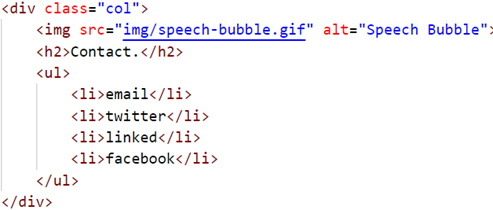
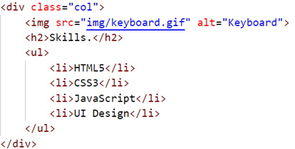
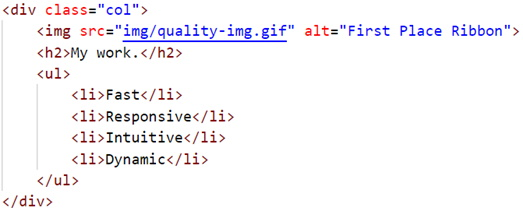
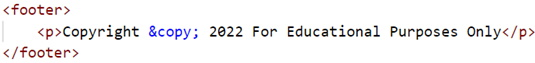

The following file is required for this lesson:
* [hello-build-style-guide.zip](files/hello-style-guide.zip)

## Review Instructions
You can follow along with your instructor to compare this build to the one you completed. The completed build should look like:

 

_NOTE: There is a hover effect on **Hire me**._

## Steps - HTML
1. The `<head>` block: 

2. The `<body>` block in the container **`
`**: 
    <ol type="a">
        <li>&lt;header&gt; 
        
        </li>
        <li>Add a &lt;section&gt; block</li>
        <li>Add a &lt;div&gt; for the first column: 
        
        </li>
        <li>Add a &lt;div&gt; for the second column: 
        
        </li>
        <li>Add a &lt;div&gt; for the third column: 
        
        </li>
        <li>Add a &lt;footer&gt; below the &lt;/section&gt;: 
        
        </li>
    </ol>

## Steps - CSS
Add the style rules as follows:
1. Body: 
    <ol type="a">
        <li>Background color</li>
        <li>Font color</li>
        <li>Font family</li>
    </ol>
2. Header/Banner section: 
    <ol type="a">
        <li>Heading
            <ol type="i">
                <li>Font size</li>
                <li>Font styling</li>
            </ol>
        </li>
        <li>Paragraph
            <ol type="i">
                <li>Font colors</li>
                <li>Font styling</li>
            </ol>
        </li>
        <li>Hyperlink
            <ol type="i">
                <li>Styling</li>
                <li>Hover effect</li>
            </ol>
        </li>
    </ol>
3. Main: 
    <ol type="a">
        <li>Section with 3 div elements each representing a column
            <ol type="i">
                <li>Flex container</li>
                <li>Spacing around</li>
                <li>Spacing between columns</li>
            </ol>
        </li>
        <li>Each div needs styling for:
                <ol type="i">
                    <li>Background color</li>
                    <li>Center align text</li>
                    <li>Font sizing</li>
                </ol>
        </li>
    </ol>
4. Footer: 
    <ol type="a">
        <li>Font styling</li>
        <li>Sapcing around and inside</li>
        <li>Background color</li>
    </ol>

## Validation
1.	Validate your html using [https://validator.w3.org/](https://validator.w3.org/){:target="_blank"}.
2.	Check your document outline using [https://gsnedders.html5.org/outliner/](https://gsnedders.html5.org/outliner/){:target="_blank"}.

### References
* [HTML Refresher](files/dmit1530-week-01-html-refresher.pdf){:target="_blank"}
* [CSS Refresher](files/dmit1530-week-01-css-refresher.pdf){:target="_blank"}
* [Photoshop Refresher](files/dmit1530-week-01-photoshop-refresher.pdf){:target="_blank"}
* [Emmet Cheatsheet](files/emmet-cheatsheet.pdf){:target="_blank"}

### [Module Home](../module1.md)
### [DMIT1530 Home](../../)