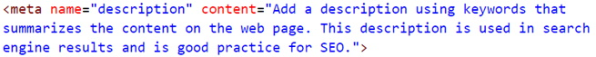

The following files are required for this lesson:
* [demo-reset.zip](files/demo-reset.zip)
* [demo-box-sizing.zip](files/demo-box-sizing.zip)

## Introduction
This lesson will be in two parts:
* [Part 1: - Demo Resets](#resets)
* [Part 2: - Demo Box Sizing](#box)

## Demo Instructions
You can follow along with your instructor to complete this build and/or you can use this document as a guide in completing the demo build.

## Steps - <a ID="resets">Part 1</a>: Demo Resets
1.	Download the **demo-reset.zip** file from and extract its contents to a folder named **demo-reset**.
2.	Open **index.html** in your browser to see something like: 

3.	In your code editor you will see the following code: 

4.	Uncomment the first stylesheet link for **reset.css**, save and refresh the browser to see: 
 
**Question**: What happened?
5.	Have a look at the **reset.css** code to verify your answer.
6.	In your code editor, comment out the **reset.css** and uncomment the link for **normalize.css**. Refresh your browser to see: 
 
**Question**: What difference did this make?
7.	Have a look at the **normalize.css** code to verify your answer.
8.	Back in the code editor, comment out the **normalize.css** link and uncomment the **reboot.css** link. Save and refresh your browser to see: 
 
**Question**: What happened?
9.	Have a look at the **reboot.css** code to verify your answer.
10.	Question: which one of the three stylesheets do you use?
11.	You need to markup your document in the `<head>` using a `<meta>` tag. Add the following code to your index.html file: 

Note: Google results will now truncate the description at ~300 characters. Previously it was recommended to keep the description length to 50 - 160 characters, but now that can increase to around 300.

You need to customize the content to match the summary of the web page.

## Steps - <a ID="box">Part 2</a>: Demo Box Sizing
1.	Download the **demo-box-sizing.zip** file and extract its contents to a folder named **demo-box-sizing**.
2.	Open index.html in your browser to see something like: 

3.	In your code editor you will see the following code: 

4.	Uncomment the `.border-box` class, save and refresh the browser to see: 
 
**Question**: What happened?
5.	Add the following code to the top of your stylesheet: 

6.	There may not be a big change but you should see: 

7.	Now you need to use the developer tools to see the difference in the two boxes: 
    <ol type="a">
        <li>box-sizing: content-box; 
        
        
        </li>
        <li>box-sizing: border-box; 
        
        
        </li>
    </ol>
8.	**Question**: If you want all your _blocks_ on your web page to have the same width, which box-sizing would you use?

### References
* [Frameworks](files/dmit1530-week-02-frameworks.pdf){:target="_blank"}
* [Box Sizing](files/dmit1530-week-02-box-sizing.pdf){:target="_blank"}

### [Module Home](../)
### [DMIT1530 Home](../../)
