

The following files are required for this lesson:
* [demo-optimized-photos.zip](files/demo-optimized-photos.zip)
* [demo-svg.zip](files/demo-svg.zip)

## Introduction
This lesson will be taught in two parts:
* [Part 1: Image Optimization](#optimize)
* [Part 2: SVG](#svg)

## Demo Instructions
You can follow along with your instructor to complete this build and/or you can use this document as a guide in completing the demo build.

## Steps - <a ID="optimize">Part 1</a>: Image Optimization
1.	Download the **demo-optimized-photos.zip** file and extract its contents to a folder named **demo-optimized-photos**.
2.	Add the code below to the `<body>` of index.html: 
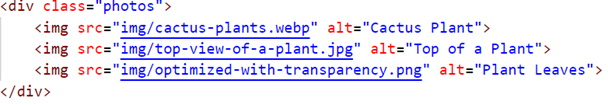
3.	Save and refresh in your browser to see: 
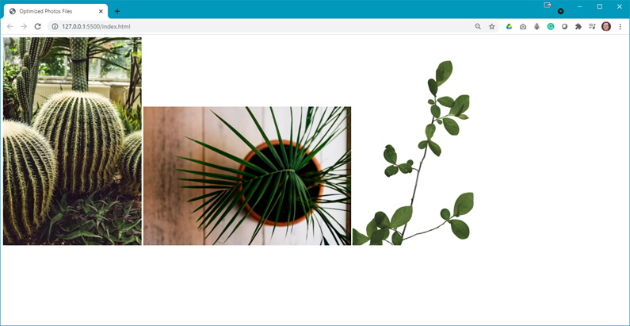
4.	In your **styles.css** file add the `.photos` class style rule: 
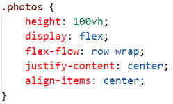
5.	You should now see something like the following: 
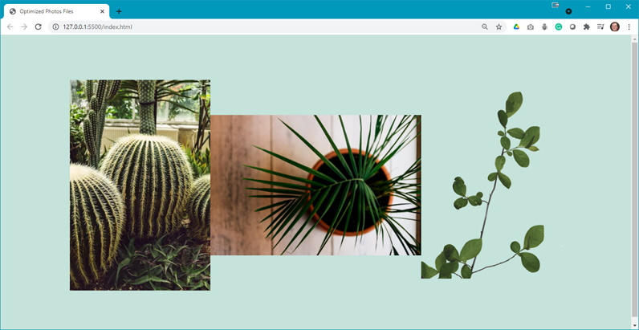 
**Question**: What effect did the styling rule have on the output?
6.	Now shrink the width of your browser to get the following: 
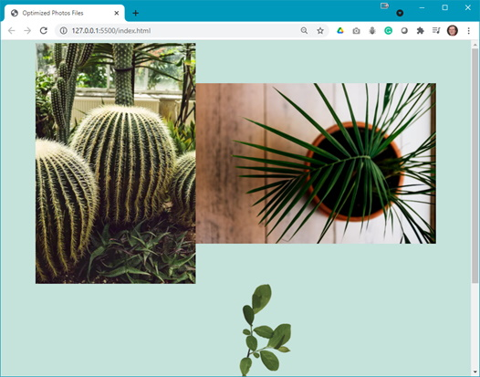 
**Question**: Why did the output change?
7.	Now you want to add some spacing between our images. Add the following style rule: 
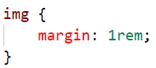 
**Question**: What is the `1 rem`?
8.	Refresh your browser and you should now see: 
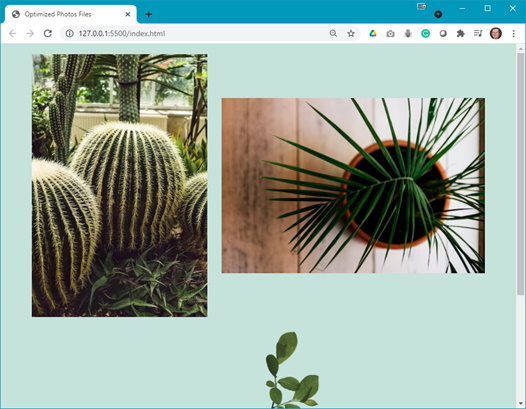 
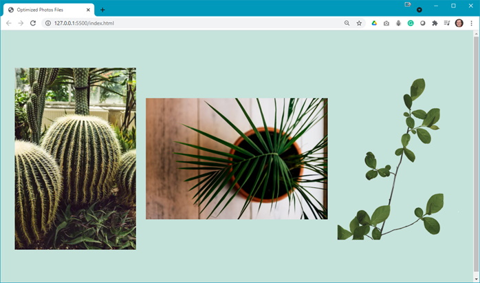 
**Question**: Any questions relating to the final output?
9.	As before, you need to add some meta data to the `<head>` of your web page. Add something close to the following: 
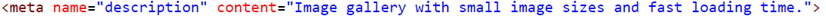
10.	**Question**: How would different types of images affect the load time of this web page?

## Steps - <a ID="svg">Part 2</a>: SVG
1.	Download the **demo-svg.zip** file and extract its contents to a folder named **demo-svg**.
2.	In your code editor, view the **browser-website.svg** file. What do you notice about this file?
3.	Add the code below to the `
` in the `<section>` of index.html: 
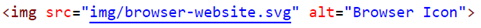
4.	Save and refresh in your browser to see: 
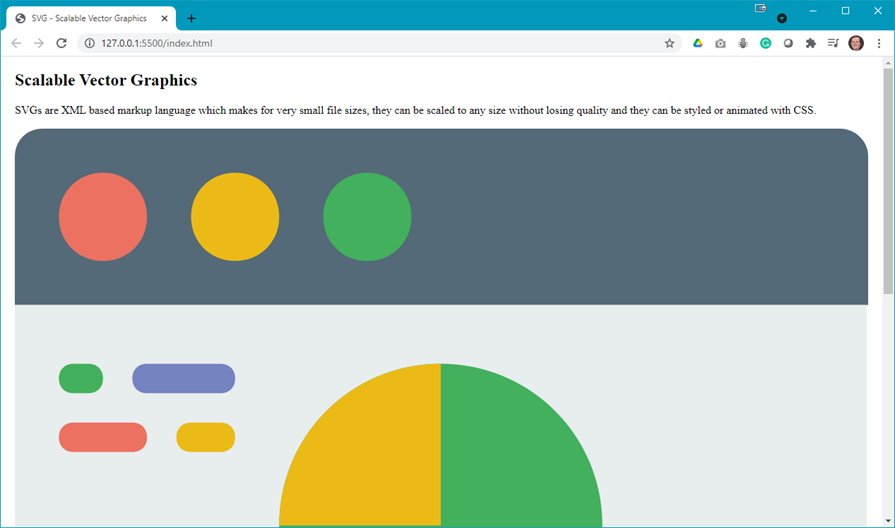 You will have to scroll to see the full image.
5.	Experiment by increasing or minimizing the output % of the browser. What effect did this have on the display size of the image and the resolution of the image? [_Hint: Compare the image to the size of the text on the web page._]
6.	Now, comment out the `` element you added.
7.	In your code editor, select the browser-website.svg file. Copy all the code that starts with `<svg> … </svg>` block and paste below the commented out `` element. Save and refresh your browser to see: 
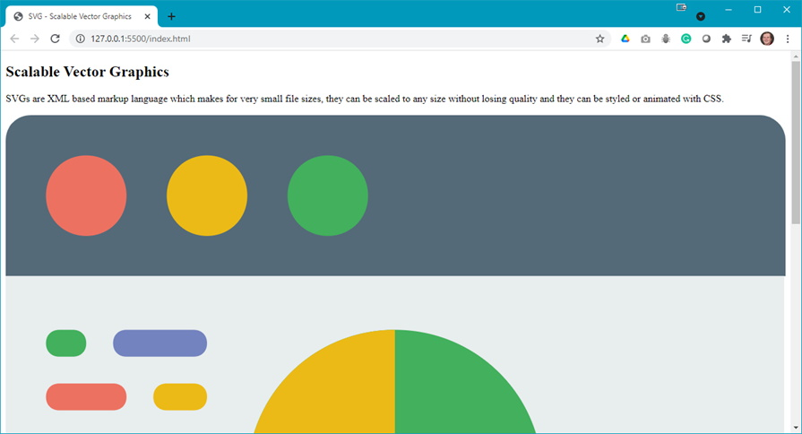
8.	You will want to be able to scale this. To do this you need to add the following style rules to your **styles.css** file:
    <ol type="a">
        <li>Add spacing to the &lt;section&gt; element: 
        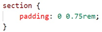
        </li>
        <li>Style the &lt;svg&gt; element: 
        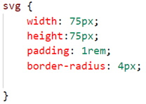 
        At this point, save and refresh the browser to see: 
        
        </li>
        <li>Add a hover effect to the &lt;svg&gt; element: 
        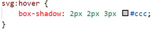 
        Once again, save and refresh your browser and test the hover action to see: 
        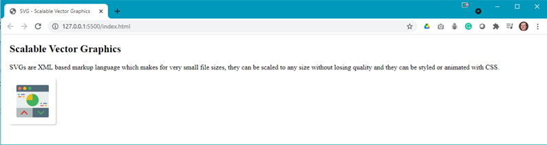
        </li>
        <li>Now experiment by changing the width and height of the &lt;svg&gt; element: 
        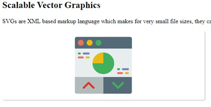 Note: the image does not change in size.
        </li>
        <li>Now you can scale the &lt;svg&gt; by scaling the container by commenting out the code you just added and add the following code: 
        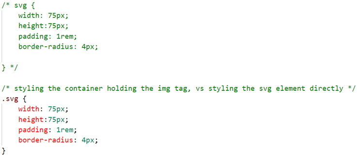
        </li>
        <li>Uncomment the &lt;img&gt; element in your **index.html** and the result should look like: 
        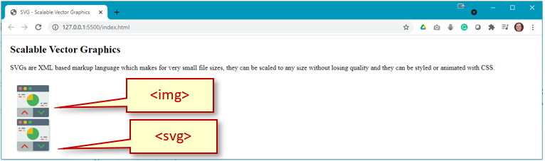
        </li>
        <li>Now change the width and heigh in the .svg class: 
        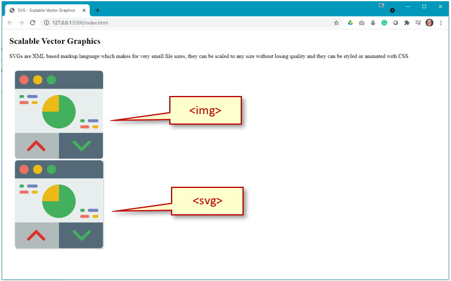
        </li>
        <li>For a final comparison uncomment the &lt;svg&gt; style rule so that both the element and the class style rules are being applied: 
        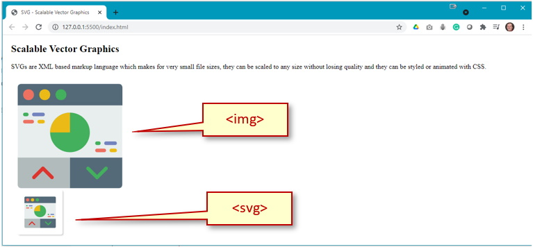
        </li>
    </ol>
9.	Even though we set both width and height for the SVG image, the SVG scaled proportionally. For your personal understanding, research if it is possible to scale an SVG with width and height of different values.

### Resopurces
* [Choosing the Right Image](files/choosing-the-right-image.pdf){:target="_blank"}

#### [Module Home](../)
#### [DMIT1530 Home](../../)