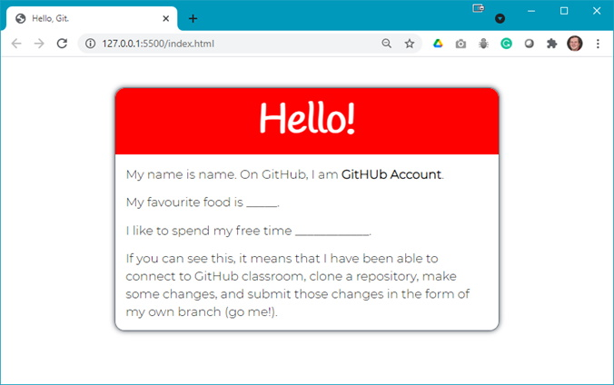
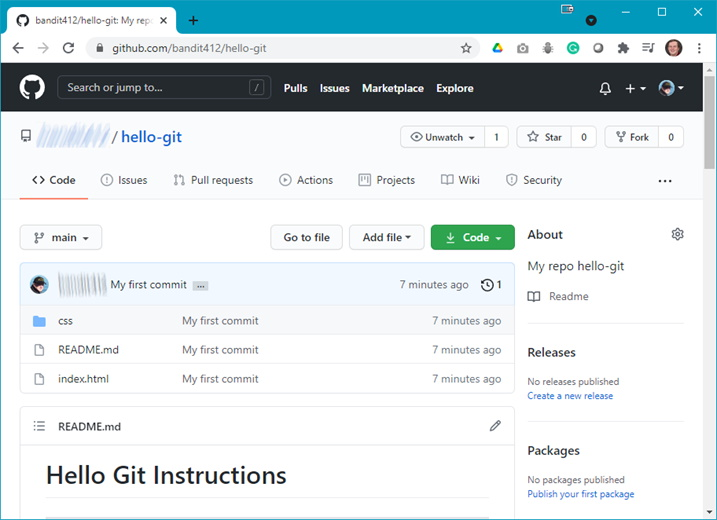
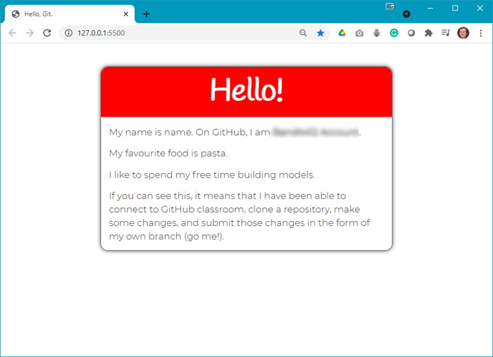

The following file is required for this lesson:
* [hello-git.zip](files/hello-git.zip)

## Demo Instructions
You can follow along with your instructor to complete this build and/or you can use this document as a guide in completing the demo build. **You will need a [GitHub](https://github.com){:target="_blank"} account for this lesson**.

## Steps
1.	Download the **hello-git.zip** file from Moodle and extract its contents to a folder named **hello-git**.
2.	Open **index.html** in your browser to see something like:<br>

3.	In your code editor, open the **README.md** file to see the instructions for this demo:<br>
    <ol type="a">
        <li>Command prompt in Windows (Mac terminal will be similar):<br>
    </li>

```
Microsoft Windows [Version 10.0.19042.985]
(c) Microsoft Corporation. All rights reserved.

C:\Users\yourusername>cd C:\Work\_DMIT1530\1212_A02\hello-git

C:\Work\_DMIT1530\1212_A02\hello-git>git init
Initialized empty Git repository in C:/Work/_DMIT1530/1212_A02/hello-git/.git/

C:\Work\_DMIT1530\1212_A02\hello-git>git add -A
warning: LF will be replaced by CRLF in README.md.
The file will have its original line endings in your working directory
warning: LF will be replaced by CRLF in css/modern-reset.css.
The file will have its original line endings in your working directory
warning: LF will be replaced by CRLF in css/styles.css.
The file will have its original line endings in your working directory
warning: LF will be replaced by CRLF in index.html.
The file will have its original line endings in your working directory

C:\Work\_DMIT1530\1212_A02\hello-git>git status
On branch main

No commits yet

Changes to be committed:
  (use "git rm --cached <file>..." to unstage)
        new file:   README.md
        new file:   css/modern-reset.css
        new file:   css/styles.css
        new file:   index.html


C:\Work\_DMIT1530\1212_A02\hello-git>git commit -m "My first commit"
[main (root-commit) 0835829] My first commit
 4 files changed, 220 insertions(+)
 create mode 100644 README.md
 create mode 100644 css/modern-reset.css
 create mode 100644 css/styles.css
 create mode 100644 index.html

C:\Work\_DMIT1530\1212_A02\hello-git>git branch -m main

C:\Work\_DMIT1530\1212_A02\hello-git>git remote add origin https://github.com/yourGitAccount/hello-git.git

C:\Work\_DMIT1530\1212_A02\hello-git>git push -u origin main
Enumerating objects: 7, done.
Counting objects: 100% (7/7), done.
Delta compression using up to 8 threads
Compressing objects: 100% (7/7), done.
Writing objects: 100% (7/7), 3.16 KiB | 3.16 MiB/s, done.
Total 7 (delta 0), reused 0 (delta 0), pack-reused 0
To https://github.com/yourGitAccount/hello-git.git
 * [new branch]      main -> main
Branch 'main' set up to track remote branch 'main' from 'origin'.

C:\Work\_DMIT1530\1212_A02\hello-git>
```

<br>
    <ol type="a" start="b">
        <li>Result on GitHub:<br>
        
        </li>
        <li>Resulting web page:<br>
        
        </li>
    </ol>

## Summary
You will be using GitHub for submitting assignments in this course. The assignments will be set up using GitHub Classroom; the assignment details for each submission will be give in the assignment specifications.

### References
* [Git Notes](files/git-notes.pdf){:target="_blank"}
* [Installing GitHub](files/dmit1530-week-03-git-installation.pdf){:target="_blank"}
* [Git Command Line](files/dmit1530-week-03-command-line-cheat-sheet.pdf){:target="_blank"}
* [Git Terminology](files/dmit 1530-week-03-git-terminology.pdf){:target="_blank"}

### [Module Home](../module1.md)
### [DMIT1530 Home](../../)