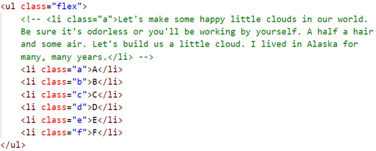
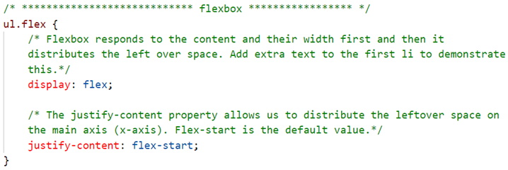
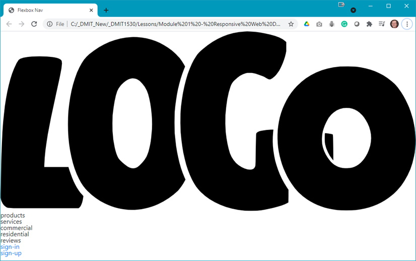

The following files are required for this lesson:
* [demo-flexbox-content.zip](files/demo-flexbox-content.zip)
* [demo-flexbox-nav.zip](files/demo-flexbox-nav.zip)

## Introduction
This lesson will be taught in two parts:
* [Part 1: Flexbox Content](#content)
* [Part 2: Flexbox Nav](#nav)

## Demo Instructions
You can follow along with your instructor to complete this build and/or you can use this document as a guide in completing the demo build.

## Steps - <a ID="content">Part 1</a>: Flexbox Content
1.	Download the **demo-flexbox-content.zip** file and extract its contents to a folder named **demo-flexbox-content**.
2.	Open **index.html** in your browser to see something like: 

3.	The first result you need looks like: 

4.	In your code editor examine the code below: 

5.	Examine the code in **styles.css** and notice that there is no `.flex` class style rule created. Therefore, add the following rule, save, and refresh your browser: 
 
You should now see: 

6.	Now you can change the `justify-content` to different values: 
    <ol type="a">
        <li>flex-end: 
        
        </li>
        <li>center: 
        </li>
        <li>>space-between: 
        </li>
        <li>space-around: 
        </li>
        <li>space-evenly: 
        </li>
    </ol>
7. The next flexbox property is `align-items` which allows the distribution on the cross axis (y-axis). Reset the `justify-content` to `flex-start` and add the following code to the class (`justify-content: flex-start;` is shown only for reference to where this code goes): 

8.	As the result is the same as was shown in step 5, make the following change in your stylesheet before displaying the result in your browser: 
 

9.	Now examine the other values for align-items: 
    <ol type="a">
        <li>flex-start: 
        
        </li>
        <li>flex-end: 
        </li>
        <li>center: 
        </li>
        <li>>baseline: 
        
         <b>Question</b>: What is the difference between center and baseline?
        </li>
    </ol>

## Steps - <a ID="nav">Part 2</a>: Flexbox Nav
1.	Download the **demo-flexbox-nav.zip** file from Moodle and extract its contents to a folder named **demo-flexbox-nav**.
2.	The goal of this demo should look like: 

3.	Open **index.html** in your browser to see something like: 
 
**Question**: What do you think you need to do to achieve the desired output?
4.	Add the following style rules to your **styles.css** file: 
    <ol type="a">
        <li>Style the &lt;body&gt; element: 
        
        </li>
        <li>Add a .flex-container class: 
        
        </li>
        <li>Style the &lt;header&gt;: 
         
        
        </li>
        <li>As the LOGO is really big, and the image used is an SVG, you can set the size of the logo using: 
         
        
        </li>
        <li>Now set the margins for the &lt;li&gt; elements: 
         
        
        </li>
        <li>Next, the two hyperlinks, sign-in and sign-up, need to be styled for hover effect and to make them look like buttons: 
         
        </li>
        <li>When you hover your mouse over these simulated buttons, there is no visible change in their appearance. To get the desired effect add the following: 
         
        
        </li>
    </ol>
5.	Optionally, you can add hyperlinks to the menu `<li>`'s and style them appropriately.

## Summary
More properties of flexbox will be demonstrated in the next demo.

### References
* [How to Use Flexbox](files/how-to-use-flexbox.pdf){:target="_blank"}

### [Module Home](../module1.md)
### [DMIT1530 Home](../../)