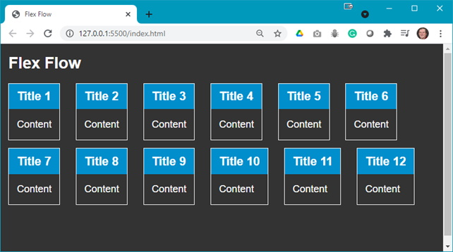

The following file is required for this lesson:
* [demo-flex-flow.zip](files/demo-flex-flow.zip)

## Demo Instructions
You can follow along with your instructor to complete this build and/or you can use this document as a guide in completing the demo build.

## Steps
1.	Download the **demo-flex-flow.zip** file from Moodle and extract its contents to a folder named **demo-flex-flow**.
2.	The first goal of this demo should look like: 

3.	Open **index.html** in your browser to see something like: 
 
**Question**: What do you think you need to do to achieve the desired output?
4.	Add the following style rules to your **styles.css** file: 
    <ol type="a">
        <li>Add a <b>.flex-container</b> class: 
        
        </li>
        <li>Modify the following code in your <b>index.html</b>: 
         
        
        </li>
    </ol>
5.	There are other properties of flexbox that you can set. First you will look at `flex-direction`. Do each of the following and examine the output: 
    <ol type="a">
        <li><b><code>flow</code></b>: 
         
        The output should not have changed.
        </li>
        <li><b><code>flow-reverse</code></b>: 
        
        </li>
        <li><b><code>column</code></b>: 
        
        </li>
        <li><b><code>column-reverse</code></b>: 
        
        </li>
    </ol>
6.	Now you can examine the `flex-wrap` property. First set the `flex-flow` to `row`, then do each of the following: 
    <ol type="a">
        <li><b><code>nowrap</code></b>: 
         
        The output should be the same as shown in step 4b, or if you make your browser window narrower: 
        
        </li>
        <li><b><code>wrap</code></b>: 
        
        </li>
        <li><b><code>wrap-reverse</code></b>: 
        
        </li>
    </ol>
7.	Finally, you can combine `flex-direction` and `flex-wrap` as `flex-flow`. First comment out all the style rules after `display: flex;` and do each of the following and examine the output. 
    <ol type="a">
        <li>Default setting (<b><code>flex-flow: row nowrap</code></b>): 
        
        </li>
        <li><b><code>flex-flow: row-reverse wrap</code></b>: 
        
        </li>
        <li><b><code>flex-flow: column-reverse wrap-reverse</code></b>: 
         
        There are other combinations which you can explore.
        </li>
    </ol>

### Resources
* [Flexbox Resoources](files/flexbox-resources.zip)

### [Module Home](../module1.md)
### [DMIT1530 Home](../../)