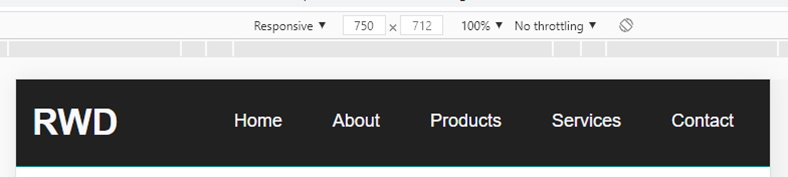

The following files are required for this lesson:
* [demo-media-queries.zip](files/demo-media-queries.zip)
* [demo-rwd-menu.zip](files/demo-rwd-menu.zip)

## Introduction
This lesson will be taught in two parts:
* [Part 1: Media Queries](#queries)
* [Part 2: RWD Menu](#menu)

## Demo Instructions
You can follow along with your instructor to complete this build and/or you can use this document as a guide in completing the demo build.

## Steps - <a ID="queries">Part 1</a>: Media Queries
1.	Download the **demo-media-queries.zip** file and extract its contents to a folder named **demo-media-queries**.
2.	A wide resolution of the **index.html** should look like: 

3. When you narrow your browser, you want to see something like: 
 Note: the color changes.
4.	Open the **styles.css** file and scroll down to find the comment about Media Queries and add the following: 
 
**Question**: What did this media query do?
5.	Add the following query below the one you just added: 
 
**Question**: What did this media query do?
6.	Now add the last media query: 
 
**Question**: What did this media query do?
7.	For each of the media queries, use the developer tools to set the width that will trigger the change.

## Steps - <a ID="menu">Part 2</a>: RWD Menu
1.	Download the **demo-rwd-menu.zip** file and extract its contents to a folder named demo-rwd-menu.
2.	A wide resolution of the **index.html** should look like: 

3.	When you narrow your browser, you want to see something like: 

4.	Examine the **index.html** file to see the menu: 
 
Note: There is nothing special here; we can see the `<nav>` element is inside a **`flex`** container.
5.	Open the **styles.css** file and scroll down to find the start of the first media query and code as shown below: 
 
Here you see the style rules that get applied when the width is `>= 750px`.
6.	Open the developer tools in your browser and make the following change: 

7.	Now, change the width to 749 px and you should get: 
 
Notice that the layout changed as the width now is less than the width set in the media query.
8.	Now add the code below to the second media query in your styles.css: 

9.	In developer tools make the following change: 

10.	Now change the size and see what happens, i.e.: 
 And: 
 
Notice that no matter how wide we make the browser window, the menu is locked at a width of 1400 px.

## Summary
More media query examples will be demonstrated in the next demo.

### [Module Home](../)
### [DMIT1530 Home](../../)
