

The following file is required for this lesson:
* [demo-liquid-fixed-layout.zip](files/demo-liquid-fixed-layout.zip)

## Demo Instructions
You can follow along with your instructor to complete this build and/or you can use this document as a guide in completing the demo build.

## Steps
1.	Download the **demo-liquid-fixed-layout.zip** file and extract its contents to a folder named **demo-liquid-fixed-layout**.
2.	The output of this demo should look like: 
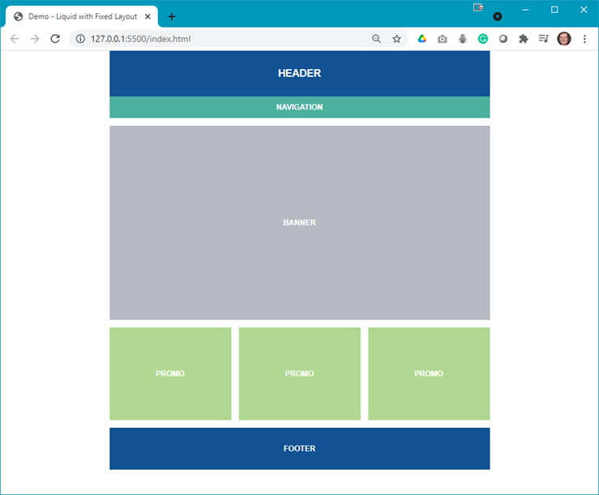
3.	The first step is to code the layout in **index.html** (all classes shown in the code will need to be added to your **styles.css** file): 
    <ol type="a">
        <li>Create a container: 
        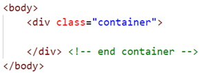
        </li>
        <li>Add a &lt;header&gt; block inside the container: 
        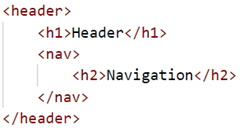
        </li>
        <li>Add the &lt;main&gt; with a &lt;section&gt;: 
        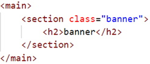
        </li>
        <li>Add a flex container below the &lt;section&gt; created above: 
        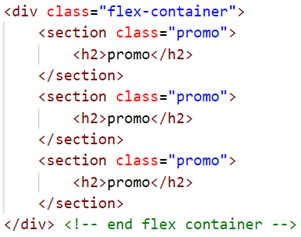
        </li>
        <li>Add a &lt;footer&gt;: 
        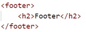 
        At this point, your web page should look like: 
        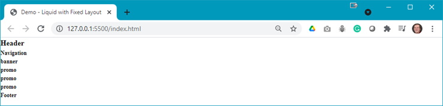
        </li>
    </ol>
4.	Now you need to add style rules to your **styles.css** file: 
    <ol type="a">
        <li>Style the &lt;body&gt; element with generic CSS; this will be mobile first: 
        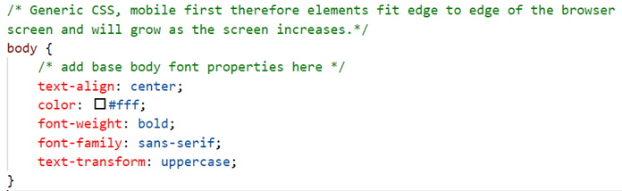
        </li>
        <li>Style the &lt;header&gt; and &lt;footer&gt; elements: 
        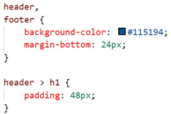
        </li>
        <li>Style the &lt;nav&gt; element: 
        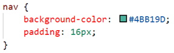 
        At this point, your web page should look like: 
        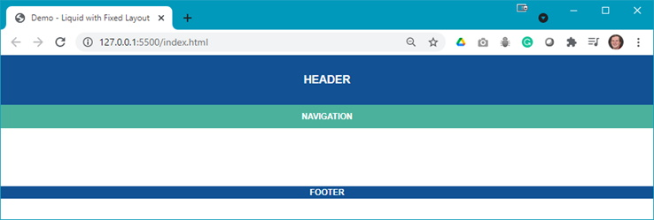
        </li>
        <li>As the &lt;section&gt; blocks are not yet being displayed, are they still there? The answer is yes: 
        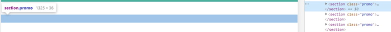 
        Now style the <b>.promo</b> class: 
        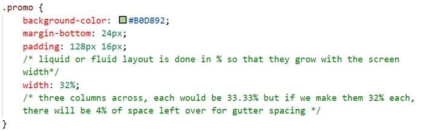 
        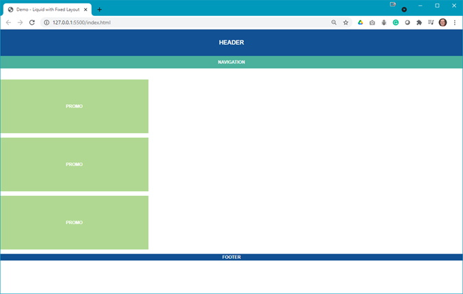
        </li>
        <li>You need each of the promo blocks to be side-by-side, equally spaced, thus add the .flex-container class: 
        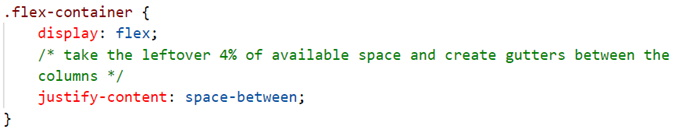 
        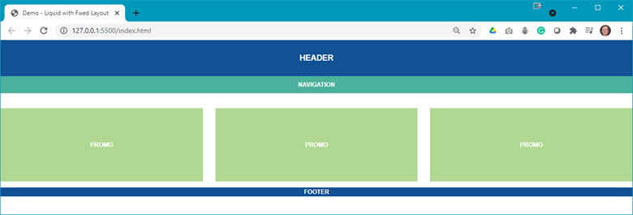
        </li>
        <li>You still need the .banner class, which is: 
        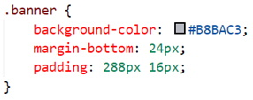 
        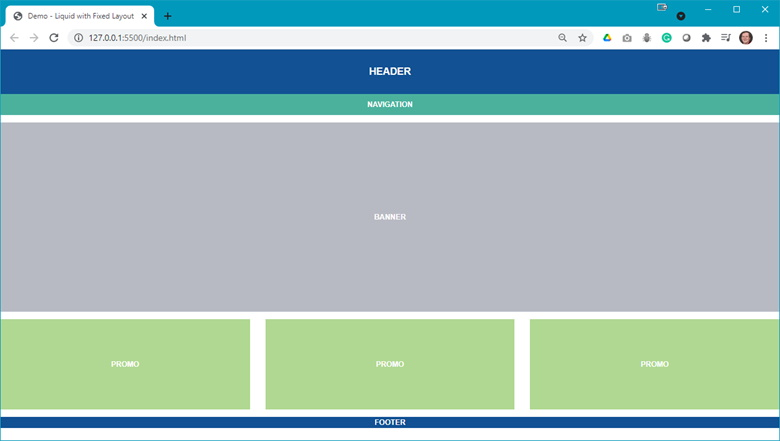
        </li>
        <li>Next add some padding for the &lt;footer&gt; element: 
        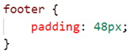 
        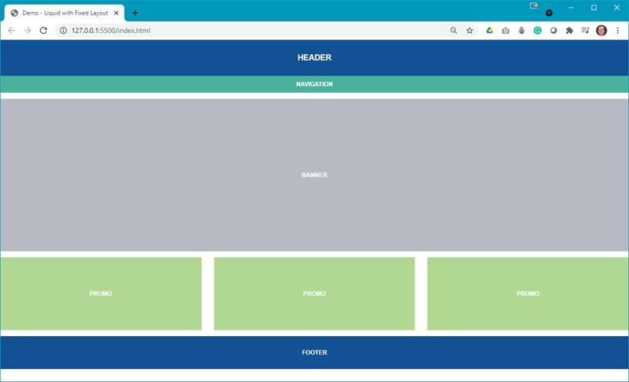
        </li>
    </ol>
5.	The next step is to add a media query that will make the web page change at a specific width. Add the following to your **styles.css** file: 
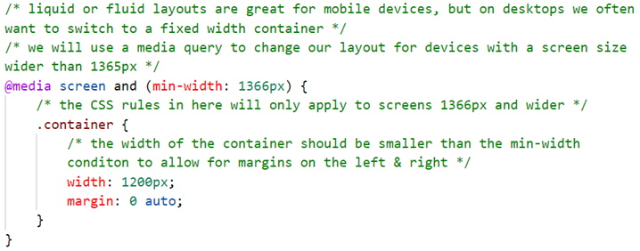
6.	You need to test this using the browser’s developer tools. Remember the min-width: 1366 px; thus, once the page width exceeds the minimum width (larger screen resolution) the web page will change: 
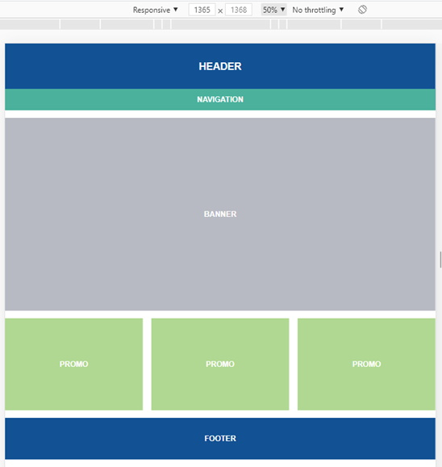&nbsp;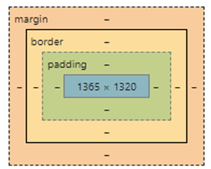 
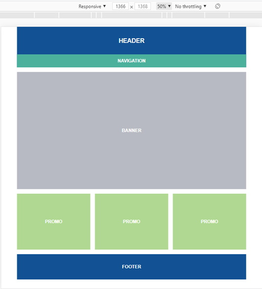&nbsp;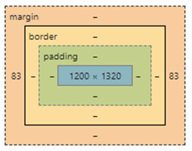 
7.	The next step is to see how images behave in this layout. Add the following code below the `<h2>` in each `<section class="promo">`: 
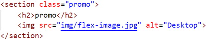
8.	Notice how the images have broken the layout: 
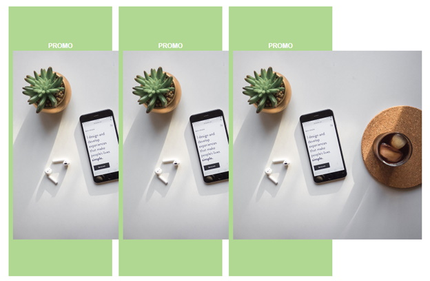
9.	To fix this there needs to be a style rule to set the maximum width of the `` element to 100%. Open the reset.css file and scroll down to line 52. Replace the `÷` symbol with the following code: 
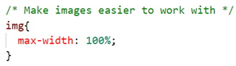 
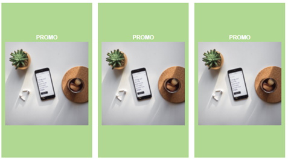
10.	Using the browser’s developer tools, change the width of the web page and notice how the images scale.

## Exercise
Open the **flexbox-exercise-instructions.docx** file on Moodle and follow the instructions to complete the exercise for this lesson.

### [Module Home](../module1.md)
### [DMIT1530 Home](../../)
