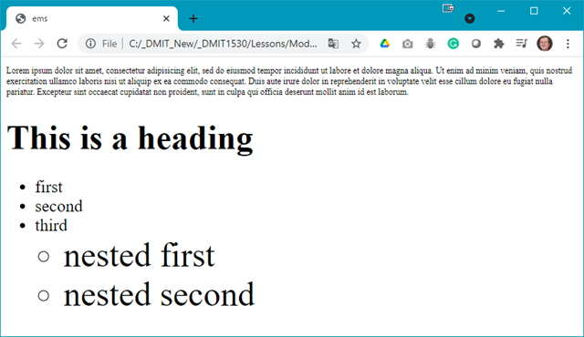
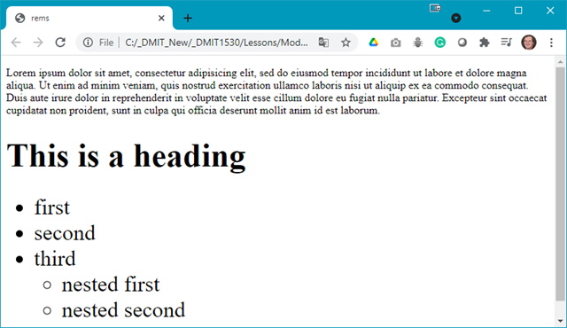

The following file is required for this lesson:
* [ems.zip](files/ems.zip)

## Demo Instructions
You can follow along with your instructor to complete this build and/or you can use this document as a guide in completing the demo build.

## Steps
1.	Download the **ems.zip** file from Moodle and extract its contents to a folder named **ems**.
2.	The output of the **ems.html** should look like: 
 
Notice the increasing font size in each level of the nested list.
3.	The output of the **rems.html** should look like: 
 
Notice the font size does not change in the lower levels of the nested list.
4.	Review the style rules embedded in the **ems.html** file. Make note of the calculations.
5.	Review the style rules embedded in the **rems.html** file. Make note of the comments on lines 5 & 6.

### Resources
* [Font Sizing with rems](font-sizing-with-rems.pdf){:target="_blank"}

#### [Module Home](../)
#### [DMIT1530 Home](../../)