

The following files are required for this lesson:
* [demo-selectors.zip](files/demo-selectors.zip)
* [demo-flex-order.zip](files/demo-flex-order.zip)
* [demo-flexbox-layout.zip](files/demo-flexbox-layout.zip)

## Introduction
This lesson will be taught in three parts:
* [Part 1: CSS Selectors](#selectors)
* [Part 2: Flex Order](#order)
* [Part 3: Flexbox Layout](#layout)

## Demo Instructions
You can follow along with your instructor to complete this build and/or you can use this document as a guide in completing the demo build.

## Steps - <a ID="selectors">Part 1</a>: CSS Selectors
1.	Download the demo-selectors.zip file and extract its contents to a folder named demo-selectors.
2.	The completed output should look like: 
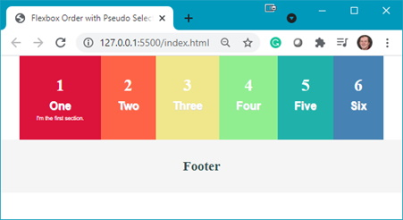
3.	You need to add some code to the **index.html** file: 
    <ol type="a">
        <li>Add a flex container: 
        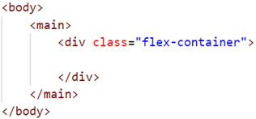
        </li>
        <li>Add &lt;section&gt; blocks inside the flex container: 
        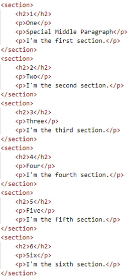
        </li>
        <li>Add a &lt;footer&gt;: 
        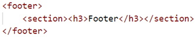 
        The output in your browser should look like: 
        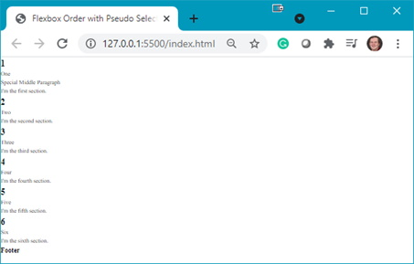
        </li>
    </ol>
4.	Now you need to add style rules to the **styles.css** file: 
    <ol type="a">
        <li>Add a .flex-container class: 
        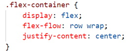 
        <b>Question</b>: What does this style rule do?
        </li>
        <li>Add styling for the &lt;section&gt; elements: 
        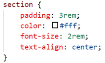 
        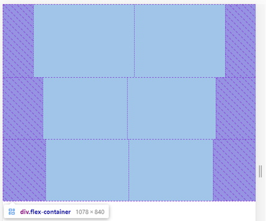
        </li>
        <li>As the individual &lt;section&gt; blocks do not appear, you need to use a pseudo-selector to target the styling of each &lt;section&gt;:
            <ol type="i">
                <li>first-child: 
                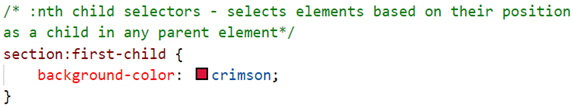
                </li>
                <li>last-child: 
                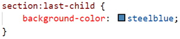
                </li>
                <li>>nth-child(2): 
                
                </li>
                <li>nth-child(3): 
                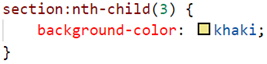 
                Refresh your browser to see: 
                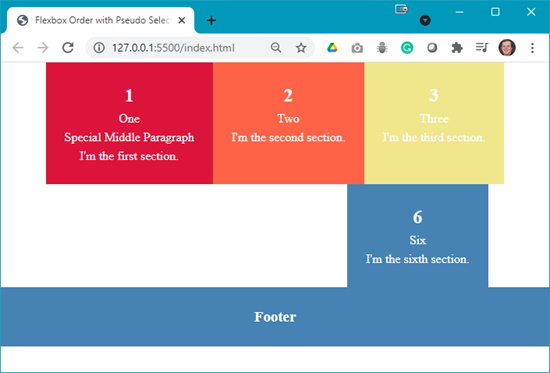
                </li>
                <li>nth-last-child(3): 
                
                </li>
                <li>nth-last-child(2): 
                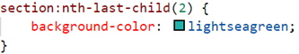 
                Refresh your browser to see the following making note of the colours you used for each &lt;section&gt;’s background: 
                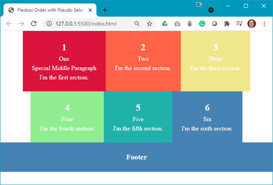
                </li>
            </ol>
        </li>
        <li>The &lt;footer&gt; needs to have a different background colour: 
        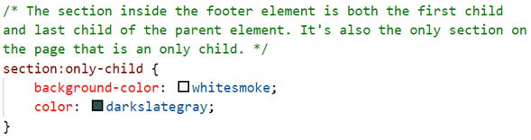 
        
        </li>
        <li>The nth of type selector can be used to target the position of a child element. Each &lt;section&gt; has two &lt;p&gt; elements, thus you can target each of these using: 
        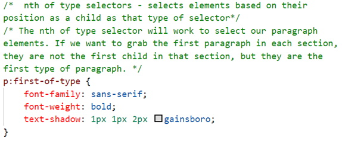 
        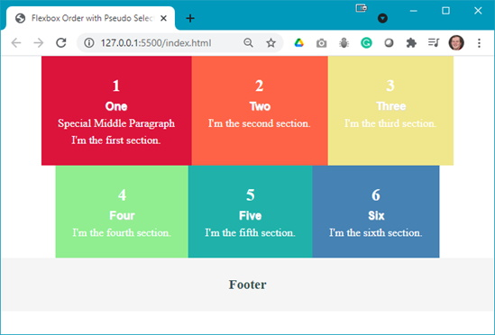 
        Note: the font of the 1st paragraph is now <b>bolded</b> and has a slight text shadow:
        </li>
        <li>Targeting the other paragraphs is done using: 
        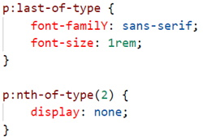
        </li>
    </ol>

## Steps - <a ID="order">Part 2</a>: Flex Order
