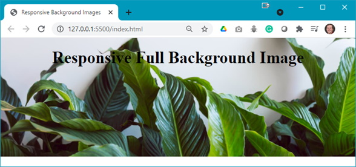
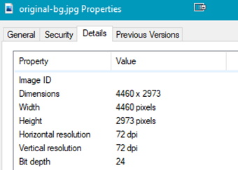
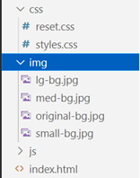

The following file is required for this lesson:
* [demo-responsive-bg.zip](files/demo-responsive-bg.zip)

## Demo Instructions
You can follow along with your instructor to complete this build and/or you can use this document as a guide in completing the demo build.

## Steps
1.	Download the demo-responsive-bg.zip file from Moodle and extract its contents to a folder named demo-responsive-bg.
2.	The completed output should look like: 

3.	The first thing to do is find the size of the original image; this is needed as a starting point for this demo: 

4.	Use Photoshop or [Squoosh](https://squoosh.app/){:target="_blank"} to resize the image (save each resized image but do not overwrite the original file): 
    <ol type="a">
        <li>600px x 400px: name this <b>small-bg.jpg</b></li>
        <li>1200px x 800px: name this file <b>med-bg.jpg</b></li>
        <li>1800px x 1200px: name this file <b>lg-bg.jpg</b></li>
    </ol> 
    **Note**: you should now have 4 images in your **img** folder: 
    
5.	You will need to add style rules to the **styles.css** file: 

### [Module Home](../module1.md)
### [DMIT1530 Home](../../)

