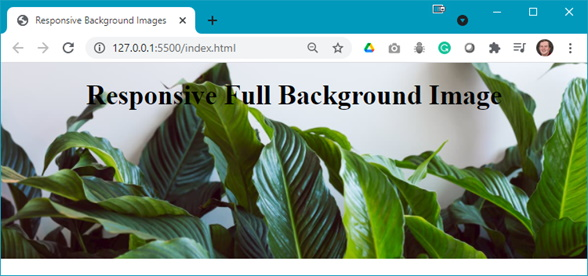
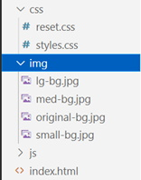
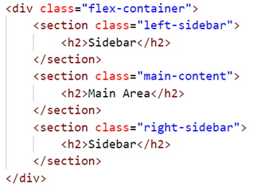

The following file is required for this lesson:
* [demo-responsive-bg.zip](files/demo-responsive-bg.zip)

## Demo Instructions
You can follow along with your instructor to complete this build and/or you can use this document as a guide in completing the demo build.

## Steps
1.	Download the demo-responsive-bg.zip file from Moodle and extract its contents to a folder named demo-responsive-bg.
2.	The completed output should look like: 

3.	The first thing to do is find the size of the original image; this is needed as a starting point for this demo: 

4.	Use Photoshop or [Squoosh](https://squoosh.app/){:target="_blank"} to resize the image (save each resized image but do not overwrite the original file): 
    <ol type="a">
        <li>600px x 400px: name this <b>small-bg.jpg</b></li>
        <li>1200px x 800px: name this file <b>med-bg.jpg</b></li>
        <li>1800px x 1200px: name this file <b>lg-bg.jpg</b></li>
    </ol> 
    **Note**: you should now have 4 images in your **img** folder: 
    
5.	You will need to add style rules to the **styles.css** file: 
    <ol type="a">
        <li>Start with the smallest image: 
        
        </li>
        <li>Style the &lt;h1&gt;: 
        
        </li>
    </ol>
6.	As the width of the browser increases, the quality of the image degrades. To fix this we need a media query: 
    <ol type="a">
        <li>First break point at 850px: 
        
        </li>
        <li>Next break point at 1000px: 
        
        </li>
        <li>Finally, a full-sized image for wide screens: 
        
        </li>
        <li>Open the browser’s developer tools to see: 
            <ol type="i">
                <li>Smallest resolution: 
                
                </li>
                <li>Medium image: 
                
                </li>
                <li>Large image: 
                
                </li>
            </ol>
        </li>
    </ol>

## Additional Layout
For extra practice you will add content and styling rules to get the output shown below: 

1.	The **index.html** file needs the following code added below the `<header>` block: 

2.	The following code needs to be added to the **styles.css** file: 
    <ol type="a">
        <li>Add a .flex-container class: 
        
        </li>
        <li>Style the &lt;section&gt; element: 
        
        </li>
        <li>Style the first &lt;section&gt; element: 
        
        </li>
        <li>Style the second &lt;section&gt; element: 
        
        </li>
        <li>Style the last &lt;section&gt; element: 
        
        </li>
        <li>Add a media query so you can switch the order back to the original order: 
        
        </li>
        <li>Add a media query for a fixed-width, edge-to-edge, background image: 
        
        </li>
    </ol>
3.	Refresh your browser to see the final output. Additionally, use your browser’s developer tools to see the results at different screen widths.

#### [Module Home](../)
#### [DMIT1530 Home](../../)