

The following files are required for this lesson:
* [demo-single-level-nav-main.zip](files/demo-single-level-nav-main.zip)
* [demo-multi-level-nav-main.zip](files/demo-multi-level-nav-main.zip)

## Introduction
This lesson will be taught in two parts:
* [Part 1: Single-level Navigation](#single)
* [Part 2: Mulit-level Navigation](#multi)

## Demo Instructions
You can follow along with your instructor to complete this build and/or you can use this document as a guide in completing the demo build.

## Steps - <a ID="single">Part 1</a>: Single-level Navigation
1.	Download the **demo-single-level-nav-main.zip** file and extract its contents to a folder **named demo-single-level-nav-main**.
2.	The completed output should look like: 
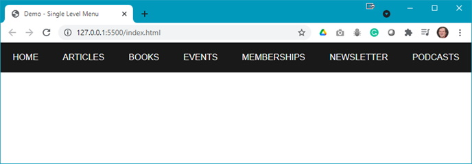 
Note: When the browser is resized, the menu will start to wrap to the next row.
3.	The index.html file needs to be updated as follows: 
    <ol type="a">
        <li>Modify the &lt;head&gt; to be: 
        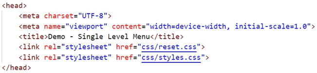
        </li>
        <li>Add the following to the &lt;body&gt;: 
        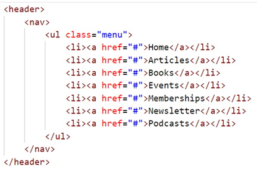
        </li>
    </ol>
4.	The web page should now look like: 
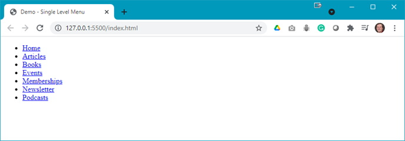 
**Question**: What needs to be done to the menu?
5.	Open the **styles.css** and add the following style rules: 
    <ol type="a">
        <li>Style the &lt;body&gt; element: 
        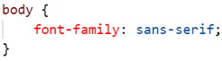
        </li>
        <li>Style the &lt;header&gt;: 
        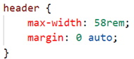
        </li>
        <li>Style the menu &lt;ul&gt;: 
        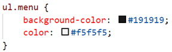
        </li>
        <li>Style the &lt;a&gt; elements of the menu: 
        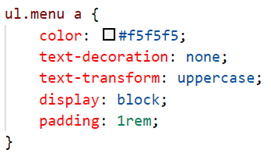 
        Your web page should now look like: 
        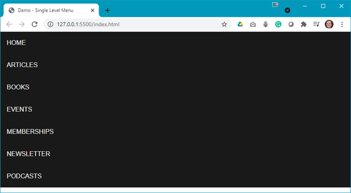 
        <b>Question</b>: what needs to be done next?
        </li>
        <li>Now add the media query: 
        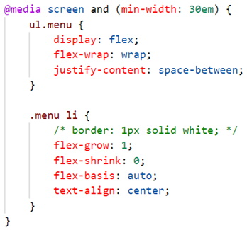 
        <b>Question</b>: What does this media query do? What size is 30em?
        </li>
        <li>When you resize your browser, you should see something like: 
        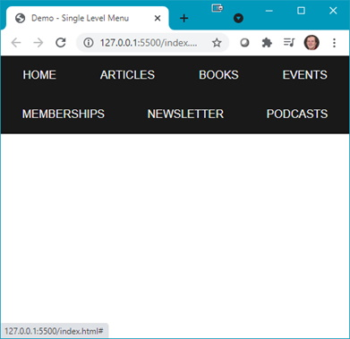
        </li>
    </ol>
6.	The `img` folder contains several SVG files. As a challenge, add these to your menu items and modify your **styles.css** code to produce the following output: 
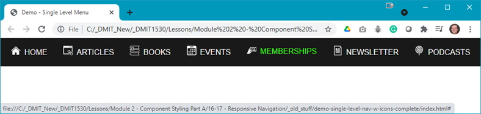 
**Note**: the green text is a hover effect.

## Steps - <a ID="multi">Part 2</a>: Multi-level Navigation
1.	Download the **demo-multi-level-nav-main.zip** file and extract its contents to a folder named **demo-multi-level-nav-main**.
2.	The completed output should look like:
_insert image here…_
3.	More notes to follow...

### [Lesson Home](16-17-responsive-nav.md)
### [Module Home](../module2.md)
### [DMIT1530 Home](../../)
