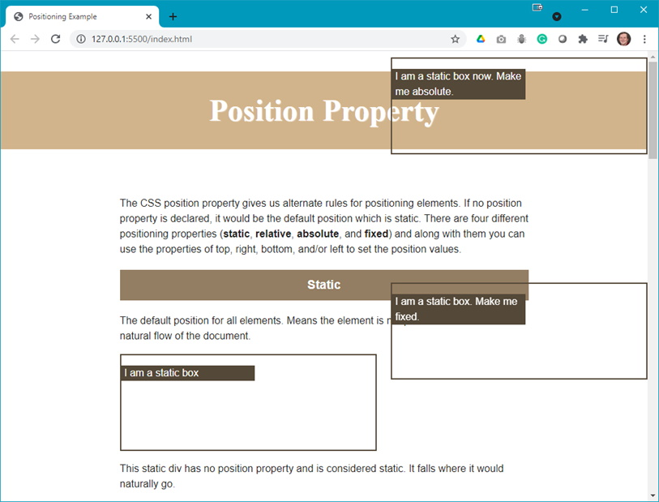
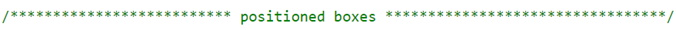
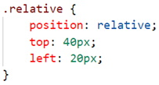
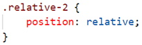
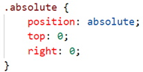
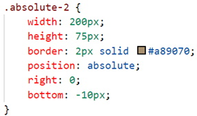
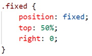

## Demo Instructions
You can follow along with your instructor to complete this build and/or you can use this document as a guide in completing the demo build.

## Steps
1.	Download the [[demo] Positioning Properties](https://github.com/dmit1530-2021/demo-positioning){:target="_blank"} repository from GitHub. Downloading the repository will get a filed called demo-positioning-main.zip which you need to extract its contents to a folder named demo-positioning-main.
2.	The completed output should look like: 
 
**Note**: When there are two boxes on the right side of the browser. To see the effect, you will need to scroll your browser. When you first open index.html in your browser these boxes are further down the web page.
3.	The main.css file needs to be updated as follows (you will need to scroll to find the  section: 
    <ol type="a">
        <li>Add the following code to the .relative class style rule: 
         
        <b>Question</b>: What does thie rule do?
        </li>
        <li>Add the following to the .relative-2 class style rule: 
         
        <b>Question</b>: What does thie rule do?
        </li>
        <li>Add the following to the .absolute class style rule: 
         
        <b>Question</b>: What does thie rule do?
        </li>
        <li>Modify the .absolute-2 class style rule to be: 
         
        <b>Question</b>: What changed?
        </li>
        <li>Add the following to the .fixed class style rule: 
         
        <b>Question</b>: What does thie rule do?
        </li>
    </ol>
4.	Now refresh your browser and explore the changes.

### [Lesson Home](index.md)
### [Module Home](../)
### [DMIT1530 Home](../../)