

The following files are required for this lesson:
* [demo-toggle-nav.zip](files/demo-toggle-nav.zip)
* [toggle-nav-3-images.zip](files/toggle-nav-3-images.zip)

## Introduction
This lesson will be taught in three stages:
* [Stage 1: Basic Toggle Nav](#toggle1)
* [Stage 2: Toggle Nav Version 2](#toggle2)
* [Stage 3: Toggle Nav Version 3](#toggle3)

## Demo Instructions
You can follow along with your instructor to complete this build and/or you can use this document as a guide in completing the demo build.

## Steps – <a ID="toggle1">Stage 1</a>: Basic Toggle Nav
1.	Download the **demo-toggle-nav.zip** file and extract its contents to a folder named **demo-toggle-nav**.
2.	The completed output should look like when you resize your browser: 
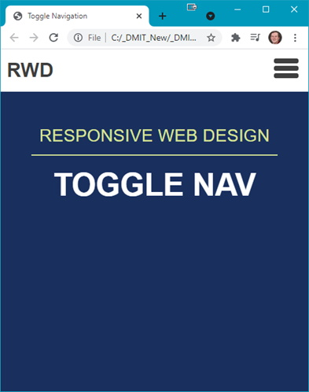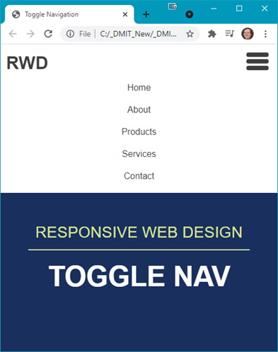 
**Note**: When the browser is resized, the menu will start to wrap to the next row.
3.	Add the following code to your **index.html**: 
    <ol type="a">
        <li>Add the &lt;header&gt; block: 
        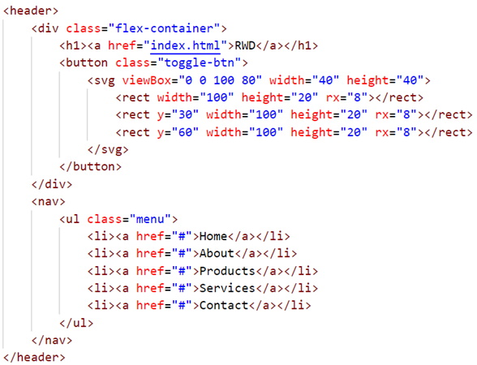
        </li>
         <li>Add the &lt;section&gt; block: 
        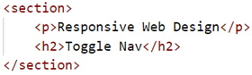
        </li>
         <li>Add the following code, which <b>must</b> the last line of code in the &lt;body&gt;: 
        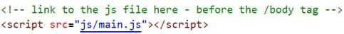 
        Open <b>index.html</b> in the browser to see: 
        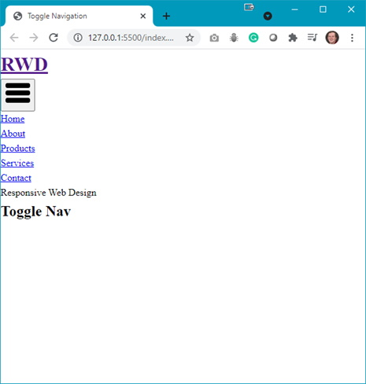 
        <b>Question</b>: What needs to be done now?
        </li>
    </ol>
4.	Open **styles.css** and add the following: 
    <ol type="a">
        <li>You will need a .flex-container class: 
        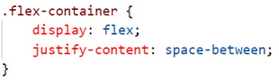
        </li>
        <li>Start styling the header and nav: 
        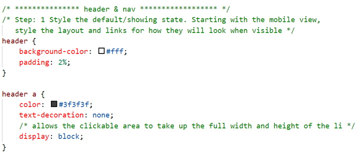
        </li>
        <li>Add styling for the menu and hover effects: 
        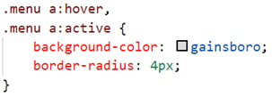
        </li>
        <li>Style the toggle button: 
        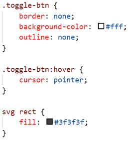
        </li>
        <li>Style the menu list items: 
        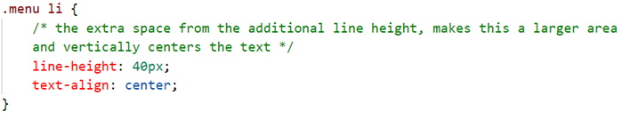
        </li>
        <li>Refresh your browser to see: 
        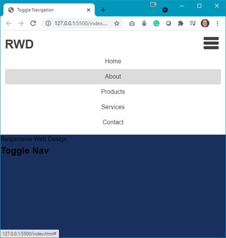 
        <b>Note</b>: The <em>hamburger</em> icon does not collapse the menu; it is still fixed in place. 
        <b>Question</b>: What is the next step?
        </li>
    </ol>
5.	The next step is to hide the menu. Add the following rules to your **styles.css**: 
    <ol type="a">
        <li>Style the header nav: 
        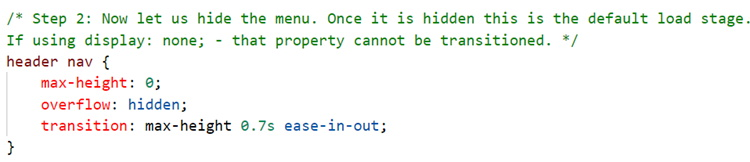
        </li>
        <li>Create a class that will show the menu: 
        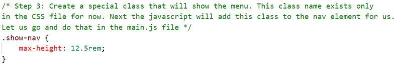 
        Refresh your browser to see (press the <em>hamburger</em> icon to see the changes): 
        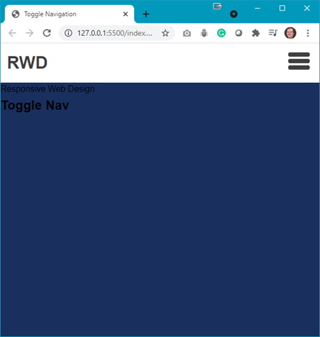 
        <b>Question</b>: What is the next step?
        </li>
    </ol>
6.	Next the `<section>` needs some styling so add the following style rules: 
    <ol type="a">
        <li>Initial section styling: 
        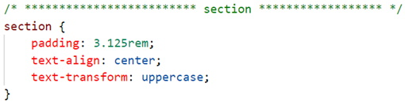
        </li>
        <li>Style the paragraph: 
        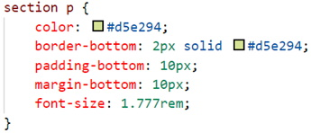
        </li>
        <li>Style the heading: 
        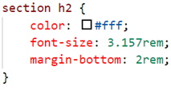 
        Refresh your browser to see (you will need to resize your browser): 
        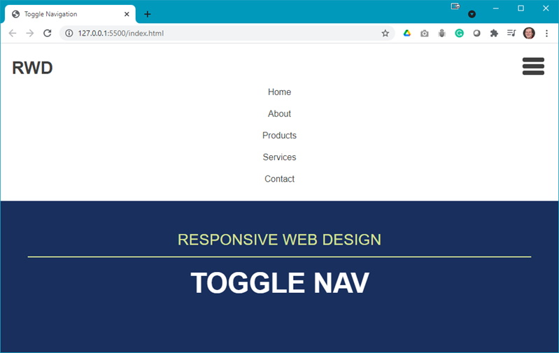 
        <b>Question</b>: What needs to be done next?
        </li>
    </ol>
7.	A media query is needed, thus add the following media query: 
    <ol type="a">
        <li>Hide the toggle button (<em>hamburger</em> icon): 
        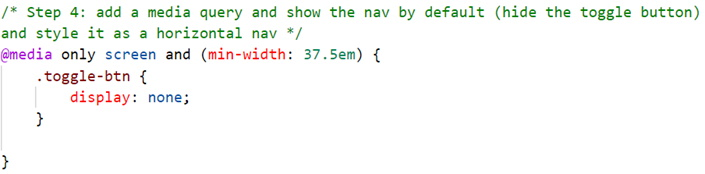
        </li>
        <li>Show the nav by default, thus add the following to your media query: 
        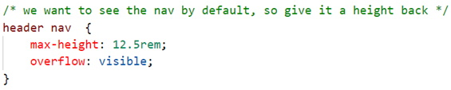
        </li>
    </ol>
8.	The result, at a wider browser width, is: 
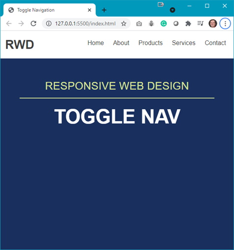 
**Question**: When the toggle button is pressed, the section content is pushed down. Would it not be better if the dropdown menu were an overlayed menu?

## Steps – <a ID="toggle2">Stage 2</a>: Toggle Nav Version 2
1.	To get the desired effect make the following changes to your **styles.css** file: 
    <ol type="a">
        <li>Modify the header nav style rule as shown below: 
        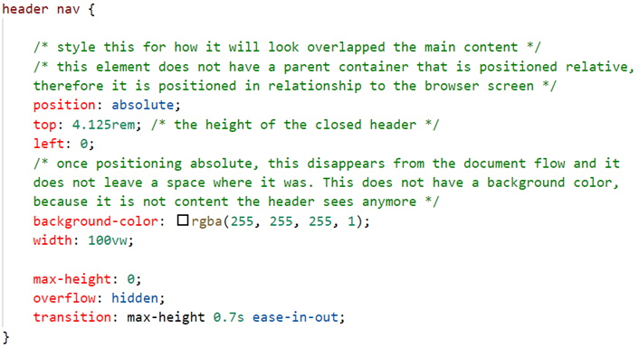
        </li>
        <li>Add some padding to the menu (add this below the header nav style rule): 
        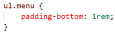
        </li>
    </ol>
2.	Refresh your browser to see the menu now overlays the section content. 
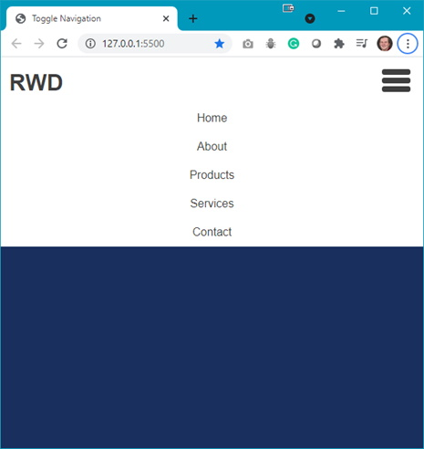

## Steps – <a ID="toggle3">Stage 3</a>: Toggle Nav Version 3
1.	Download the **toggle-nav-3-images.zip** file from Moodle and extract the images to your **img** folder.
2.	The completed output should look like (partial view shown): 
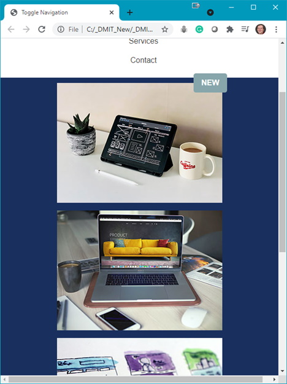
3.	The first step is to add the following to your **index.html**:
    <ol type="a">
        <li>Add the following below the &lt;h2&gt; in the &lt;section&gt;: 
        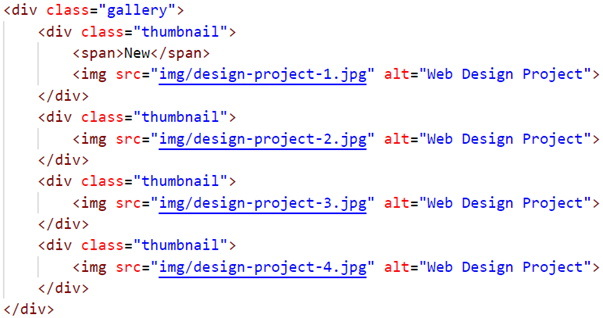 
        You should see the images below the heading.
    </ol>
4.	Now add the following style rules below the section h2 style rule: 
    <ol type="a">
        <li>Style the .gallery class: 
        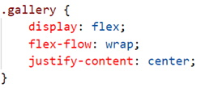
        </li>
        <li>Style the .thumbnail class: 
        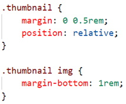
        </li>
        <li>Style the &lt;span&gt; class: 
        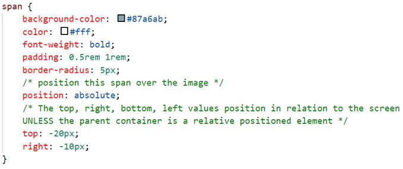
        </li>
    </ol>
5.	Test the results in your browser; use different browser widths to see the full effects.

#### [Module Home](../)
#### [DMIT1530 Home](../../)