

The following files are required for this lesson:
* [demo-picture-element.zip](files/demo-picture-element.zip)
* [demo-responsive-card-component.zip](files/demo-responsive-card-component.zip)

## Introduction
This lesson has two parts:
* Part 1: Picture Element
  * [Picture Element](#picture)
  * [Picture Element with Webp](#webp)
* [Part 2: Responsive Card](#card)

## Demo Instructions
You can follow along with your instructor to complete this build and/or you can use this document as a guide in completing the demo build.

## Steps - Part 1:
### <a ID="picture">Picture Element</a>
1.	Download the **demo-picture-element.zip** file and extract its contents to a folder named **demo-picture-element**.
2.	The completed output should look like when you resize your browser: 
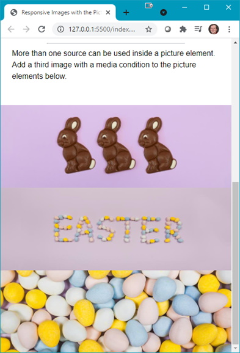 
**Note**: At a larger resolution, the images will be larger.
3.	The first step is to add the picture element to index.html: 
    <ol type="a">
        <li>Add the following code just before &lt;/section&gt;: 
        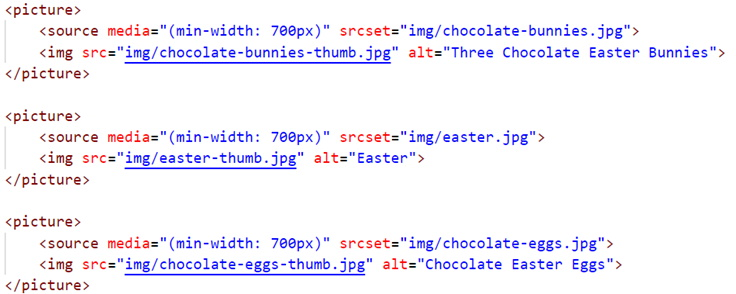 
        <b>Note</b>: The &lt;picture&gt; element has a <em>built-in</em> media query to swap out the image when the browser width reaches the breakpoint.
    </ol>

### <a ID="webp">Picture Element with Webp</a>
1. Download the **demo-picture-webp-main.zip** file and extract its contents to a folder named **demo-picture-webp-main**.
2.	The completed output should look like: 
    <ol type="a">
        <li>Google Chrome: 
        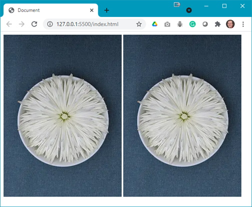
        </li>
        <li>Edge: 
        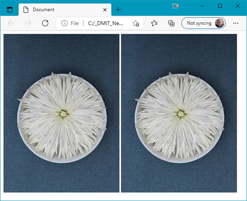
        </li>
        <li>Internet Explorer: 
        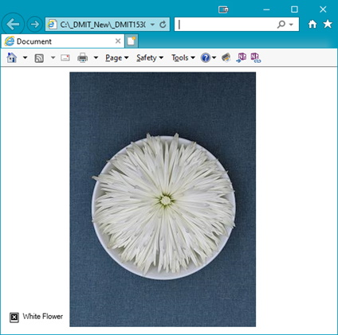
        </li>
        <li>Firefox: 
        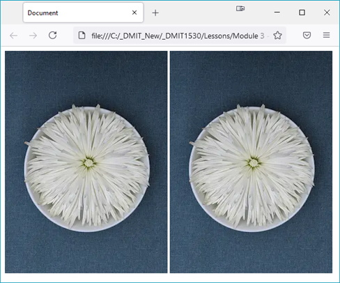
        </li>
        <li>Safari: 
        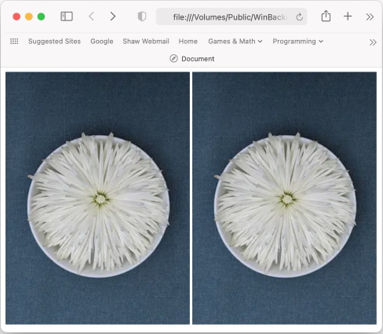
        </li>
    </ol>

## Steps - <a ID="card">Part 2</a>: Responsive Card
1. Download the **demo-responsive-card-component.zip** file and extract its contents to a folder named **demo-responsive-card-component**.
2.	The completed output should look like: 
    <ol type="a">
        <li>Narrow Width: 
        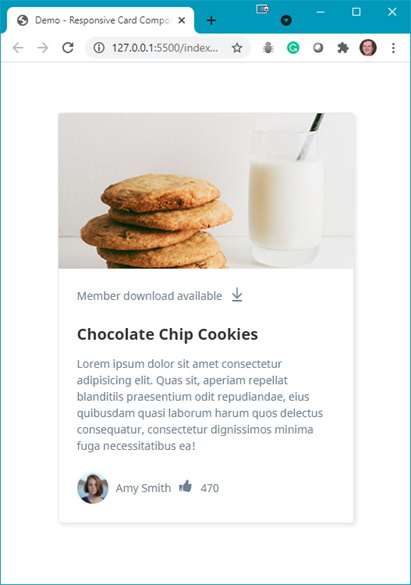
        </li>
        <li>Wide Width: 
        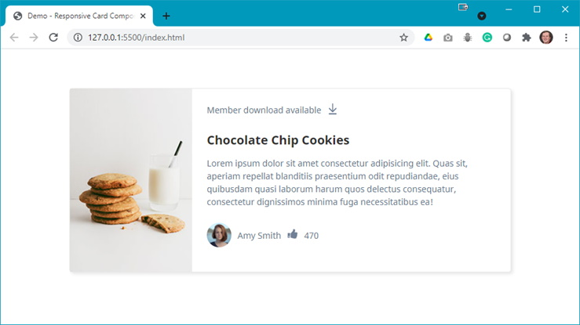
        </li>
    </ol>
3.	Modify your **index.html** with the code shown below: 
    <ol type="a">
        <li>Update the &lt;head&gt; with links to the stylesheets: 
        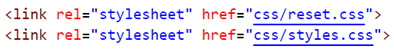
        </li>
        <li>Add the following div elements: 
        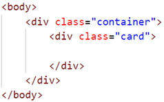
        </li>
        <li>Add a &lt;picture&gt; element: 
        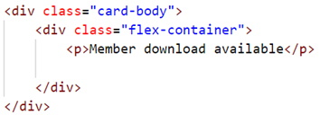
        </li>
         <li>Add the following below the &lt;/picture&gt; element: 
        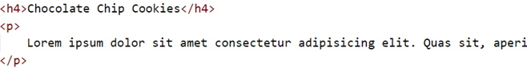
        </li>
        <li>Add the SVG below the paragraph (remember to copy the code from the SVG file)</li>
        <li>Below the flex container div, add the following (inside the paragraph tags, is a paragraph of lorem ipsum text): 
        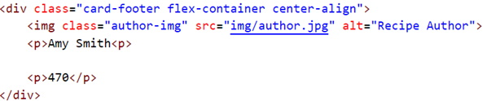
        </li>
        <li>Between the two paragraphs, add the <b>thumbs-up-icon.svg</b> (remember to copy the code from the SVG file): 
        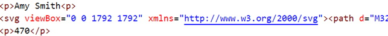
        </li>
    </ol>
4.	Refresh your browser and scroll to see something like: 
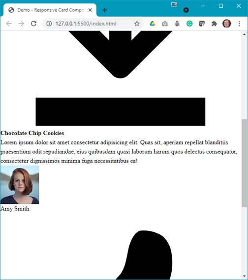 **Question**: What needs to be done next?
5.	Open your **styles.css** file and add the following style rules: 
    <ol type="a">
        <li>Add some initial style rules: 
        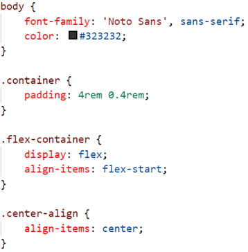
        </l1>
        <li>Style the card: 
        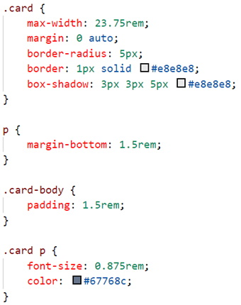
        </l1>
        <li>Style the SVG: 
        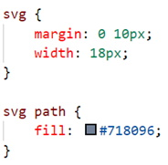
        </l1>
        <li>Style the card footer contents: 
        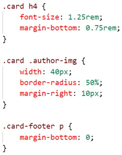
        </l1>
    </ol>
6.	Refresh your browser and use a wide width to see: 
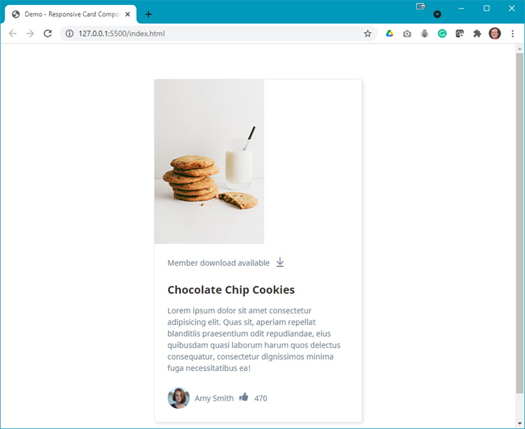 **Question**: Now what needs to be done?
7.	You now must add the following media query for the wide width of the browser: 
    <ol type="a">
        <li>Add the following media query: 
        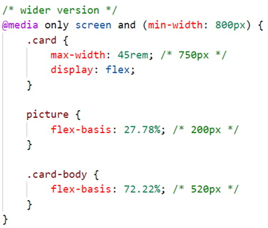
        </l1>
    </ol>
8.	Refresh your browser to see the desired output at both narrow and wide browser widths.

#### [Module Home](../)
#### [DMIT1530 Home](../../)