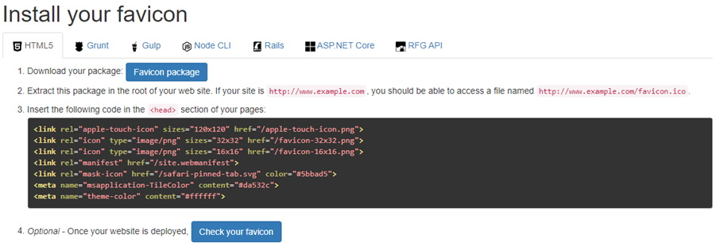

The following files are required for this lesson:
* [demo-favicon.zip](files/demo-favicon.zip)
* [dmit1530-icon.png](files/dmit1530-icon.png)

## Introduction
This lesson does not have any HTML or CSS; it is just for the <head> element block. There are two links on Moodle:
* [Favicon Generator](https://realfavicongenerator.net/){:target="_blank"}
* [Meta Description](https://moz.com/learn/seo/meta-description#:~:text=The%20meta%20description%20is%20an,can%20influence%20click-through%20rates.){:target="_blank"}

## Demo Instructions
You can follow along with your instructor to complete this build and/or you can use this document as a guide in completing the demo build.

## Steps
1.	Download the **demo-facicon.zip** file and extract its contents to a folder named **demo-favicon**.
2.	As there will be no HTML or CSS, there is no final web output for this demo.
3.	Download the **dmit1530-icon.png** file and save it to the **demo-favicon** folder.
4.	Open the Favicon Generator website to see: 

5.	Using the Select your Favicon Image button, open the dmit1530-icon.png file. 

6.	On the next screen there are many options, but just scroll down to find the
**Generate your Favicons HTML code** button to generate your icons. 

7.	On the next screen you can download your **Favicon package** and see the code to paste into the `<head>` section of your web page. 
 
Download the ZIP file and extract its contents to the **demo-favicons** folder (make sure you copy the files to the root of the web project).
8.	Now copy the code and paste it into the `<head>` section of your index.html file just below the `<title>` element. 
 
9.  There is a  on step 4 on the **Install your icon** page. This only works for a deployed web site. To test your favicon it is recommended to deploy your site to **netlify**. Once deployed, you can add the url created from netlify and test your icon. The results should look like the following (remember that netlify uses https): 

10. That is all there is to it … you can try this with your own png icons. When you create your png image for your favicon, the minimum file size recommended is 260px x260px. If your original png file is bigger, then optimize it to that size. The image must be square in dimensions, or you will get a warning when creating your icon files.
11.	To complete this lesson, open the [Meta Description](https://moz.com/learn/seo/meta-description#:~:text=The%20meta%20description%20is%20an,can%20influence%20click-through%20rates.){:target="_blank"} web link and review the reference.

#### [Module Home](../)
#### [DMIT1530 Home](../../)