
The following file is required for this lesson:
* [responsive-form.zip](files/responsive-form.zip)

## Introduction
This lesson builds on the form concepts taught in [COMP1017](../../../comp1017/module3/24-styling-forms/styling-forms.md){:target="_blank"}.

## Demo Instructions
You can follow along with your instructor to complete this build and/or you can use this document as a guide in completing the demo build.

## Steps
1.	Download the **responsive-form.zip** file and extract its contents to a folder named **responsive-form**.
2.	The output of this lesson should look like: 
    <ol type="a">
        <li>Wide width version: 
        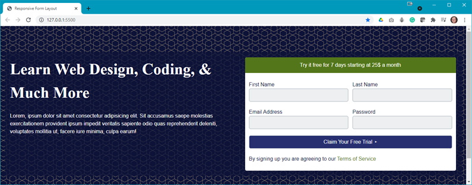
        </li>
        <li>Narrow width version: 
        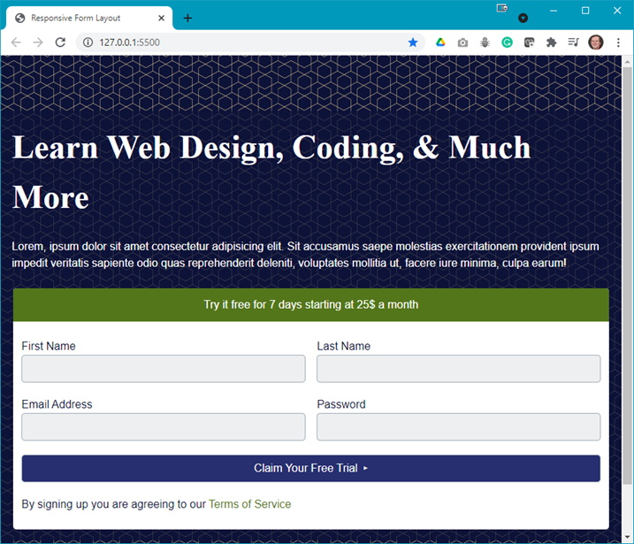
        </li>
    </ol>
3.	The first step is to build the form in HTML, thus add the following to your **index.html**: 
    <ol type="a">
        <li>Add a &lt;section&gt; for your form (the paragraph has lorem ipsum text): 
        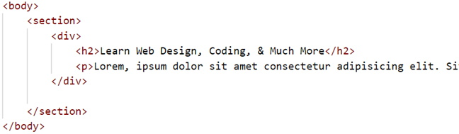
        </li>
        <li>Add a &lt;form&gt; below the div: 
        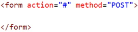
        </li>
        <li>To group the form elements nively, add a &lt;fieldset&gt; to the form: 
        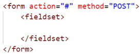
        </li>
        <li>Add a flex container div: 
        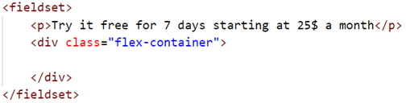
        </li>
        <li>Add the input fields of the form: 
        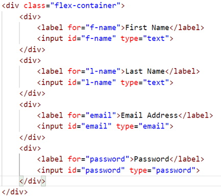
        </li>
        <li>Add the submit button: 
        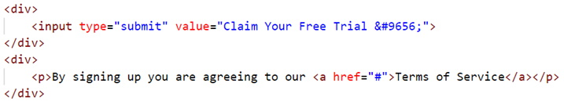
        </li>
    </ol>
4.	Refresh your browser to see: 
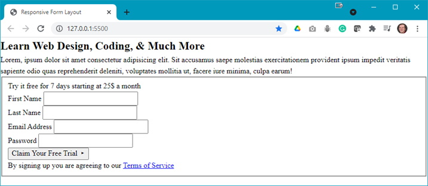 **Question**: What are the next steps?
5.	Open your **styles.css** file and add the following style rules: 
    <ol type="a">
        <li>Add the :root style rule: 
        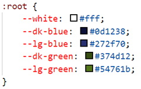 
        The :root style rule: 
        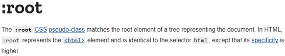 
        <b>Reference</b>: [https://developer.mozilla.org/en-US/docs/Web/CSS/:root](https://developer.mozilla.org/en-US/docs/Web/CSS/:root){:target="_blank"}
        </li>
        <li>Style the basic elements of the web page: 
        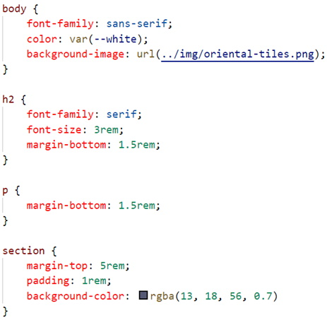 
        Notice the use of one of the :root defined colours.
        </li>
        <li>Start styling the form by styling the &lt;fieldset&gt;: 
        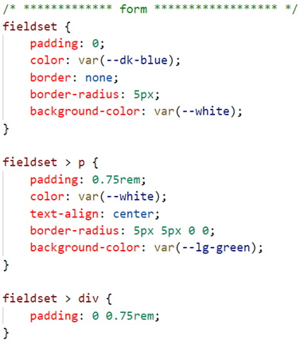 
        Notice the use of more :root defined colours.
        </li>
        <li>Style the input fields and theier associated labels: 
        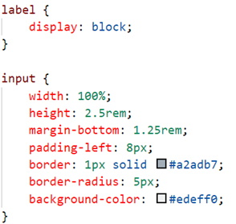
        </li>
        <li>Style the submit button: 
        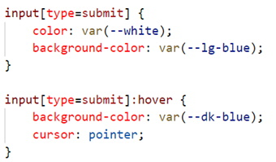
        </li>
        <li>Style the anchpr elements of the form: 
        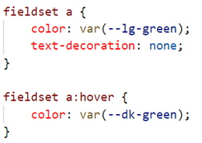
        </li>
    </ol>
6.	Refresh your browser and make the width wider to see something like: 
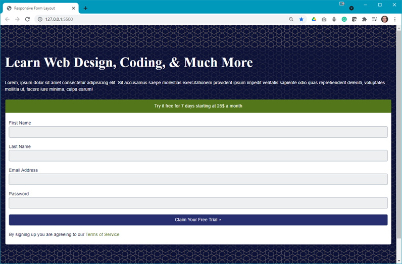 **Question**: What is next?
7.	Add the following media queries to your **styles.css** and refresh your browser after each is added to see the effects: 
    <ol type="a">
        <li>Add the following media query to affect the flex container: 
        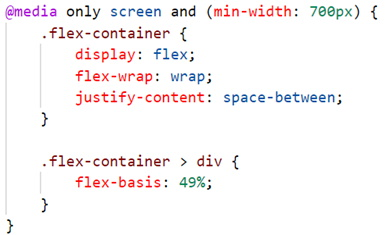 
        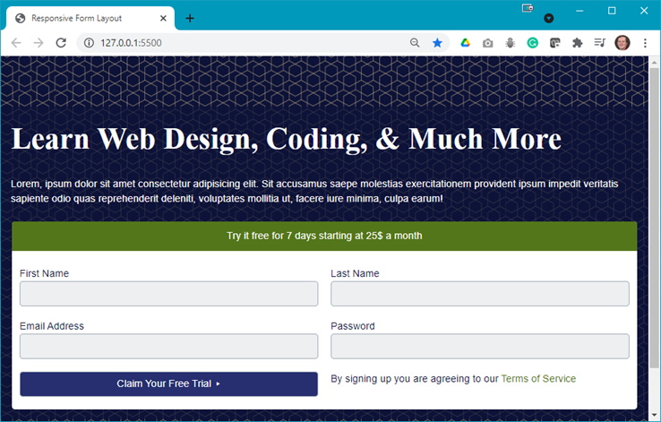 
        <b>Question</b>: What are the changes?
        </li>
        <li>Add the following media query to affect form in the section: 
        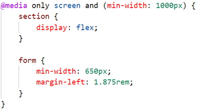 
        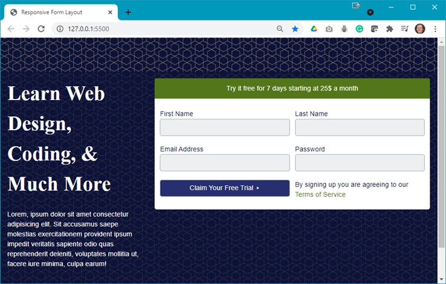 
        <b>Question</b>: What are the changes?
        </li>
        <li>Add a media query for the max width: 
        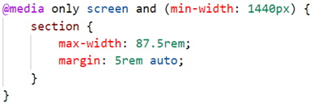 
        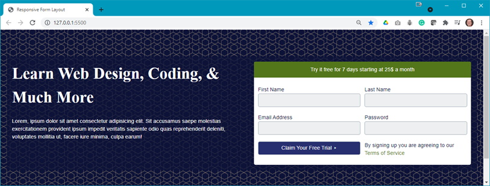 
        <b>Question</b>: What are the changes?
        </li>
    </ol>
8.	You should now experiment with different browser widths to see the full effect of the styling and media queries.

### [Module Home](../module3.md)
### [DMIT1530 Home](../../)