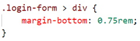
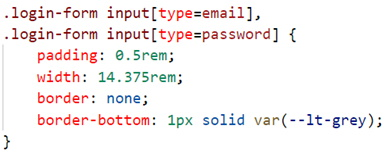

The following file is required for this lesson:
* [demo-form-styling.zip](files/demo-form-styling.zip)

## Introduction
This lesson builds on the form concepts taught in [COMP1017](../../../comp1017/module3/24-styling-forms/styling-forms.md){:target="_blank"}.

## Demo Instructions
You can follow along with your instructor to complete this build and/or you can use this document as a guide in completing the demo build.

## Steps
1.	Download the **demo-form-styling.zip** file and extract its contents to a folder named **demo-form-styling**.
2.	The output of this lesson should look like: 

3.	The first steps are to build the web page and add the form elements. Open your **index.html** file and add the following code:
    <ol type="a">
        <li>Create the starting web page: 
        
        </li>
        <li>Add the &lt;header&gt; block complete with a navigation menu: 
        
        </li>
        <li>Add a search form after the closing div and before the closing header: 
        
        </li>
        <li>Add a &lt;section&gt; inside the main &lt;form&gt; block: 
        
        </li>
    </ol>
4.	Refresh your browser to see: 
 **Question**: What are the next steps?
5.	You will need to add the **reset.css** file and create a **styles.css** file to your **css** folder.
6.	Modify your styles.css file by adding the following rules: 
    <ol type="a">
        <li>Add the :root style rule: 
        
        </li>
        <li>Add some basic styling: 
        
        </li>
        <li>Style the .header-top class: 
        
        </li>
        <li>Style the .sr-only class: 
        
        </li>
        <li>Style the submit buttons for uppercase letters and rounded corners: 
        
        </li>
        <li>Style the search form: 
        
        </li>
        <li>Add some padding to the &lt;section&gt;: 
        
        </li>
    </ol>
7.	Refresh your browser to see something like: 
 **Question**: What needs to be done now?
8.	It is time to start styling the login form. Add the following style rules: 
    <ol type="a">
        <li>Add the .login-form class rule: 
        
        </li>
        <li>Style the labels: 
        
        </li>
        <li>Style the div elements: 
        
        </li>
        <li>Style the input fields: 
        
        </li>
    </ol>
9.	Refresh your browser to see something like: 
 **Question**: What are the next steps?
10.	Add more style rules to your styles.css file: 
    <ol type="a">
        <li>Style the submit buttons and add a hover effect: 
        
        </li>
        <li>Add :focus style rule: 
         
         
        <b>Reference</b>: <a href="https://developer.mozilla.org/en-US/docs/Web/CSS/:focus" target="_blank">https://developer.mozilla.org/en-US/docs/Web/CSS/:focus</a>
        </li>
        <li>Add some <em>error checking</em> to the input fields: 
        
        </li>
    </ol>
11.	Refresh your browser and try the form: 
    <ol type="a">
        <li>Hover over an input field: 
        
        </li>
        <li>No data entered: 
        
        </li>
        <li>Form fields filled out: 
        
        </li>
    </ol>

#### [Module Home](../)
#### [DMIT1530 Home](../../)