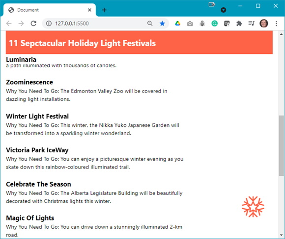
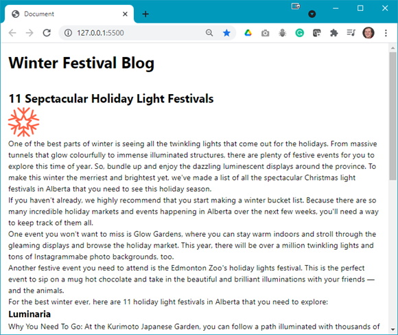
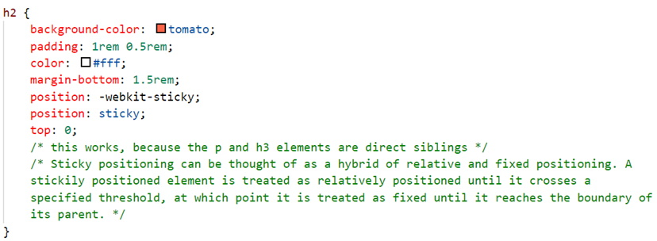
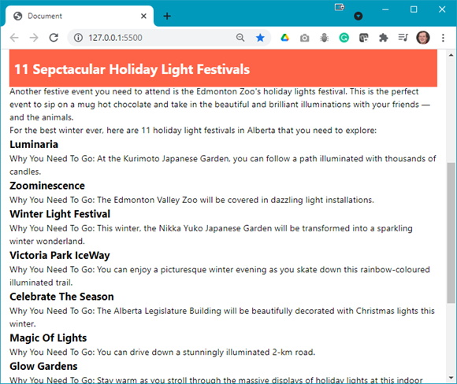
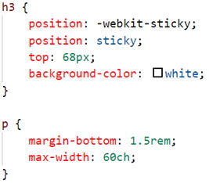
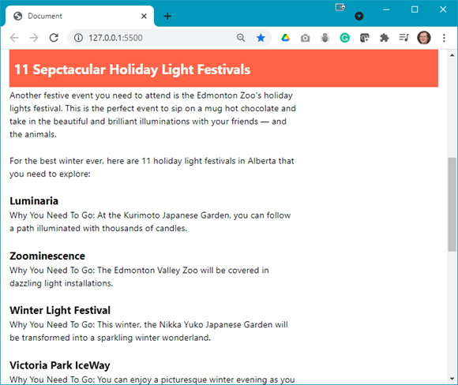
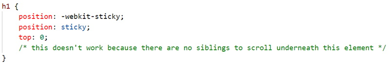
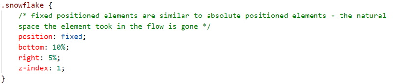
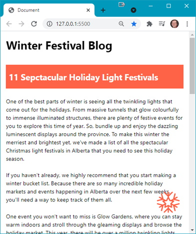

The following file is required for this lesson:
* [demo-sticky-fixed-position.zip](files/demo-sticky-fixed-position.zip)

## Demo Instructions
You can follow along with your instructor to complete this build and/or you can use this document as a guide in completing the demo build.

## Steps
1.	Download the **demo-sticky-fixed-position.zip** file and extract its contents to a folder named **demo-sticky-fixed-position**.
2.	The output of this lesson should look like: 
 
**Note**: The header and the snowflake icon are fixed on the web page.
3.	The starting output when you run index.html in the browser looks like: 
 
**Question**: What needs to be done?
4.	Open your **styles.css** file and add the following style rules: 
    <ol type="a">
        <li>Style the head &lt;h2&gt; for colour and make it <em>sticky</em>: 
         
        The output should now look like: 
        
        </li>
        <li>Style the head &lt;h3&gt; and &lt;p&gt; elements: 
         
        The output should now look like: 
        
        </li>
        <li>Try to make the &lt;h&gt; <em>sticky</em>: 
         
        <b>Note</b>: There should be no change in the output.
        </li>
        <li>Finally, fix the position of the snowflake: 
        
        </li>
    </ol>
5.	You should now see the snowflake fixed near the bottom of the web page and fixed at a set distance on the right. When you resize the browser, you should be able to see: 

### [Module Home](../module3.md)
### [DMIT1530 Home](../../)

