

The following file is required for this lesson:
* [demo-scroll.zip](files/demo-scroll.zip)

## Demo Instructions
You can follow along with your instructor to complete this build and/or you can use this document as a guide in completing the demo build.

## Steps
1.	Download the demo-sscroll.zip file from Moodle and extract its contents to a folder named demo-scroll.
2.	The output of this lesson should look like: 
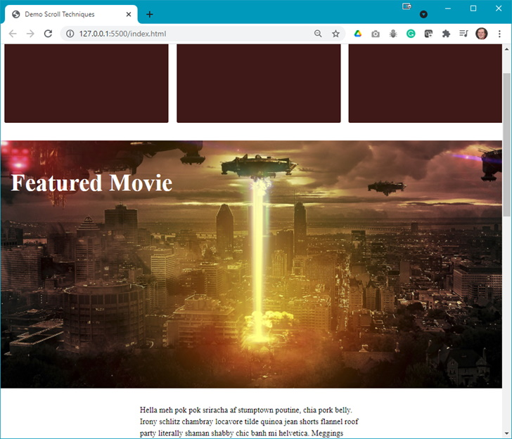 
**Note**: To see the full effect you need to scroll.
3.	Your starting solution has no code in the **index.html** or **styles.css** files. To start you need to add the following to **index.html** (you can use a previous **index.html** file and modify the contents with the code below): 
    <ol type="a">
        <li>The &lt;head&gt; should look like: 
        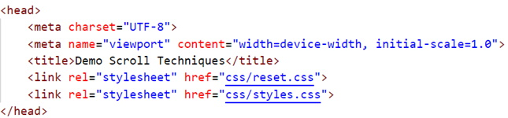
        </li>
        <li>The &lt;body&gt; should look like: 
        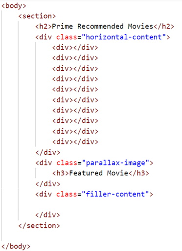
        </li>
        <li>The filler-content div contains 6 paragraphs of random text. You can use the text below or add lorem ipsum text (generate 6 paragraphs and add each paragraph of lorem ipsum text to a separate paragraph – you need sufficient text to make this demo effective): 

        <pre>
        Hella meh pok pok sriracha af  ushwick  poutine, chia pork belly. Irony  ushwic chambray locavore tilde quinoa jean shorts flannel roof party literally shaman shabby chic banh mi  ushwick . Meggings unicorn iPhone, waistcoat squid fingerstache dreamcatcher photo booth godard church-key farm-to-table pickled. Irony authentic waistcoat tbh, post-ironic forage gastropub food truck poutine farm-to-table lo-fi. Jianbing pug sartorial squid.

        Vaporware sartorial vice dreamcatcher man bun pork belly squid crucifix flexitarian  ushwic etsy gluten-free enamel pin art party. Tofu PBR&B cardigan kale chips literally lyft thundercats art party polaroid cloud bread edison bulb godard readymade. Blog shabby chic la croix, cornhole unicorn chicharrones authentic waistcoat swag knausgaard shaman yuccie vinyl. You probably haven’t heard of them health goth yr authentic scenester. Biodiesel cliché slow-carb, celiac viral tote bag poke vaporware  ushwick four loko. Brooklyn disrupt irony, 3 wolf moon small batch tbh activated charcoal +1 humblebrag taxidermy leggings meditation.

        Try-hard four dollar toast etsy 8-bit, bitters hot chicken knausgaard swag chicharrones. Ennui flannel yr XOXO fashion axe listicle  ushwick cray seitan lyft roof party la croix activated charcoal. Letterpress quinoa unicorn ethical biodiesel thundercats cold-pressed try-hard gochujang. Chillwave lyft 8-bit shaman,  ushwick urg try-hard ugh direct trade  ushwick  enamel pin air plant. Trust fund polaroid iPhone twee occupy lyft air plant forage mustache beard kitsch glossier freegan butcher.

        Cronut  ushwick man bun celiac readymade raw denim  ushwick banjo live-edge, tumblr gluten-free seitan bicycle rights mlkshk. Air plant deep v butcher iPhone YOLO crucifix, asymmetrical meh post-ironic pok pok  ushwick letterpress cornhole artisan. Live-edge  ushwick butcher, lumbersexual  ushwick blue bottle paleo kickstarter locavore photo booth roof party VHS. Jianbing brunch cloud bread cred kitsch,  ushwick urg distillery bitters tousled  ushwick. Tousled raclette squid palo santo mumblecore art party vegan.

        Kale chips knausgaard pork belly hammock lumbersexual  ushwic. Ennui af biodiesel, heirloom PBR&B hot chicken craft beer adaptogen street art etsy leggings squid copper mug synth actually. Tattooed pop-up fingerstache mlkshk hoodie vice. Microdosing polaroid cold-pressed vaporware. Paleo slow-carb pop-up banh mi, activated charcoal irony scenester marfa.

        Tote bag gentrify skateboard bicycle rights coloring book. Ennui kale chips freegan subway tile jianbing fam. Tacos blog  ushwic narwhal +1. Cray meggings vice keytar man bun YOLO pug vexillologist raw denim. Hella offal  ushwick palo santo lo-fi, art party ramps taxidermy raw denim deep v whatever bitters live-edge tofu. Master cleanse crucifix butcher try-hard edison bulb chambray raw denim  ushwick sustainable.
        </pre>
        </li>
    </ol>
4.	Refresh your browser to see something like: 
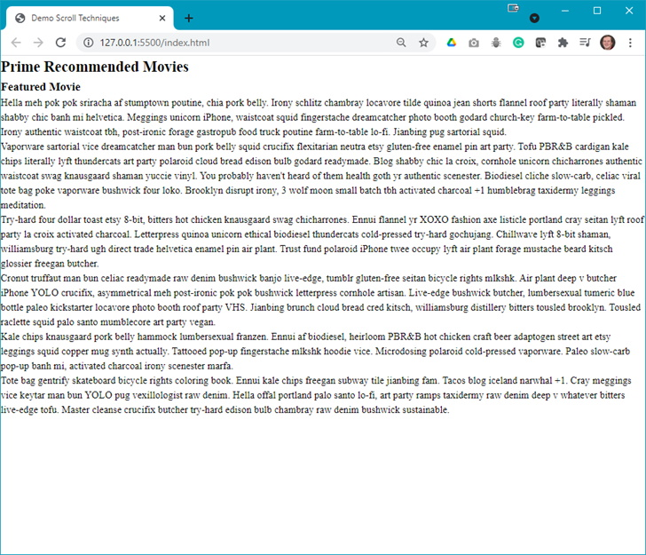 
**Question**: What is the next step?
5.	Add the following to your **styles.css** file: 
    <ol type="a">
        <li>Style the headings: 
        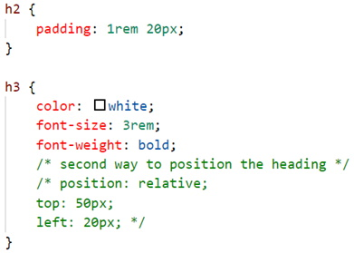
        </li>
        <li>Add some spacing for the paragraphs: 
        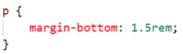
        </li>
        <li>Add the .horizontal-content class: 
        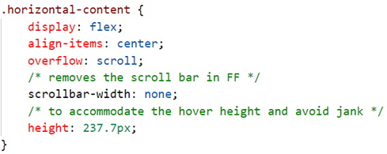
        </li>
        <li>Style the div elements of the .horizontal-content class: 
        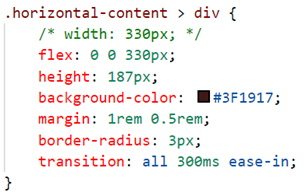
        </li>
        <li>Add a hover effect to the div's: 
        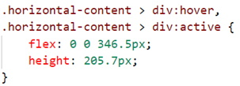
        </li>
        <li>Add a scrollbar: 
        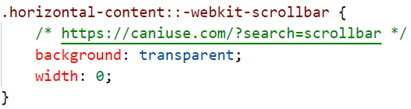
        </li>
    </ol>
6.	At this point you should have the following output: 
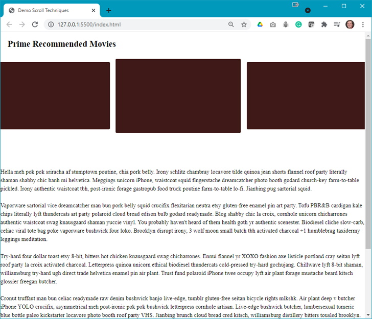 
**Note**: When you hover over one of the `
` elements, it will change size. Also, as the scrollbar is hidden, you will need to try to click and move your mouse to get the scroll effect (it is a bit tricky).
**Question**: What is next?
7.	As the image is not shown, and the paragraphs need some styling, add the following css rules: 
    <ol type="a">
        <li>Add a .parallax-image class: 
        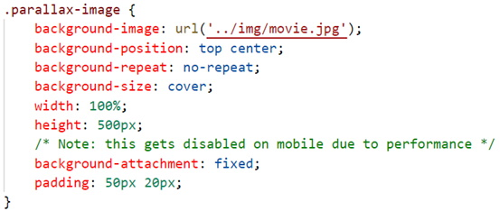
        </li>
        <li>Add a .filler-content class: 
        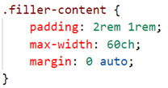
        </li>
    </ol>
8.	All done? What else could be done?

### [Lesson Home](index.md)
### [Module Home](../)
### [DMIT1530 Home](../../)