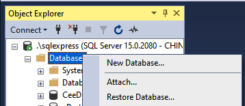
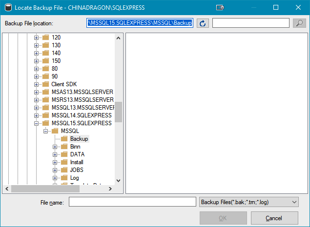

## Software
The following software is **required** for this course and needs to be installed on a Windows Operating System:
* [Visual Studio Community Edition](https://visualstudio.microsoft.com/downloads/){:target="_blank"}
* [SQL Express](https://www.microsoft.com/en-us/sql-server/sql-server-downloads){:target="_blank"}
  * SQL Server Management Studio (SSMS) - use the same link as above
* [LINQPad](https://www.linqpad.net/Download.aspx){:target="_blank"}

## Databases
* eStore
* CeeDeeMusic
* GroceryList
* others TBD

## <a ID="restore">Creating Databases from Backup</a>
These notes apply to the eStore database.
1. Download the **eStore.bak** file from Moodle.
2. Open SQL Server Management Studio (SSMS) and connect to your database server.
3. Right-click Databases and select Restore Database… from the menu: 
4. On the restore Database screen, select Device and click on the `[…]` icon to search for the backup file you downloaded: 
5. Click the **Add** button to bring up the **Locate Backup File** wizard: 
6. Navigate to find the backup file (you need to know where you saved the file):
7. Select the **eStore.bak** file and press **OK**
8. On the **Select backup devices** screen just press **OK**:
9. Finally, press **OK** on the **Restore Database – eStore** screen:
10. If successful, you will see a popup message that the database was successfully restored. Just Press OK to close the popup and you will see the database in the Object Explorer:
11. To see the data, open LINQPad and [add a connection to the eStore database](../unit1/1_1_0.md/#connection):

To restore the other databases, use the steps above and select the appropriate `*.bak` file.

#### [DMIT2018 Home](../)