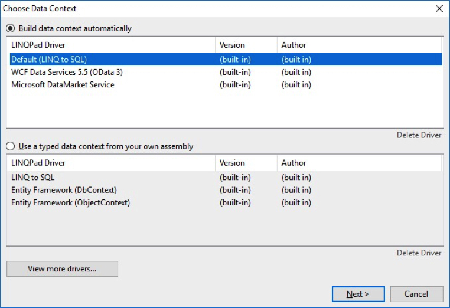
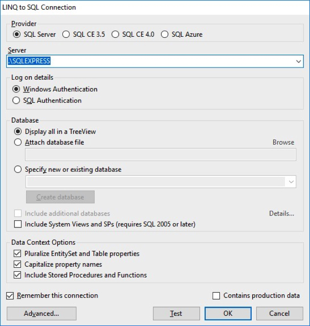
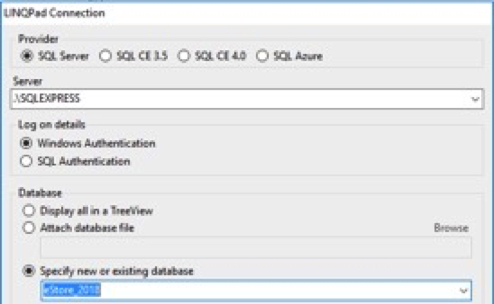
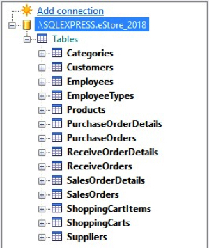
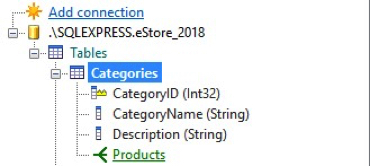
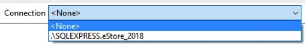
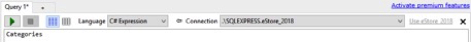
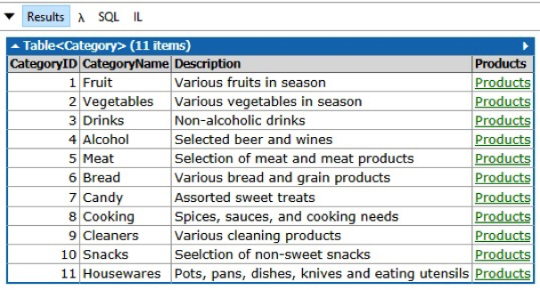
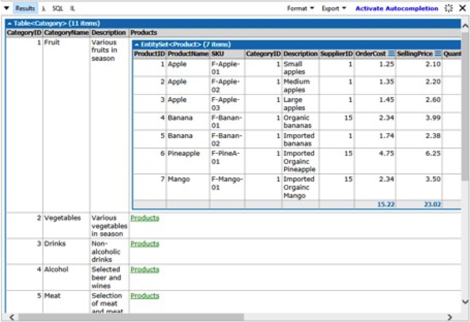
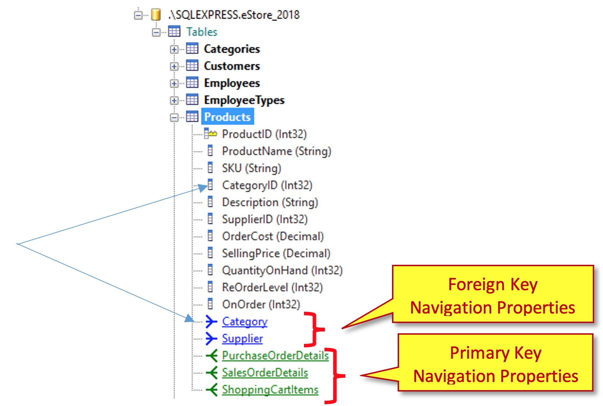

## Introduction
LINQ stands for **L**anguage **In**tegrated **Q**uery. This is a powerful feature of the C# language that allows SQL-Like querying of data, including data stored in a database. LINQ statements can be written in two ways: (1) Query syntax, or (2) Method syntax. These ways are not in conflict either; you can combine Query syntax and Method syntax in a single statement.

## Query Syntax
Query syntax appears, at first, to look like SQL. LINQ queries use keywords that closely resemble SQL keywords, but LINQ’s keywords act as operators in that they are used to form an expression. LINQ query operators perform specific processing acts on the objects as their “operands”. They flow together in a kind of “sequence” and end with the select.

Query syntax includes seven major clauses (five of which are the more commonly used):
* `from` clause: A query expression **must** begin with a **from** clause. Additionally, a query expression can contain sub-queries, which also **must** begin with a **from** clause
* `where` clause: The **where** clause is used in a query expression to specify which elements from the data source will be returned in the query expression
* `select` clause: In a query expression, the **select** clause specifies the type of values that will be produced when the query is executed. The result is based on the evaluation of all previous clauses and on any expressions in the **select** clause itself. A query expression must end with either a **select** clause or a **group** clause.
* `group` clause: The **group** clause returns a sequence of `IGrouping<TKey, TElement>` objects that contain zero or more items that match the key value for the group.
* `orderby` clause: In a query expression, the **orderby** clause causes the returned sequence or subsequence (group) to be sorted in either ascending or descending order. Multiple keys can be specified to perform one or more secondary sort operations.
* `join` clause: The **join** clause is useful for associating elements from different source sequences that have no direct relationship in the object model.
* `let` clause: In a query expression, it is sometimes useful to store the result of a sub-expression to use it in subsequent clauses. You do this with the **let** keyword.

### Syntax
An example of the flow seen in a typical LINQ query can be illustrated in the following (over-simplified) grammar:

```
from [type-name] identified in enumerable-expression
[orderby expression], ..n [{ascending / descending}]
[where boolean-expression]
[group group-object by group-obj-property [into group-identifier]]
select expression
```

## LINQPad – A Scratch-pad for LINQ
[LINQPad](http://LINQPad.net) is a stand-alone application that you cause in place of creating a sample console application to test and/or explore LINQ. The LINQPad editor window allows you to select from three main contexts:
* **Expressions**: In this context, you simply must generate an expression in the editor and run the expression. LINQPad will show the output in the Results window.
* **Statements**: Imagine lines of code in a method, and you have the Statements context. Here you write the complete program statements - declaring variables, making calculations, performing queries, writing if or flow-control statements, etc. - and LINQPad executes these like it was the body of some method call. If you want to output anything to the results window, simply call the `.Dump()` extension method that LINQPad includes for all objects.
* **Program**: This context most closely represents a console application. You are given a `Main()` method and you can add additional methods and/or classes to build a complete console-like application. In this context, however, instead of calling `Console.WriteLine(…)`, you continue to use the `.Dump()` method to output content to the Results window.

LINQPad allows you to connect to a database. Clicking “Add Connection…” opens the “Choose Data Context” dialog. Click “Next” (leaving the default) move you into the “LINQPad Connection” dialog where you specify your server name and your existing database. From there, you can see the database and its tables and columns in the explorer pane on the left.

## Setup LINQPad Database Connection
Once LINQPad is installed on your computer, the only setup that is needed is to create a connection to a database. When starting LINQPad for the first time no database connections are listed.


To create a database connection, click on the Add connection link. The first thing that happens is shown in the figure below:



Press **Next >** as you will be using the default LINQ to SQL context.



The next step is to select the database you want to connect to. Use the **Specify new or existing database radio button**. It will take a few seconds for the list of databases to populate with the names of the databases. Once the list is populated, select the database you want to connect to.



Once the database is selected, press OK. The add connection wizard will close and LINQPad will show the new database connection and should display the tables of the database.



## Testing the Database
Before we go into creating LINQ Queries, it is best to explore the database.

### Categories
Expand the Categories to see:<br>


Here we can see the fields of the **Category** table and can identify the **Primary Key** (`CategoryID`).
Next, we can examine the data in this Entity by following these steps:
1.	In the Query 1 window type Categories
2.	We need a database connection for this to work, thus you select from the Connection dropdown list:<br>
<br>OR select the Use `eStore 2018` link.
3.	When this is done, you should see:<br>

4.	Press the green triangle to execute your basic query.
5.	The results should look like:<br>


You should notice the `Products` link in the right-hand column. If you select, click, on one of the links, you should see something like:<br>

This is a navigation property, lists all the **Products** in the selected **Category**, which we will learn about next. This technique is useful to see the data, and how the table entities are related.

## Navigation Properties
When a database connection is made in LINQPad, LINQPad automatically adds navigation properties for the Primary Key to Foreign Key relationships. If we examine the **Products** entity in LINQPad we see the following:<br>


### Foreign Key Navigation Property
These properties represent that the Entity belongs to only 1 parent entity:
* A `Product` belongs to only 1 `Category`
* A `Product` belongs to only 1 `Supplier`

### Primary Key Navigation Property
These properties represent that the Entity has many child entities:
* A `Product` can be on many `PurchaseOrderDetail`
* A `Product` can be on many `SalesOrderDetail`
* A `Product` can be on many `ShoppingCartItem`

#### [Unit 1 Home](index.md)
#### [DMIT2018 Home](../)