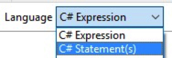
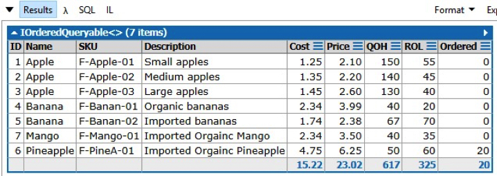

## LINQ Examples
The following examples use the eStore database (the connection was created in [Lesson 1.1.0](1_1_0.md)). The query below uses the C# Statements from the Language dropdown:<br>


#### List all the Products sorted by Name of a Category:

```
var results = from x in Products
              where x.CategoryID == 1 //select a known Category
              orderby x.ProductName
              select new
              {
                  ID = x.ProductID,
                  Name = x.ProductName,
                  SKU = x.SKU,
                  Description = x.Description,
                  Cost = x.OrderCost,
                  Price = x.SellingPrice, 
                  QOH = x.QuantityOnHand,
                  ROL = x.ReOrderLevel,
                  Ordered = x.OnOrder
              };
results.Dump();
```



Once you have a query that displays the correct/desired results, you should save it so it can be used later.


### [Unit 1 Home](linq.md)
### [DMIT2018 Home](../)