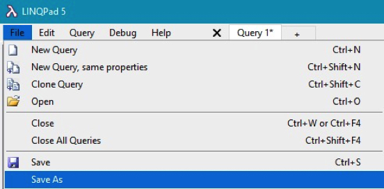

## LINQ Examples
The following examples use the eStore database (the connection was created in [Lesson 1.1.0](1_1_0.md)). The query below uses the C# Statements from the Language dropdown:<br>


**List all the Products sorted by Name of a Category**:

```
var results = from x in Products
              where x.CategoryID == 1 //select a known Category
              orderby x.ProductName
              select new
              {
                  ID = x.ProductID,
                  Name = x.ProductName,
                  SKU = x.SKU,
                  Description = x.Description,
                  Cost = x.OrderCost,
                  Price = x.SellingPrice, 
                  QOH = x.QuantityOnHand,
                  ROL = x.ReOrderLevel,
                  Ordered = x.OnOrder
              };
results.Dump();
```


Once you have a query that displays the correct/desired results, you should save it so it can be used later.
1. 
2.	Pick a location on your computer and give the file a name that represents the query (i.e., `ProductsForCategory`):<br>


The next query uses a Navigation Property, to look at the parent entity to read data from that entity:

**List all the Products sorted by Name**:

```
var results = from x in Products
              orderby x.ProductName
              select new
              {
                  ID = x.ProductID,
                  Name = x.ProductName,
                  Category = x.Category.CategoryName,
                  Price = x.SellingPrice
              };
results.Dump();
```


This next query lists all the child entities of all the parent entities.

**Products for Category**

```
var results = from x in Categories
              where x.CategoryID == 1
              select new
              {
                  Name = x.CategoryName,
                  Description = x.Description,
                  Products = from y in x.Products //uses a navigation property
                             orderby y.ProductName
                             select new
                             {
                                 Name = y.ProductName,
                                 SKU = y.SKU,
                                 Supplier = y.Supplier.SupplierName, //uses a navigation property
                                 Cost = y.OrderCost,
                                 Price = y.SellingPrice,
                                 QOH = y.QuantityOnHand
                             }
               };
results.Dump();
```


The query below is an example of how to join string fields to display a single item of data and shows how to count rows.

**Using the Count Function**

```
var results = from x in ShoppingCarts
              select new
              {
                  Customer = x.Customer.FirstName + " " + x.Customer.LastName, //joining strings
                  Created = x.CreatedOn,
                  Updated = x.UpdatedOn,
                  Items = x.ShoppingCartItems.Count //explicit count
              };
results.Dump();
```


The query below shows how to determine if you can query the data, and an alternate sorting method.

**Ordered Products**

```
var results = from x in Products
              where x.OnOrder > 0 //implicit count
              orderby x.OnOrder descending //alternate sorting
              select new
              {
                   ID = x.ProductID,
                   SKU = x.SKU,
                   Name = x.ProductName,
                   QOH = x.QuantityOnHand,
                   ROL = x.ReOrderLevel,
                   Ordered = x.OnOrder
               };
results.Dump();
```


## Exercise
Complete Exercise [1.2.1 LINQ Queries Basic](1_2_1.md) and upload your queries to Moodle.

### [Unit 1 Home](index.md)
### [DMIT2018 Home](../)